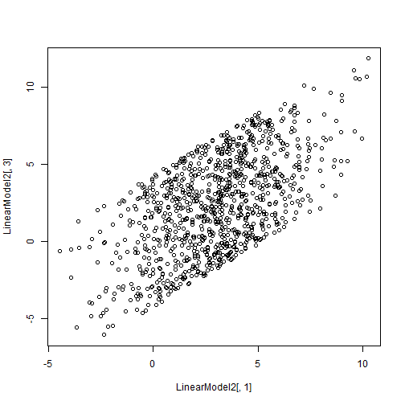

Week 2 Homework 1 - Monobit Test
========================================================
Brian Ritz
--------------------------------------------------------
MSCA 31007 Autumn 2014
--------------------------------------------------------


We created a sequence of coin tosses:


```r
set.seed(12345);
nFlips <- 1000000;
Flips.plusminus1<-(sample(0:1,nFlips,repl=T)-.5)*2
```

We create the efr and efrc functions:


```r
erf <- function(x) 2 * pnorm(x * sqrt(2)) - 1
erfc <- function(x) 2 * pnorm(x * sqrt(2), lower = FALSE)
```

Test our random variable with the erfc test:


```r
print(erfc(abs(sum(Flips.plusminus1)/sqrt(2*nFlips))))
```

```
## [1] 0.8934
```

We also want to check the p values of each subsequence we created on the last assignment.


```r
plot(erfc(abs(apply(matrix(Flips.plusminus1,ncol=500),1,sum))/sqrt(2*500)),ylab="P-values of 2,000 runs")
```

 

For the next part of the assignment, we are tasked with coming up with our own random number generator and testing it.

My idea for a random number generator is to take the number of hits from major league baseball players with at least 100 at bats, and find if the number of hits is even or odd. I got the baseball statistics data from here: http://www.seanlahman.com/baseball-archive/statistics/.


```r
raw.data <- read.csv("C:/Users/Brian_Ritz/Desktop/Batting.csv")

head(raw.data)
```

```
##    playerID yearID stint teamID lgID  G G_batting AB R H X2B X3B HR RBI SB
## 1 aardsda01   2004     1    SFN   NL 11        11  0 0 0   0   0  0   0  0
## 2 aardsda01   2006     1    CHN   NL 45        43  2 0 0   0   0  0   0  0
## 3 aardsda01   2007     1    CHA   AL 25         2  0 0 0   0   0  0   0  0
## 4 aardsda01   2008     1    BOS   AL 47         5  1 0 0   0   0  0   0  0
## 5 aardsda01   2009     1    SEA   AL 73         3  0 0 0   0   0  0   0  0
## 6 aardsda01   2010     1    SEA   AL 53         4  0 0 0   0   0  0   0  0
##   CS BB SO IBB HBP SH SF GIDP G_old
## 1  0  0  0   0   0  0  0    0    11
## 2  0  0  0   0   0  1  0    0    45
## 3  0  0  0   0   0  0  0    0     2
## 4  0  0  1   0   0  0  0    0     5
## 5  0  0  0   0   0  0  0    0    NA
## 6  0  0  0   0   0  0  0    0    NA
```

```r
#subset to players with at least 100 at bats and get the hits column
over.100 <- raw.data[raw.data["AB"] >= 100,"H"]

# filter out NAs
over.100 <- over.100[!is.na(over.100)]

# now find if it is even or odd
rand.seq <- over.100 %% 2

print(rand.seq[1:10])
```

```
##  [1] 1 1 0 0 0 1 0 1 1 1
```

Now we will use the monobit test to test out the random sequence.


```r
# to use the monobit test, we must make the 0s into ones
all.flips <- (rand.seq - .5) * 2
num.flips <- length(rand.seq)
erf <- function(x) 2 * pnorm(x * sqrt(2)) - 1
erfc <- function(x) 2 * pnorm(x * sqrt(2), lower = FALSE)


print(erfc(abs(sum(all.flips)/sqrt(2*num.flips))))
```

```
## [1] 0.4704
```

The p-value is greater than 0.01, so it passes the test, but the p-value is not as high as the test we first did above.
