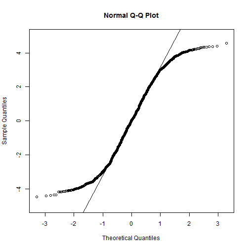
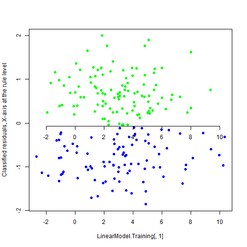

Week 3 Homework 1 - Simulation of 4 Linear Models
========================================================
Brian Ritz
--------------------------------------------------------
MSCA 31007 Autumn 2014
--------------------------------------------------------

0. We put in our meta-parmeters -- slope and intercept


```r
# Slope and Intercept
a<-.8; b<-.1
nSample<-1000
```


1. Simulate and plot Model1: input variable X ~ Norm(??=3,??=2.5); model residuals Eps ~ Norm(??=0,??=1.5)


```r
# Model 1
# Variable X~Norm(3,2.5)
X<-rnorm(n=nSample,mean=3,sd=2.5)
# Residuals Eps~Norm(0.1.5)
Eps<-rnorm(n=nSample,mean=0,sd=1.5)
Y<-a*X+b+Eps
LinearModel1<-cbind(X,Eps,Y)
plot(LinearModel1[,1],LinearModel1[,3])
```

 

Plot the residuals of the model.

```r
plot(LinearModel1[,2],type="l")
```

 

2. Simulate and plot Model2: input variable X ~ Norm(??=3,??=2.5); model residuals Eps ~ Unif(min=???4.33,max=4.33)


```r
# Model 2
# Normal X, Uniform Eps 
X<-rnorm(n=nSample,mean=3,sd=2.5)
Eps<-runif(n=nSample,min=-4.33,max=4.33)
Y<-a*X+b+Eps
LinearModel2<-cbind(X,Eps,Y)
plot(LinearModel2[,1],LinearModel2[,3])
```

 

Plot the residuals of the model.

```r
plot(LinearModel2[,2],type="l")
```

 

3. Simulate and plot Model3: input variable X ~ Norm^(??=3,??=2.5); model residuals Eps ~ Cauchi*(location=0,scale=0.3)
Simulate the input variable X and the residuals Eps


```r
# Model 3
# Normal X, Cauchy Eps
X<-rnorm(n=nSample,mean=3,sd=2.5)
Eps<-rcauchy(n=nSample,location=0,scale=.3)
```

Plot the trajectory of the Model3 residuals.


```r
plot(Eps,type="l")
```

 

Caculate the estimate of standard deviation of the residuals

```r
sd(Eps)
```

```
## [1] 12.35
```

Generate another 5 samples of residuals and estimate standard deviations for each of them.


```r
Eps1<-rcauchy(n=nSample,location=0,scale=.3)
Eps2<-rcauchy(n=nSample,location=0,scale=.3)
Eps3<-rcauchy(n=nSample,location=0,scale=.3)
Eps4<-rcauchy(n=nSample,location=0,scale=.3)
Eps5<-rcauchy(n=nSample,location=0,scale=.3)
c(sd(Eps1),sd(Eps2),sd(Eps3),sd(Eps4),sd(Eps5))
```

```
## [1]   5.952   6.958  17.250  38.138 650.699
```

The sample to sample estimates of standard deviations jump around a lot
**How do you interpret this observation?**

This is due to the fact that the second moment for a cauchy distribution does not exist. In fact, no moments for the cauchy distribution exist. That means that the standard deviation is not well defined for the distribution. This can be seen when we try to derive the variance of the cauchy distribution.

The p.d.f. of a standard cauchy distribution is:

f(x;0,1) = (1/pi)*(1/(x^2 + 1))

To find the variance, we take the integral from -infinity to +infinity of x^2f(x).
x^2f(x) = (x^2) / (pi * (x^2 + 1))

As x -> infinity or negative infinity, (x^2)f(x) approaches 1/pi.
THIS IMPLIES THAT THE INTEGRAL FROM -INFINITY TO +INFINITY OF (x^2)f(x) IS UNDEFINED.
Therefore, the variance of the cauchy distribution is undefined.


I now create Model3 and plot it


```r
Y<-a*X+b+Eps
LinearModel3<-cbind(X,Eps,Y)
plot(LinearModel3[,1],LinearModel3[,3])
```

 

4. Simulate and plot Model4: input variable X ~ Norm(??=3,??=2.5); model residuals Eps ~ Gauss(mean=0, sd is variable --this give is heteroskedacity)
Simulate the input variable X


```r
# Model 4
# Normal X, Non-homoscedastic (heteroscedastic) Eps
X<-rnorm(n=nSample,mean=3,sd=2.5)
```

**Plot the trajectory of standard deviations of total length nSample=1000.**

```r
sd.Values<-c(1,1.7,.4,1.3)
sd.process<-rep(c(rep(sd.Values[1],50),
                  rep(sd.Values[2],75),
                  rep(sd.Values[3],75),
                  rep(sd.Values[4],50)),
            4)
            
plot(sd.process,type="l")
```

 

Simulate the linear model residuals Eps with changing standard deviations.

```r
Eps<-rep(c(rnorm(n=50,mean=0,sd=2*sd.process[1]),
         rnorm(n=75,mean=0,sd=2*sd.process[2]),
         rnorm(n=75,mean=0,sd=2*sd.process[3]),
         rnorm(n=50,mean=0,sd=2*sd.process[4])))
```

Plot the residuals.


```r
plot(Eps,type="l")
```

 

heteroscedasticity transforms normal distribution into leptokurtic distribution


```r
set.seed(1112131415);
EpsLong<-rep(c(rnorm(n=500,mean=0,sd=2*sd.process[1]),
         rnorm(n=750,mean=0,sd=2*sd.process[2]),
         rnorm(n=750,mean=0,sd=2*sd.process[3]),
         rnorm(n=500,mean=0,sd=2*sd.process[4])))

Xvariable<-(100*floor(min(Eps))):(100*ceiling(max(Eps)))
 Xvariable<-Xvariable/100
# Plot the sample distribution and the theo. distribution
 plot(Xvariable,dnorm(Xvariable,mean=0,sd=2),type="l",
      ylim=c(0,.25),col="black",ylab="Distribution of Eps",xlab="")
 lines(density(EpsLong),col="red")
```

 

Generate Model4. Plot it.


```r
Y<-a*X+b+Eps
LinearModel4<-cbind(X,Eps,Y)
plot(LinearModel4[,1],LinearModel4[,3])
```

 


Now we plot the 4 charts together.

```r
# Plot X-Y Charts for all 4 models together
layout(matrix(1:4,ncol=2))
plot(LinearModel1[,1],LinearModel1[,3],ylab="Variable Y",xlab="Variable X")
plot(LinearModel3[,1],LinearModel3[,3],ylab="Variable Y",xlab="Variable X")
plot(LinearModel4[,1],LinearModel4[,3],ylab="Variable Y",xlab="Variable X")
plot(LinearModel5[,1],LinearModel5[,3],ylab="Variable Y",xlab="Variable X")
```

```
## Error: object 'LinearModel5' not found
```

 

Calculate the theoretical ??2 for the "correct model" which is model 1


```r
# Theoretical Rho^2
Theoretical.Rho.Squared<-(.8*2.5)^2/((.8*2.5)^2+1.5^2)
Theoretical.Rho.Squared
```

```
## [1] 0.64
```

And compare with the estimated ??2 -- we get the estimated rho squareds from each model


```r
# Estimate Rho^2 using lm()
c(Model1.r.squared=summary(lm(LinearModel1[,3]~LinearModel1[,1]))$r.squared,
Model2.r.squared=summary(lm(LinearModel2[,3]~LinearModel2[,1]))$r.squared,
Model3.r.squared=summary(lm(LinearModel3[,3]~LinearModel3[,1]))$r.squared,
Model4.r.squared=summary(lm(LinearModel4[,3]~LinearModel4[,1]))$r.squared)
```

```
## Model1.r.squared Model2.r.squared Model3.r.squared Model4.r.squared 
##          0.62395          0.38757          0.02807          0.51684
```

**How do you interpret the results?**

The first model is the closest  to the true theoretical Rho Squared. This indicates that the first model is the best fitting model to the simulated data. 


---------------------

We now estimate parameters a,b,?? using the function lm()


```r
lm(LinearModel1[,3]~LinearModel1[,1])
```

```
## 
## Call:
## lm(formula = LinearModel1[, 3] ~ LinearModel1[, 1])
## 
## Coefficients:
##       (Intercept)  LinearModel1[, 1]  
##            0.0813             0.7950
```


```r
summary(lm(LinearModel1[,3]~LinearModel1[,1]))
```

```
## 
## Call:
## lm(formula = LinearModel1[, 3] ~ LinearModel1[, 1])
## 
## Residuals:
##    Min     1Q Median     3Q    Max 
## -4.824 -0.995 -0.006  1.030  4.476 
## 
## Coefficients:
##                   Estimate Std. Error t value Pr(>|t|)    
## (Intercept)         0.0813     0.0752    1.08     0.28    
## LinearModel1[, 1]   0.7950     0.0195   40.69   <2e-16 ***
## ---
## Signif. codes:  0 '***' 0.001 '**' 0.01 '*' 0.05 '.' 0.1 ' ' 1
## 
## Residual standard error: 1.5 on 998 degrees of freedom
## Multiple R-squared:  0.624,	Adjusted R-squared:  0.624 
## F-statistic: 1.66e+03 on 1 and 998 DF,  p-value: <2e-16
```

and using the method of moments directly.


```r
# Estimate parameters using lm() and Method of Moments
aEstimate<-cov(LinearModel1[,3],LinearModel1[,1])/
  var(LinearModel1[,1])
bEstimate<-mean(LinearModel1[,3])-
  aEstimate*mean(LinearModel1[,1])
sigmaEstimate<-sqrt(var(LinearModel1[,3]-
                         aEstimate*LinearModel1[,1]))
c(aEstimate,bEstimate,sigmaEstimate)
```

```
## [1] 0.79496 0.08133 1.49495
```

**Compare the differences between the assumptions of the 4 models and tell how they change the model behavior and estimated parameters.**

The linear model assumes that the residuals are normally distributed around 0 with constant variance. 

Linear Model1 -- This assumption holds for the first model. We know this because we constructed the data using a random normal variable to add in the error term.

Linear Model2 -- For the second model, this assumption does not hold, because the residuals are uniformly distributed around zero instead of normally distributed.

Linear Model3 -- In model three, the residuals have a cauchy distribution, so the assumption of normal residuals breaks down as well. 

Linear Model4 -- Model four has heterskedacity, which means that the variance of the residuals is not constant for all x's. This violates the assumptions of the linear model as well.
