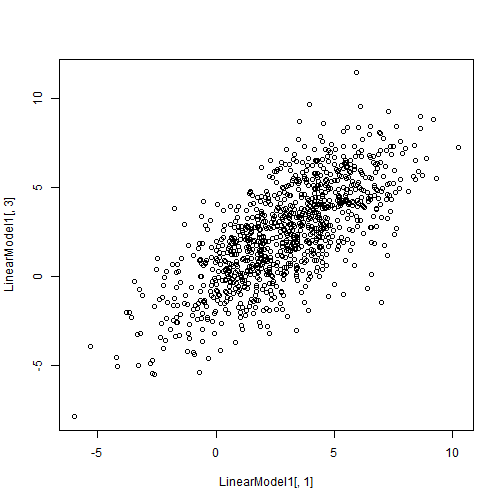

Week 6 Homework 2 - Design and Simulate Logisitic Regression Problem
========================================================
Brian Ritz
--------------------------------------------------------
MSCA 31007 Autumn 2014
--------------------------------------------------------

For my problem that can be solved, I will simulate data from the following situation:

Water is placed inside a freezer of constant temperature for 48 hours. At the end of 48 hours, the water is either observed as frozen or unfrozen, and the temperature of the freezer is taken with an unreliable thermometer. The thermometer's error can be simulated by a normal random variable with mean=0 and standard deviation = 2. I will use logistic regression to try to pinpoint the freezing point of water using 1000 repeats of the experiment.

First we will create our simulation data.


```r
# number of samples
nSample <- 1000

# outcome -- 1 for frozen, 0 for not frozen equal probability of each, although that is not necessary for the experiment
outcome <- rbinom(nSample, 1, .5)

freezing.temp <- 32

true.temp <- (runif(nSample)*5)*((outcome-.5)*-2) + freezing.temp
meas.temp <- true.temp+rnorm(nSample, 0, 2)

experimental.data <- data.frame(temp=meas.temp, frozen=outcome)

head(experimental.data)
```

```
##    temp frozen
## 1 32.08      0
## 2 32.28      0
## 3 30.74      1
## 4 37.47      0
## 5 34.95      0
## 6 27.49      1
```

```r
plot(experimental.data)
```

 

Now we use the glm function to approximate a simple logistic regression.


```r
model <- glm(frozen~temp, data=experimental.data, family=binomial(link=logit))
predicted.probabilities<- predict(model,type="response")

plot(experimental.data$temp,predicted.probabilities)
```

 


Let's find the temperature where we expect the probability of being frozen to cross from >.5 to <.5.

The probability can be expressed as a function of the temperature:
P(frozen = 1) = 1 / (1 + e^(-(Intercept.coef + temp.coef*temp)))

This can be rearraged into"log odds":

ln( P(frozen=1) / (1-P(frozen=1)) ) = Intercept.coef + temp.coef*temp

Plug in .5 for the probability and rarrange to find the temp.

ln(1) - Intercept.coef / temp.coef= temp

0 - Intercept.coef / temp.coef= temp

Therefore, the temperature at which water freezes according to our estimates should be the Intercept / the temperature coefficient.


```r
summary(model)
```

```
## 
## Call:
## glm(formula = frozen ~ temp, family = binomial(link = logit), 
##     data = experimental.data)
## 
## Deviance Residuals: 
##     Min       1Q   Median       3Q      Max  
## -2.6820  -0.4720  -0.0683   0.4879   2.7584  
## 
## Coefficients:
##             Estimate Std. Error z value Pr(>|z|)    
## (Intercept)  26.4821     1.6381    16.2   <2e-16 ***
## temp         -0.8286     0.0511   -16.2   <2e-16 ***
## ---
## Signif. codes:  0 '***' 0.001 '**' 0.01 '*' 0.05 '.' 0.1 ' ' 1
## 
## (Dispersion parameter for binomial family taken to be 1)
## 
##     Null deviance: 1385.62  on 999  degrees of freedom
## Residual deviance:  686.92  on 998  degrees of freedom
## AIC: 690.9
## 
## Number of Fisher Scoring iterations: 6
```

```r
print(model$coefficients)
```

```
## (Intercept)        temp 
##     26.4821     -0.8286
```

```r
est.freezing.temp <- -model$coefficients["(Intercept)"] / model$coefficients["temp"]
```

The estimated freezing point according to our model is 31.9613. This is very close to the freezing temp we used to simulate our data -- 32 degrees.


