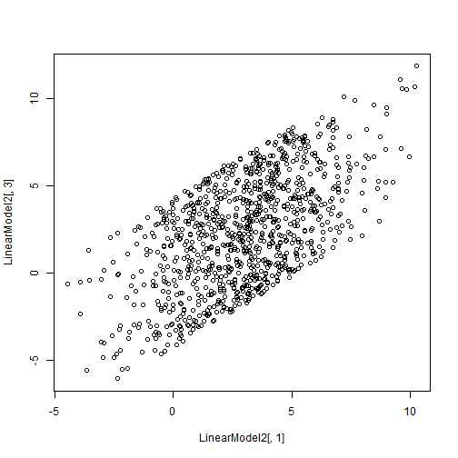
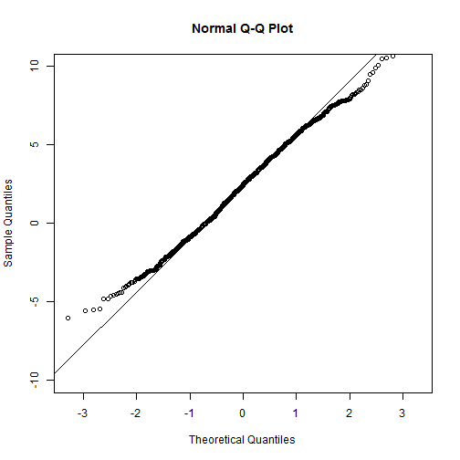
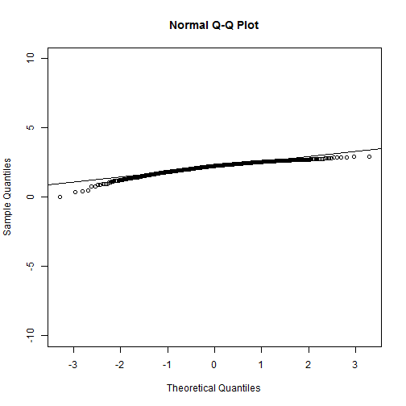
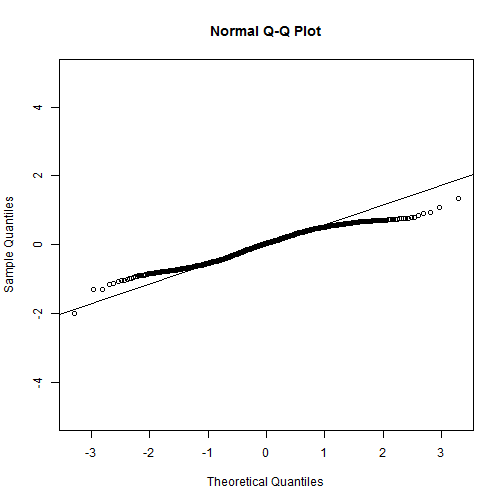

Week 6 Homework 1 - Logistic Regression
========================================================
Brian Ritz
--------------------------------------------------------
MSCA 31007 Autumn 2014
--------------------------------------------------------
Case 1
-----------------

We will try to unscrample the model generating functions again from Week 4, this time using logistic regression.

Read in the data


```r
# import the data
LinearModel.Training <- read.csv("C:/Users/Brian_Ritz/uchicago/statistical_analysis/hw/LinearModelCase1Training.csv")

nSample.Training<-length(LinearModel.Training[,1])
head(LinearModel.Training)
```

```
##     Input Output Model.Switch
## 1  7.6587 5.2133            0
## 2 -0.7749 0.3439            1
## 3  9.9633 7.2693            0
## 4  3.5232 3.9132            1
## 5  3.2498 3.5360            1
## 6 10.2054 7.2255            0
```

Now we also plot the dataset:


```r
plot(LinearModel.Training[,1],LinearModel.Training[,2], type="p",pch=19)
```

 

Now we separate the dataset based on the values in the thrid column.


```r
# Define training samples generated by model 1 and model 2
LinearModel.Training.1<-cbind(LinearModel.Training[,1],rep(NA,nSample.Training))
LinearModel.Training.2<-cbind(LinearModel.Training[,1],rep(NA,nSample.Training))

# this sets the output values for all values where the third column is 1
LinearModel.Training.1[LinearModel.Training[,3]*(1:nSample.Training),2]<-LinearModel.Training[LinearModel.Training[,3]*(1:nSample.Training),2]

# this sets the values for where the third column is 0
LinearModel.Training.2[(1-LinearModel.Training[,3])*(1:nSample.Training),2]<-LinearModel.Training[(1-LinearModel.Training[,3])*(1:nSample.Training),2]

# Print the first 10 rows to check the separation
cbind(LinearModel.Training,LinearModel.Training.1,LinearModel.Training.2)[1:10,]
```

```
##      Input  Output Model.Switch       1      2       1      2
## 1   7.6587  5.2133            0  7.6587     NA  7.6587  5.213
## 2  -0.7749  0.3439            1 -0.7749 0.3439 -0.7749     NA
## 3   9.9633  7.2693            0  9.9633     NA  9.9633  7.269
## 4   3.5232  3.9132            1  3.5232 3.9132  3.5232     NA
## 5   3.2498  3.5360            1  3.2498 3.5360  3.2498     NA
## 6  10.2054  7.2255            0 10.2054     NA 10.2054  7.226
## 7   4.2171  3.0516            0  4.2171     NA  4.2171  3.052
## 8   2.5947  2.3962            1  2.5947 2.3962  2.5947     NA
## 9  -1.3089 -1.3342            0 -1.3089     NA -1.3089 -1.334
## 10 -0.9927 -1.8690            0 -0.9927     NA -0.9927 -1.869
```

So now we have two datasets that represent the observations from the two model switch variables.

Plot the subsamples:


```r
# Plot the subsamples
matplot(LinearModel.Training[,1],cbind(LinearModel.Training.1[,2],LinearModel.Training.2[,2]),pch=16,col=c("green","blue"),ylab="Subsamples of the training sample")
```

 

Lets estimate a linear regression line for all of the data we just plotted.


```r
EstimatedLinearModel.Training<-lm(LinearModel.Training[,2]~LinearModel.Training[,1])
EstimatedLinearModel.Training$coefficients
```

```
##               (Intercept) LinearModel.Training[, 1] 
##                   0.09605                   0.79332
```

Let's see the summary.


```r
summary(EstimatedLinearModel.Training)
```

```
## 
## Call:
## lm(formula = LinearModel.Training[, 2] ~ LinearModel.Training[, 
##     1])
## 
## Residuals:
##    Min     1Q Median     3Q    Max 
## -1.856 -0.740  0.108  0.681  1.997 
## 
## Coefficients:
##                           Estimate Std. Error t value Pr(>|t|)    
## (Intercept)                 0.0961     0.0958     1.0     0.32    
## LinearModel.Training[, 1]   0.7933     0.0239    33.2   <2e-16 ***
## ---
## Signif. codes:  0 '***' 0.001 '**' 0.01 '*' 0.05 '.' 0.1 ' ' 1
## 
## Residual standard error: 0.878 on 198 degrees of freedom
## Multiple R-squared:  0.848,	Adjusted R-squared:  0.847 
## F-statistic: 1.11e+03 on 1 and 198 DF,  p-value: <2e-16
```

**INTERPRETATION**
The p-value of the intercept is .317, indicating that we do not have a lot of confidence that the true intercept of the model is different from 0. The parameter estimate of the X variable is .79332, indicating that for every increase in the first variable of magnitude 1, the 2nd variable increases by ~.79. The R squared for the model is .84, indicating that 84% of model total variance can be explained by differences in the model inputs.


Let's check out the residuals.

```r
EstimatedResiduals.Training<-EstimatedLinearModel.Training$residuals
plot(LinearModel.Training[,1],EstimatedResiduals.Training)
```

 

Plot residuals for observations from the two different models (as indicated by that third variable):


```r
# Define residuals corresponding to different models 
EstimatedResiduals.Training.1<-EstimatedResiduals.Training
EstimatedResiduals.Training.2<-EstimatedResiduals.Training
EstimatedResiduals.Training.1[(LinearModel.Training[,3]==0)*(1:nSample.Training)]<-NA
EstimatedResiduals.Training.2[(LinearModel.Training[,3]==1)*(1:nSample.Training)]<-NA
# Print the first ten columns to check the separation 
cbind(EstimatedResiduals.Training,EstimatedResiduals.Training.1,EstimatedResiduals.Training.2,LinearModel.Training[,3])[1:10,]
```

```
##    EstimatedResiduals.Training EstimatedResiduals.Training.1
## 1                      -0.9585                            NA
## 2                       0.8626                        0.8626
## 3                      -0.7309                            NA
## 4                       1.0221                        1.0221
## 5                       0.8618                        0.8618
## 6                      -0.9667                            NA
## 7                      -0.3900                            NA
## 8                       0.2417                        0.2417
## 9                      -0.3919                            NA
## 10                     -1.1775                            NA
##    EstimatedResiduals.Training.2  
## 1                        -0.9585 0
## 2                             NA 1
## 3                        -0.7309 0
## 4                             NA 1
## 5                             NA 1
## 6                        -0.9667 0
## 7                        -0.3900 0
## 8                             NA 1
## 9                        -0.3919 0
## 10                       -1.1775 0
```


Plot the residuals again, and coloring them by model. 

```r
# Plot the residuals corresponding to different models
matplot(LinearModel.Training[,1],cbind(EstimatedResiduals.Training.1,EstimatedResiduals.Training.2),pch=16,col=c("green","blue"),ylab="Separated parts of the training sample")
```

 

The residuals for the first model (the model with 1's in the third variable) are mostly greater than 0, while the residuals for the second model are mostly negative. This means that the first group of observations mostly lie above the regression line, while the second group of observations lie below the regression line. This means that the two groups of observations can most likely should be estimated by two different lines.


**Now we try to separate the clusters of residuals using Logistic Regression**


```r
# Create the data frame for logistic regression
Logistic.Model.Data<-data.frame(Logistic.Output=LinearModel.Training[,3],Logistic.Input=EstimatedResiduals.Training)
LinearModel.Training.Logistic<-glm(Logistic.Output~Logistic.Input,data=Logistic.Model.Data,family=binomial(link=logit))
summary(LinearModel.Training.Logistic)
```

```
## 
## Call:
## glm(formula = Logistic.Output ~ Logistic.Input, family = binomial(link = logit), 
##     data = Logistic.Model.Data)
## 
## Deviance Residuals: 
##     Min       1Q   Median       3Q      Max  
## -2.9042  -0.0909   0.0163   0.1531   2.9201  
## 
## Coefficients:
##                Estimate Std. Error z value Pr(>|z|)    
## (Intercept)       0.475      0.338    1.41     0.16    
## Logistic.Input    6.438      1.058    6.09  1.2e-09 ***
## ---
## Signif. codes:  0 '***' 0.001 '**' 0.01 '*' 0.05 '.' 0.1 ' ' 1
## 
## (Dispersion parameter for binomial family taken to be 1)
## 
##     Null deviance: 275.978  on 199  degrees of freedom
## Residual deviance:  61.733  on 198  degrees of freedom
## AIC: 65.73
## 
## Number of Fisher Scoring iterations: 7
```

I use the predict function to find the probability of the first model.


```r
Predicted.Probabilities.Training<-predict(LinearModel.Training.Logistic,type="response")
plot(LinearModel.Training[,1],Predicted.Probabilities.Training)
```

 

This graph shows that most observations are fairly well predicted. They either have a very high probability or very low probability of belonging to the first model. This means that the model is not "unsure" about the majority of the observations. 


Now lets use that predicted values from the logistic regression to determine which point belongs to which point. We partition out the residuals from the original model according to which group we estimate the model belonging to. Then we can use those values further in the analysis to determine two models for the two different groups of observations.


```r
# Create the unscrambling sequence for the training sample
Unscrambling.Sequence.Training.Logistic<-(predict(LinearModel.Training.Logistic,type="response")>.5)*1
# Create classified residuals
ClassifiedResiduals.Training.1<-EstimatedResiduals.Training
ClassifiedResiduals.Training.2<-EstimatedResiduals.Training
ClassifiedResiduals.Training.1[(Unscrambling.Sequence.Training.Logistic==0)*(1:nSample.Training)]<-NA
ClassifiedResiduals.Training.2[(Unscrambling.Sequence.Training.Logistic==1)*(1:nSample.Training)]<-NA

# we now have the residuals by group as estimated by our logistic model
# Print first 10 rows to check
cbind(EstimatedResiduals.Training,ClassifiedResiduals.Training.1,ClassifiedResiduals.Training.2)[1:10,]
```

```
##    EstimatedResiduals.Training ClassifiedResiduals.Training.1
## 1                      -0.9585                             NA
## 2                       0.8626                         0.8626
## 3                      -0.7309                             NA
## 4                       1.0221                         1.0221
## 5                       0.8618                         0.8618
## 6                      -0.9667                             NA
## 7                      -0.3900                             NA
## 8                       0.2417                         0.2417
## 9                      -0.3919                             NA
## 10                     -1.1775                             NA
##    ClassifiedResiduals.Training.2
## 1                         -0.9585
## 2                              NA
## 3                         -0.7309
## 4                              NA
## 5                              NA
## 6                         -0.9667
## 7                         -0.3900
## 8                              NA
## 9                         -0.3919
## 10                        -1.1775
```


```r
# Plot both classes of the residuals
matplot(LinearModel.Training[,1],cbind(ClassifiedResiduals.Training.1,ClassifiedResiduals.Training.2),pch=16,col=c("green","blue"),ylab="Classified residuals, X-axis at 0")
axis(1,pos=0)
```

 


```r
Classification.Rule.Logistic<--LinearModel.Training.Logistic$coefficients[1]/LinearModel.Training.Logistic$coefficients[2]
Classification.Rule.Logistic
```

```
## (Intercept) 
##     -0.0738
```

The classification rule we used previously in assignment 4 is whether or not the residual from the original model was greater than or equal to zero.

The classification rule estimated by logistic regression is whether or not the residual is above or below -0.0738.


```r
matplot(LinearModel.Training[,1],cbind(ClassifiedResiduals.Training.1,ClassifiedResiduals.Training.2),pch=16,col=c("green","blue"),ylab="Classified residuals, X-axis at the rule level")
axis(1,pos=Classification.Rule.Logistic)
```

 


**NOW LETS APPLY THAT TO THE TRAINING DATASET**
Read in the sample.


```r
LinearModel<-read.csv(file="C:/Users/Brian_Ritz/uchicago/statistical_analysis/hw/LinearModelCase1.csv",header=TRUE,sep=",")

nSample<-length(LinearModel[,1])
LinearModel[1:10,]
```

```
##     X      X.1 LinearModel
## 1   1  4.95423      5.3789
## 2   2  2.23662      1.1761
## 3   3  3.84540      1.8389
## 4   4  1.14640      0.8422
## 5   5  5.18165      2.5158
## 6   6 -1.10516     -1.9829
## 7   7  0.07713     -0.3956
## 8   8  5.35590      3.5119
## 9   9  6.63841      4.6648
## 10 10  3.66413      3.6976
```


Estimated linear model from the main sample

```r
EstimatedLinearModel<-lm(LinearModel[,2]~LinearModel[,1])
EstimatedLinearModel$coefficients
```

```
##      (Intercept) LinearModel[, 1] 
##        3.059e+00       -7.681e-05
```

Get the residuals.


```r
EstimatedResiduals<-EstimatedLinearModel$residuals
plot(LinearModel[,1],EstimatedResiduals)
```

 


Define the predicted probabilities and unscrambling sequence for the main sample.
Note: the function predict uses the argument newdata. This argument should be a data frame with the same names of variables as the data frame used to estimate logistic model. But the residuals in this data frame are from the main sample.


```r
Unscrambling.Sequence.Logistic<-(predict(LinearModel.Training.Logistic,newdata=data.frame(Logistic.Output=EstimatedResiduals,Logistic.Input=EstimatedResiduals),type="response")>.5)*1
```

Estimate probability of the model classified as first. Check the hypothesis p=0.5 against two-sided alternative.


```r
Probability<-sum(Unscrambling.Sequence.Logistic)/length(Unscrambling.Sequence.Logistic)
Probability
```

```
## [1] 0.52
```


```r
binom.test(sum(Unscrambling.Sequence.Logistic),nSample,p=.5,alternative="t")
```

```
## 
## 	Exact binomial test
## 
## data:  sum(Unscrambling.Sequence.Logistic) and nSample
## number of successes = 520, number of trials = 1000, p-value =
## 0.2174
## alternative hypothesis: true probability of success is not equal to 0.5
## 95 percent confidence interval:
##  0.4885 0.5514
## sample estimates:
## probability of success 
##                   0.52
```

We see from the binomial test that we cannot rule out that the sequence is the result of a simple bernoulli experiment with p=.5.

Classify the residuals of the main sample into 2 groups using the logistic model classifier.


```r
# Create classified residuals
ClassifiedResiduals.1<-EstimatedResiduals
ClassifiedResiduals.2<-EstimatedResiduals
ClassifiedResiduals.1[(Unscrambling.Sequence.Logistic==0)*(1:nSample)]<-NA
ClassifiedResiduals.2[(Unscrambling.Sequence.Logistic==1)*(1:nSample)]<-NA
# Print first 10 rows to check
cbind(EstimatedResiduals,ClassifiedResiduals.1,ClassifiedResiduals.2)[1:10,]
```

```
##    EstimatedResiduals ClassifiedResiduals.1 ClassifiedResiduals.2
## 1              1.8948                1.8948                    NA
## 2             -0.8227                    NA               -0.8227
## 3              0.7862                0.7862                    NA
## 4             -1.9128                    NA               -1.9128
## 5              2.1226                2.1226                    NA
## 6             -4.1642                    NA               -4.1642
## 7             -2.9818                    NA               -2.9818
## 8              2.2970                2.2970                    NA
## 9              3.5796                3.5796                    NA
## 10             0.6054                0.6054                    NA
```


```r
# Plot both classes of the residuals
matplot(LinearModel[,1],cbind(ClassifiedResiduals.1,ClassifiedResiduals.2),pch=16,col=c("green","blue"),ylab="Classes of the main sample, X-axis at 0")
axis(1,pos=0)
```

 


```r
matplot(LinearModel[,1],cbind(ClassifiedResiduals.1,ClassifiedResiduals.2),pch=16,col=c("green","blue"),ylab="Classes of the main sample, X-axis at the rule level")
axis(1,pos=Classification.Rule.Logistic)
```

 

Both residuals look good -- no patterns.

Separate the given sample into 2 subsamples using the trained logistic model.


```r
# Create recovered models
LinearModel1.Recovered<-LinearModel
LinearModel2.Recovered<-LinearModel
LinearModel1.Recovered[(1-Unscrambling.Sequence.Logistic)*(1:nSample),2]<-NA
LinearModel2.Recovered[Unscrambling.Sequence.Logistic*(1:nSample),2]<-NA
# Print the first 1 rows of scrambled and unscrambled samples
cbind(LinearModel,LinearModel1.Recovered,LinearModel2.Recovered)[1:10,]
```

```
##     X      X.1 LinearModel  X   X.1 LinearModel  X      X.1 LinearModel
## 1   1  4.95423      5.3789  1 4.954      5.3789  1       NA      5.3789
## 2   2  2.23662      1.1761  2    NA      1.1761  2  2.23662      1.1761
## 3   3  3.84540      1.8389  3 3.845      1.8389  3       NA      1.8389
## 4   4  1.14640      0.8422  4    NA      0.8422  4  1.14640      0.8422
## 5   5  5.18165      2.5158  5 5.182      2.5158  5       NA      2.5158
## 6   6 -1.10516     -1.9829  6    NA     -1.9829  6 -1.10516     -1.9829
## 7   7  0.07713     -0.3956  7    NA     -0.3956  7  0.07713     -0.3956
## 8   8  5.35590      3.5119  8 5.356      3.5119  8       NA      3.5119
## 9   9  6.63841      4.6648  9 6.638      4.6648  9       NA      4.6648
## 10 10  3.66413      3.6976 10 3.664      3.6976 10       NA      3.6976
```


```r
# Plot the unscrambled subsamples
matplot(LinearModel[,1],cbind(LinearModel1.Recovered[,2],LinearModel2.Recovered[,2]), type="p",col=c("green","blue"),pch=19,ylab="Separated Subsamples")
```

 

Now estimate the linear models from the subsamples.

```r
LinearModel1.Recovered.lm<-lm(LinearModel1.Recovered[,2]~LinearModel1.Recovered[,1])
LinearModel2.Recovered.lm<-lm(LinearModel2.Recovered[,2]~LinearModel2.Recovered[,1])
```

Compare the results of fitting of the first recovered linear model:

```r
summary(LinearModel1.Recovered.lm)
```

```
## 
## Call:
## lm(formula = LinearModel1.Recovered[, 2] ~ LinearModel1.Recovered[, 
##     1])
## 
## Residuals:
##    Min     1Q Median     3Q    Max 
## -2.099 -1.198 -0.333  0.891  6.334 
## 
## Coefficients:
##                             Estimate Std. Error t value Pr(>|t|)    
## (Intercept)                 4.885087   0.135129   36.15   <2e-16 ***
## LinearModel1.Recovered[, 1] 0.000173   0.000234    0.74     0.46    
## ---
## Signif. codes:  0 '***' 0.001 '**' 0.01 '*' 0.05 '.' 0.1 ' ' 1
## 
## Residual standard error: 1.54 on 518 degrees of freedom
##   (480 observations deleted due to missingness)
## Multiple R-squared:  0.00105,	Adjusted R-squared:  -0.000877 
## F-statistic: 0.545 on 1 and 518 DF,  p-value: 0.461
```

and the second recovered linear model:

```r
summary(LinearModel2.Recovered.lm)
```

```
## 
## Call:
## lm(formula = LinearModel2.Recovered[, 2] ~ LinearModel2.Recovered[, 
##     1])
## 
## Residuals:
##    Min     1Q Median     3Q    Max 
## -6.795 -0.886  0.313  1.254  2.111 
## 
## Coefficients:
##                              Estimate Std. Error t value Pr(>|t|)    
## (Intercept)                  1.071709   0.141303    7.58  1.8e-13 ***
## LinearModel2.Recovered[, 1] -0.000327   0.000244   -1.34     0.18    
## ---
## Signif. codes:  0 '***' 0.001 '**' 0.01 '*' 0.05 '.' 0.1 ' ' 1
## 
## Residual standard error: 1.55 on 478 degrees of freedom
##   (520 observations deleted due to missingness)
## Multiple R-squared:  0.00374,	Adjusted R-squared:  0.00165 
## F-statistic: 1.79 on 1 and 478 DF,  p-value: 0.181
```

The results of the first and second linear model differ differ in their estimate of the intercept. Both of the models' estimates for the slope parameters is not significantly different from zero, so we cannot rule out that their slopes are the same. However, model1's estimate of the intercept is 4.88, while model2's estimate of the intercept is materially different, coming in at 1.0717.


Compare the summaries of the mix with the summary of the single linear model fit.

```r
# summary of single linear model fit
summary(EstimatedLinearModel)
```

```
## 
## Call:
## lm(formula = LinearModel[, 2] ~ LinearModel[, 1])
## 
## Residuals:
##    Min     1Q Median     3Q    Max 
## -9.031 -1.735 -0.002  1.693  8.245 
## 
## Coefficients:
##                   Estimate Std. Error t value Pr(>|t|)    
## (Intercept)       3.06e+00   1.62e-01   18.94   <2e-16 ***
## LinearModel[, 1] -7.68e-05   2.80e-04   -0.27     0.78    
## ---
## Signif. codes:  0 '***' 0.001 '**' 0.01 '*' 0.05 '.' 0.1 ' ' 1
## 
## Residual standard error: 2.55 on 998 degrees of freedom
## Multiple R-squared:  7.57e-05,	Adjusted R-squared:  -0.000926 
## F-statistic: 0.0755 on 1 and 998 DF,  p-value: 0.784
```
The single model linear fit had a near 0 parameter for the effect of the input variable, with a non-zero parameter for the intercept. This differs from the two estimates of two models unscrambled according to logistic regression. In the two models method, we found the intercepts to both be non-distinguishable from 0, and the coefficients on the input variable to be greater than zero in both cases.


Plot the residuals estimated by a single linear model and the residuals of the unscrambled mix. Estimate standard deviations of the two samples of residuals:


```r
# Plot residuals
Residuals.Comparison<-cbind(Unscrambled.residuals=c(summary(LinearModel1.Recovered.lm)$residuals,summary(LinearModel2.Recovered.lm)$residuals),Single.Model.residuals=EstimatedResiduals)
matplot(Residuals.Comparison,type="p",pch=16,ylab="Residuals before and after unscrabling")
```

 


```r
# Estimate standard deviations
apply(Residuals.Comparison,2,sd)
```

```
##  Unscrambled.residuals Single.Model.residuals 
##                  1.541                  2.550
```

The sample was mixed using estimated binomial probability of `probability`

Binomial test does not reject the hypothesis p=0.5 against the two-sided alternative.

The mixed models have the following estimated parameters:

```r
rbind(LinearModel1.Recovered.lm$coefficients,LinearModel2.Recovered.lm$coefficients)
```

```
##      (Intercept) LinearModel1.Recovered[, 1]
## [1,]       4.885                   0.0001729
## [2,]       1.072                  -0.0003270
```

  
