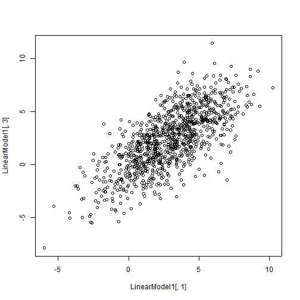
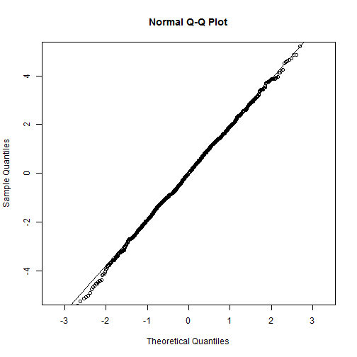
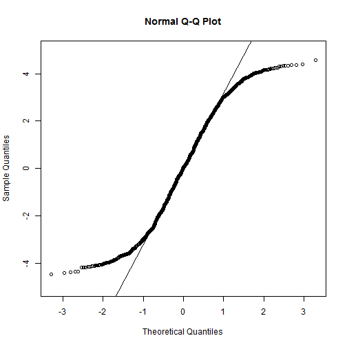
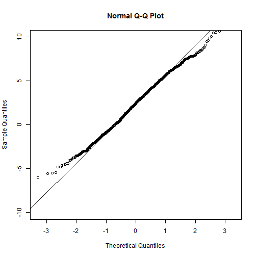
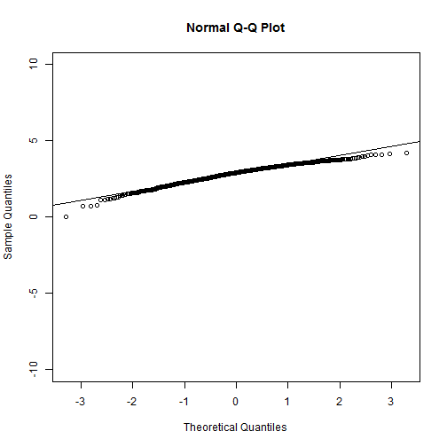
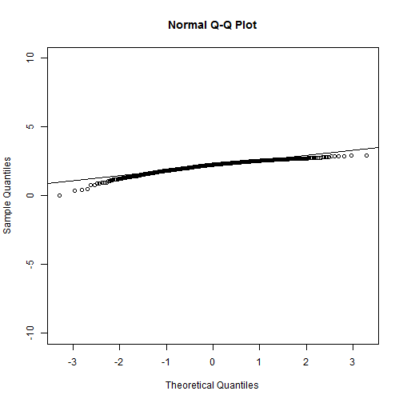
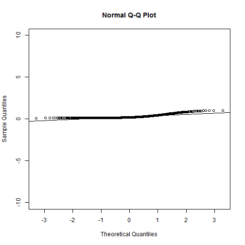
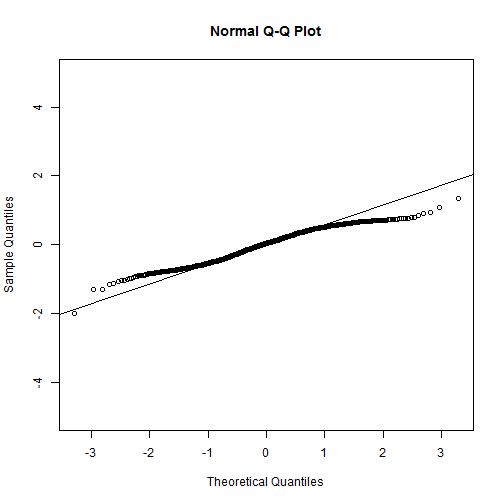

Week 7 Homework 1 - Exercise on Robustness and Transformations
========================================================
Brian Ritz
--------------------------------------------------------
MSCA 31007 Autumn 2014
--------------------------------------------------------


**STEP 1: Simulate a Normal Linear Model**


```r
# This code is based on script Robustness.R
# Slope and Intercept
a<-.8; b<-.1

# Model 1 (Normal)
set.seed(458769)
# Variable X~Norm(3,2.5)
X<-rnorm(n=1000,mean=3,sd=2.5)
# Residuals Eps~Norm(0.1.5)
Eps<-rnorm(n=1000,mean=0,sd=2)
Y<-a*X+b+Eps
LinearModel1<-cbind(X,Eps,Y)
plot(LinearModel1[,1],LinearModel1[,3])
```

 

Now we fit a linear model to the simulated data:


```r
# Fit linear model
Model1.lm<-lm(LinearModel1[,3]~LinearModel1[,1])
summary(Model1.lm)
```

```
## 
## Call:
## lm(formula = LinearModel1[, 3] ~ LinearModel1[, 1])
## 
## Residuals:
##    Min     1Q Median     3Q    Max 
## -7.167 -1.239 -0.005  1.340  6.631 
## 
## Coefficients:
##                   Estimate Std. Error t value Pr(>|t|)    
## (Intercept)         0.0484     0.0944    0.51     0.61    
## LinearModel1[, 1]   0.8025     0.0246   32.62   <2e-16 ***
## ---
## Signif. codes:  0 '***' 0.001 '**' 0.01 '*' 0.05 '.' 0.1 ' ' 1
## 
## Residual standard error: 1.95 on 998 degrees of freedom
## Multiple R-squared:  0.516,	Adjusted R-squared:  0.515 
## F-statistic: 1.06e+03 on 1 and 998 DF,  p-value: <2e-16
```

Let's also take a look at the Q-Q plots of the residuals.


```r
qqnorm(Model1.lm$residuals,ylim=c(-5,5))
qqline(Model1.lm$residuals)
```

 

The plots look mostly good. The closer the points are to the qqline, the better the data fits to a normal distribution. There may be some slight left skew, because the points on the left hand part of the graph is below the line. However, most of the points are close to the line, indicating that thes residuals mostly follow a normal distribution.

**STEP 2: SIMULATE SAME MODEL WITH UNIFORM RESIDUALS**

First, create the dummy data.


```r
# Model 2 (Uniform)
# Normal X, Uniform Eps 
X<-rnorm(n=1000,mean=3,sd=2.5)
Eps<-runif(n=1000,min=-4.33,max=4.33)
Y<-a*X+b+Eps
LinearModel2<-cbind(X,Eps,Y)
plot(LinearModel2[,1],LinearModel2[,3])
```

 

Now we estimate a model for the data.


```r
# Estimate linear model; evaluate the distribution of the residuals
Unif.lm<-lm(LinearModel2[,3]~LinearModel2[,1])
summary(Unif.lm)
```

```
## 
## Call:
## lm(formula = LinearModel2[, 3] ~ LinearModel2[, 1])
## 
## Residuals:
##    Min     1Q Median     3Q    Max 
## -4.474 -2.184  0.029  2.143  4.581 
## 
## Coefficients:
##                   Estimate Std. Error t value Pr(>|t|)    
## (Intercept)          0.170      0.123    1.37     0.17    
## LinearModel2[, 1]    0.743      0.032   23.22   <2e-16 ***
## ---
## Signif. codes:  0 '***' 0.001 '**' 0.01 '*' 0.05 '.' 0.1 ' ' 1
## 
## Residual standard error: 2.5 on 998 degrees of freedom
## Multiple R-squared:  0.351,	Adjusted R-squared:  0.35 
## F-statistic:  539 on 1 and 998 DF,  p-value: <2e-16
```

And we also check the Q-Q Plot:


```r
qqnorm(Unif.lm$residuals,ylim=c(-5,5))
qqline(Unif.lm$residuals)
```

 

This Q-Q plot of the residuals shows a difinitive short tails distribution. This means that the tails hold less density than a normal distribution.

**STEP 3: Try Different Transformations on the Output**

First plot the output, so we have something to compare to...


```r
# Q-Q Plot of the output of the model with uniform residuals
qqnorm(LinearModel2[,3],ylim=c(-10,10))
qqline(LinearModel2[,3])
```

 

Now let's try a square root transformation.


```r
# Square root
qqnorm(sqrt(LinearModel2[,3]-min(LinearModel2[,3])),ylim=c(-10,10))
qqline(sqrt(LinearModel2[,3]-min(LinearModel2[,3])))
```

 

This looks a little better, but the ends are still both below the line. This implies a monotonic negative first derivative, which in turn implies that this data distribution is skewed to the left.

Next, we try the log transformation.


```r
# Log
qqnorm(log(LinearModel2[,3]-min(LinearModel2[,3])+1),ylim=c(-10,10))
qqline(log(LinearModel2[,3]-min(LinearModel2[,3])+1))
```

 

This Q-Q Plot looks similar to the square root transformation. There is a slight left skew. Still, it is closer to the line than the original Q-Q Plot of the untransformed data.

Next, I try the inverse transformation.


```r
# Inverse
qqnorm(1/(LinearModel2[,2]-min(LinearModel2[,2])+1),ylim=c(-10,10))
qqline(1/(LinearModel2[,2]-min(LinearModel2[,2])+1))
```

 

This plot shows both ends above the Q-Q Line, implying that perhaps this distribution is slightly skewed right. 

All of these transformations show points closer the the Q-Q Line than the untransformed outputs. This implies that all of the transformations will help with the non-normality of residuals when estimated by our model.

**STEP 4: FIT LINEAR MODEL TO MODIFIED DATA**

We chose the square root transformation to mitigate the non-normality of residuals from our first estimation of our model.


```r
Unif.lm.Mod<-lm(sqrt(LinearModel2[,3]-min(LinearModel2[,3]))~sqrt(LinearModel2[,1]-min(LinearModel2[,1])))
summary(Unif.lm.Mod)
```

```
## 
## Call:
## lm(formula = sqrt(LinearModel2[, 3] - min(LinearModel2[, 3])) ~ 
##     sqrt(LinearModel2[, 1] - min(LinearModel2[, 1])))
## 
## Residuals:
##     Min      1Q  Median      3Q     Max 
## -1.9933 -0.3775  0.0408  0.3925  1.3462 
## 
## Coefficients:
##                                                  Estimate Std. Error
## (Intercept)                                        0.9825     0.0824
## sqrt(LinearModel2[, 1] - min(LinearModel2[, 1]))   0.6938     0.0302
##                                                  t value Pr(>|t|)    
## (Intercept)                                         11.9   <2e-16 ***
## sqrt(LinearModel2[, 1] - min(LinearModel2[, 1]))    22.9   <2e-16 ***
## ---
## Signif. codes:  0 '***' 0.001 '**' 0.01 '*' 0.05 '.' 0.1 ' ' 1
## 
## Residual standard error: 0.466 on 998 degrees of freedom
## Multiple R-squared:  0.346,	Adjusted R-squared:  0.345 
## F-statistic:  527 on 1 and 998 DF,  p-value: <2e-16
```

Now we plot the two Q-Q Plots-- first from our original first model, and then from our new transformed model. We compare the two.


```r
# Compare qq-plots of residuals 
# Original linear model
qqnorm(Unif.lm$residuals,ylim=c(-5,5))
qqline(Unif.lm$residuals)
```

 

We've seen this before. This indicates "skinny tails."

And now the transformed data:


```r
# Modified linear model
qqnorm(Unif.lm.Mod$residuals,ylim=c(-5,5))
qqline(Unif.lm.Mod$residuals)
```

 

The q-q plot is higher than the q-q line on the left hand side, and lower than the line on the right hand side. This indicates short tails at both ends of the distributions, but it is not as bad as before the transformation.
