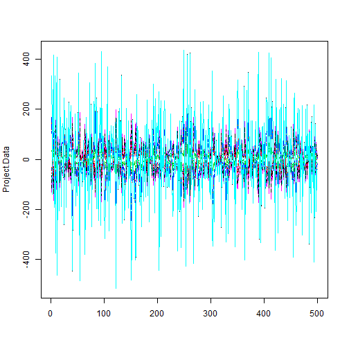

Week 8 Homework 1 - One Way Anova Examples
========================================================
Brian Ritz
--------------------------------------------------------
MSCA 31007 Autumn 2014
--------------------------------------------------------


First, load packages


```r
library(faraway)
library(fastR)
```

```
## Loading required package: mosaic
## Loading required package: car
## 
## Attaching package: 'car'
## 
## The following objects are masked from 'package:faraway':
## 
##     logit, vif
## 
## Loading required package: dplyr
## 
## Attaching package: 'dplyr'
## 
## The following objects are masked from 'package:stats':
## 
##     filter, lag
## 
## The following objects are masked from 'package:base':
## 
##     intersect, setdiff, setequal, union
## 
## Loading required package: lattice
## 
## Attaching package: 'lattice'
## 
## The following object is masked from 'package:faraway':
## 
##     melanoma
## 
## Loading required package: ggplot2
## 
## Attaching package: 'mosaic'
## 
## The following objects are masked from 'package:dplyr':
## 
##     do, tally
## 
## The following object is masked from 'package:car':
## 
##     logit
## 
## The following objects are masked from 'package:faraway':
## 
##     ilogit, logit
## 
## The following objects are masked from 'package:stats':
## 
##     binom.test, cor, cov, D, fivenum, IQR, median, prop.test, sd,
##     t.test, var
## 
## The following objects are masked from 'package:base':
## 
##     max, mean, min, prod, range, sample, sum
## 
## 
## Attaching package: 'fastR'
## 
## The following object is masked from 'package:faraway':
## 
##     punting
## 
## The following object is masked from 'package:graphics':
## 
##     panel.smooth
```

```r
# the example data is coagulation
print(coagulation)
```

```
##    coag diet
## 1    62    A
## 2    60    A
## 3    63    A
## 4    59    A
## 5    63    B
## 6    67    B
## 7    71    B
## 8    64    B
## 9    65    B
## 10   66    B
## 11   68    C
## 12   66    C
## 13   71    C
## 14   67    C
## 15   68    C
## 16   68    C
## 17   56    D
## 18   62    D
## 19   60    D
## 20   61    D
## 21   63    D
## 22   64    D
## 23   63    D
## 24   59    D
```

Plot the coagulation data


```r
xyplot(coag~diet, data=coagulation, pch=19,col="black")
```

 

**Evaluate the means with your intuition**
Looking at this visually, it looks like the means of A, B, and C diets are all different, with mean(C)>mean(B)>mean(A). It appears to my intuition that mean(D) = mean(A).

Now we check by computing simple statistics for the data:

```r
# favstats will give mean, median, min, max,n, Q1, Q3, sd, n, and missing n
coag.data.statistics<-favstats(coag~diet,data=coagulation)
coag.data.statistics
```

```
##   .group min    Q1 median    Q3 max mean    sd n missing
## 1      A  59 59.75   61.0 62.25  63   61 1.826 4       0
## 2      B  63 64.25   65.5 66.75  71   66 2.828 6       0
## 3      C  66 67.25   68.0 68.00  71   68 1.673 6       0
## 4      D  56 59.75   61.5 63.00  64   61 2.619 8       0
```

Look at the means:

```r
coag.means<-cbind(mean=coag.data.statistics[,7],size=coag.data.statistics[,9])
coag.means
```

```
##      mean size
## [1,]   61    4
## [2,]   66    6
## [3,]   68    6
## [4,]   61    8
```

Now we fit a linear model of diet on coag, we will look at the summary:

```r
coag.model<-lm(coag~diet,data=coagulation)
summary(coag.model)
```

```
## 
## Call:
## lm(formula = coag ~ diet, data = coagulation)
## 
## Residuals:
##    Min     1Q Median     3Q    Max 
##  -5.00  -1.25   0.00   1.25   5.00 
## 
## Coefficients:
##             Estimate Std. Error t value Pr(>|t|)    
## (Intercept) 6.10e+01   1.18e+00   51.55  < 2e-16 ***
## dietB       5.00e+00   1.53e+00    3.27  0.00380 ** 
## dietC       7.00e+00   1.53e+00    4.58  0.00018 ***
## dietD       2.99e-15   1.45e+00    0.00  1.00000    
## ---
## Signif. codes:  0 '***' 0.001 '**' 0.01 '*' 0.05 '.' 0.1 ' ' 1
## 
## Residual standard error: 2.37 on 20 degrees of freedom
## Multiple R-squared:  0.671,	Adjusted R-squared:  0.621 
## F-statistic: 13.6 on 3 and 20 DF,  p-value: 4.66e-05
```

The model treats the diet variable as a dummy variable, with diet A being the default (all dummy vars turned off). The fact that the dietB and dietC variables are significant means that when the diet is either B or C, the mean of the coag variable can be expected to be higher by the parameter estimate, which is 5 for dietB and 7 for dietC. 

Fit anova regression to model:

```r
anova(coag.model)
```

```
## Analysis of Variance Table
## 
## Response: coag
##           Df Sum Sq Mean Sq F value  Pr(>F)    
## diet       3    228    76.0    13.6 4.7e-05 ***
## Residuals 20    112     5.6                    
## ---
## Signif. codes:  0 '***' 0.001 '**' 0.01 '*' 0.05 '.' 0.1 ' ' 1
```
The diet variable is significant in the anova model as well.

We will now create a matrix of inputs for ANOVA. **WHY DO WE CREATE THREE INPUTS FOR 4 DIETS?** Because one of the diets will be represented by all of the input variables being false. 4 variables would "over determine" the system, and create multi-coliniarity.


```r
coag<-coagulation
coag$x1<-coag$diet=="B"
coag$x2<-coag$diet=="C"
coag$x3<-coag$diet=="D"
coag
```

```
##    coag diet    x1    x2    x3
## 1    62    A FALSE FALSE FALSE
## 2    60    A FALSE FALSE FALSE
## 3    63    A FALSE FALSE FALSE
## 4    59    A FALSE FALSE FALSE
## 5    63    B  TRUE FALSE FALSE
## 6    67    B  TRUE FALSE FALSE
## 7    71    B  TRUE FALSE FALSE
## 8    64    B  TRUE FALSE FALSE
## 9    65    B  TRUE FALSE FALSE
## 10   66    B  TRUE FALSE FALSE
## 11   68    C FALSE  TRUE FALSE
## 12   66    C FALSE  TRUE FALSE
## 13   71    C FALSE  TRUE FALSE
## 14   67    C FALSE  TRUE FALSE
## 15   68    C FALSE  TRUE FALSE
## 16   68    C FALSE  TRUE FALSE
## 17   56    D FALSE FALSE  TRUE
## 18   62    D FALSE FALSE  TRUE
## 19   60    D FALSE FALSE  TRUE
## 20   61    D FALSE FALSE  TRUE
## 21   63    D FALSE FALSE  TRUE
## 22   64    D FALSE FALSE  TRUE
## 23   63    D FALSE FALSE  TRUE
## 24   59    D FALSE FALSE  TRUE
```

Fit full and null linear models for coag~x1+x2+x3 (all inputs) and coag~1 (intercept only).
Compare the two models using anova.

```r
coag.model.full<-lm(coag~x1+x2+x3, data=coag)
coag.model.null<-lm(coag~1,data=coag)
anova(coag.model.null,coag.model.full)
```

```
## Analysis of Variance Table
## 
## Model 1: coag ~ 1
## Model 2: coag ~ x1 + x2 + x3
##   Res.Df RSS Df Sum of Sq    F  Pr(>F)    
## 1     23 340                              
## 2     20 112  3       228 13.6 4.7e-05 ***
## ---
## Signif. codes:  0 '***' 0.001 '**' 0.01 '*' 0.05 '.' 0.1 ' ' 1
```

We get the same results as before when we ran the ANOVA just on the diet dummy variables.

Now we will manually calculate the sum of squares from the ANOVA.
We need to get a grand mean and vector of group means

```r
# grand mean
grand.mean<-mean(coagulation$coag)
grand.mean
```

```
## [1] 64
```

```r
# group means
create.vector.of.means<-function(my.group.data) {
  rep(my.group.data[1],my.group.data[2])
}
group.mean<-unlist(apply(coag.means,1,create.vector.of.means))
group.mean
```

```
## mean mean mean mean mean mean mean mean mean mean mean mean mean mean mean 
##   61   61   61   61   66   66   66   66   66   66   68   68   68   68   68 
## mean mean mean mean mean mean mean mean mean 
##   68   61   61   61   61   61   61   61   61
```

Now that we have the grand mean and the group means, we can calculate the sum of squares:

```r
SST<-sum((coagulation$coag-grand.mean)^2)
SSE<-sum((coagulation$coag-group.mean)^2)
SSM<-sum((group.mean-grand.mean)^2)
print(SST)
```

```
## [1] 340
```

```r
print(SSE)
```

```
## [1] 112
```

```r
print(SSM)
```

```
## [1] 228
```

Let's compare our manually created sum of squares to summary(coag.model):

```r
names(summary(coag.model))
```

```
##  [1] "call"          "terms"         "residuals"     "coefficients" 
##  [5] "aliased"       "sigma"         "df"            "r.squared"    
##  [9] "adj.r.squared" "fstatistic"    "cov.unscaled"
```

```r
names(anova(coag.model))
```

```
## [1] "Df"      "Sum Sq"  "Mean Sq" "F value" "Pr(>F)"
```

```r
sumsq <-anova(coag.model)["Sum Sq"][,1]

#check that SST equals:
print(sum(sumsq))
```

```
## [1] 340
```

```r
print(SST)
```

```
## [1] 340
```

```r
# check that SSE equals

print(sumsq[2] )
```

```
## [1] 112
```

```r
print(SSE)
```

```
## [1] 112
```

```r
# check that SSM equals 
print(sumsq[1])
```

```
## [1] 228
```

```r
print(SSM)
```

```
## [1] 228
```

Yes, our manual computation matches the anova formula.

Check what experiment plan (basis) R uses in lm:

```r
model.matrix(coag.model)
```

```
##    (Intercept) dietB dietC dietD
## 1            1     0     0     0
## 2            1     0     0     0
## 3            1     0     0     0
## 4            1     0     0     0
## 5            1     1     0     0
## 6            1     1     0     0
## 7            1     1     0     0
## 8            1     1     0     0
## 9            1     1     0     0
## 10           1     1     0     0
## 11           1     0     1     0
## 12           1     0     1     0
## 13           1     0     1     0
## 14           1     0     1     0
## 15           1     0     1     0
## 16           1     0     1     0
## 17           1     0     0     1
## 18           1     0     0     1
## 19           1     0     0     1
## 20           1     0     0     1
## 21           1     0     0     1
## 22           1     0     0     1
## 23           1     0     0     1
## 24           1     0     0     1
## attr(,"assign")
## [1] 0 1 1 1
## attr(,"contrasts")
## attr(,"contrasts")$diet
## [1] "contr.treatment"
```

Fit the alternative model without intercept.

```r
coag.altmodel<-lm(coag~diet-1,data=coagulation)
summary(coag.model)
```

```
## 
## Call:
## lm(formula = coag ~ diet, data = coagulation)
## 
## Residuals:
##    Min     1Q Median     3Q    Max 
##  -5.00  -1.25   0.00   1.25   5.00 
## 
## Coefficients:
##             Estimate Std. Error t value Pr(>|t|)    
## (Intercept) 6.10e+01   1.18e+00   51.55  < 2e-16 ***
## dietB       5.00e+00   1.53e+00    3.27  0.00380 ** 
## dietC       7.00e+00   1.53e+00    4.58  0.00018 ***
## dietD       2.99e-15   1.45e+00    0.00  1.00000    
## ---
## Signif. codes:  0 '***' 0.001 '**' 0.01 '*' 0.05 '.' 0.1 ' ' 1
## 
## Residual standard error: 2.37 on 20 degrees of freedom
## Multiple R-squared:  0.671,	Adjusted R-squared:  0.621 
## F-statistic: 13.6 on 3 and 20 DF,  p-value: 4.66e-05
```

**Compare ANOVA tables for coag.model and coag.altmodel. Note the difference in F-tests.**

```r
anova(coag.model)
```

```
## Analysis of Variance Table
## 
## Response: coag
##           Df Sum Sq Mean Sq F value  Pr(>F)    
## diet       3    228    76.0    13.6 4.7e-05 ***
## Residuals 20    112     5.6                    
## ---
## Signif. codes:  0 '***' 0.001 '**' 0.01 '*' 0.05 '.' 0.1 ' ' 1
```

```r
anova(coag.altmodel)
```

```
## Analysis of Variance Table
## 
## Response: coag
##           Df Sum Sq Mean Sq F value Pr(>F)    
## diet       4  98532   24633    4399 <2e-16 ***
## Residuals 20    112       6                   
## ---
## Signif. codes:  0 '***' 0.001 '**' 0.01 '*' 0.05 '.' 0.1 ' ' 1
```
The F test indicates the the coag.altmodel is more significant than the coag.model. There is also one more degree of freedom in the altmodel because we used another indicator variable in place of an intercept.

Check the basis selected for the alternative model:

```r
model.matrix(coag.altmodel)
```

```
##    dietA dietB dietC dietD
## 1      1     0     0     0
## 2      1     0     0     0
## 3      1     0     0     0
## 4      1     0     0     0
## 5      0     1     0     0
## 6      0     1     0     0
## 7      0     1     0     0
## 8      0     1     0     0
## 9      0     1     0     0
## 10     0     1     0     0
## 11     0     0     1     0
## 12     0     0     1     0
## 13     0     0     1     0
## 14     0     0     1     0
## 15     0     0     1     0
## 16     0     0     1     0
## 17     0     0     0     1
## 18     0     0     0     1
## 19     0     0     0     1
## 20     0     0     0     1
## 21     0     0     0     1
## 22     0     0     0     1
## 23     0     0     0     1
## 24     0     0     0     1
## attr(,"assign")
## [1] 1 1 1 1
## attr(,"contrasts")
## attr(,"contrasts")$diet
## [1] "contr.treatment"
```
**EXPLAIN THE DIFFERENCES IN THE TWO BASES**
The first base has an intercept variable which is always one, while the altmodel base has no such variable. In its place, the altmodel has an indicator variable that indicates whether DietA is on. In this way, the altmodel constructs a "prediction" by adding on the effect of either dietA, dietB, dietC, or dietD onto a "base" of zero. THe original model's "base" is the mean of dietA, onto which it then adds the difference between dietsB/C/D and dietA to achieve the means of dietsB/C/D.


**Answer the question:**

**What is the null hypothesis in anova(coag.model) and how is it different from the null hypothesis of anova(coag.altmodel)?**
The null hypothesis of anova(coag.model) is: dietsB/C/D have the same means than dietA. The null hypothesis of anova(coag.altmodel) is: dietsA/B/C/D have means zero. It is natural that the null for anova(coag.altmodel) is rejected with greater significance given how the dot plot looks.

----------
Example 7.3.5
----------

Show the data

```r
airpollution
```

```
##   pollution      location
## 1       124   Hill Suburb
## 2       110   Hill Suburb
## 3       107 Plains Suburb
## 4       115 Plains Suburb
## 5       126    Urban City
## 6       138    Urban City
```

Calculate group means.

```r
mean(pollution~location,data=airpollution)
```

```
##   Hill Suburb Plains Suburb    Urban City 
##           117           111           132
```

Fit linear model and run anova.

```r
airp.model<-lm(pollution~location,data=airpollution)
anova(airp.model)
```

```
## Analysis of Variance Table
## 
## Response: pollution
##           Df Sum Sq Mean Sq F value Pr(>F)
## location   2    468   234.0    3.48   0.17
## Residuals  3    202    67.3
```
