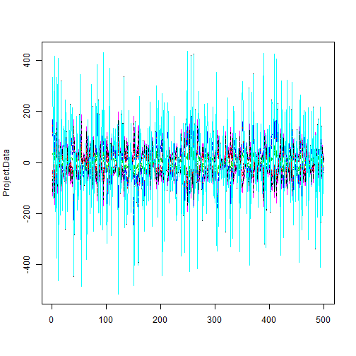

Week 9 Homework 1 - PRICIPAL COMPONENTS ANALYSIS EXAMPLE
========================================================
Brian Ritz
--------------------------------------------------------
MSCA 31007 Autumn 2014
--------------------------------------------------------

Load the data from the PCA example data from chalk.


```r
Project.Data<-read.csv(file="C:/Users/Brian_Ritz/uchicago/statistical_analysis/hw/PCA_ExampleData.csv",header=TRUE,sep=",")
Project.Data[1:10,]
```

```
##         V1      V2     V3      V4      V5      V6      V7      V8     V9
## 1   -10.00   -8.00  -6.00  -4.000   -2.00    0.00    2.00   4.000   6.00
## 2   335.26  167.31  36.42 -57.024 -112.89 -131.66 -113.08 -56.864  36.48
## 3   106.04   61.94  22.69  -4.492  -16.87  -23.94  -20.53  -1.443  23.81
## 4  -138.26  -69.14 -14.48  24.403   47.02   55.10   47.69  23.851 -14.69
## 5   139.52   66.76  11.15 -28.739  -53.45  -61.11  -52.73 -29.342  10.93
## 6   417.00  207.59  45.28 -70.757 -140.82 -163.84 -140.41 -71.100  45.15
## 7  -190.35 -104.67 -34.61  14.833   41.79   52.81   44.31  12.731 -35.39
## 8   331.04  177.06  52.22 -36.067  -85.00 -104.34  -88.76 -32.938  53.38
## 9    18.52   16.96  13.75  11.803   12.22   11.17   10.74  13.028  14.20
## 10 -375.72 -182.05 -34.10  72.048  137.86  158.20  135.88  73.694 -33.49
##        V10    V11
## 1     8.00   10.0
## 2   167.10  335.4
## 3    57.96  108.2
## 4   -68.42 -138.7
## 5    67.55  139.1
## 6   208.04  416.8
## 7  -101.92 -191.9
## 8   172.97  333.3
## 9    15.36   19.4
## 10 -184.21 -374.5
```

The first row of Project.Data contains the levels at which the variables are measured.
Separate them from the Outputs for further analysis


```r
Data.Points<-Project.Data[1,]
Project.Data<-Project.Data[-1,]
matplot(Project.Data,type="l")
```

 

Apply princomp to Project.Data, identify and interpret factor loadings. Check importance of factors and decide how many factors you would leave in the model.


```r
pcao <- princomp(Project.Data)
pro <- prcomp()
```

```
## Error: argument "x" is missing, with no default
```

Print out the loadings:


```r
print(summary(pcao))
```

```
## Importance of components:
##                         Comp.1    Comp.2    Comp.3    Comp.4    Comp.5
## Standard deviation     304.444 25.474697 2.361e+00 5.526e-06 1.750e-06
## Proportion of Variance   0.993  0.006953 5.974e-05 3.271e-16 3.281e-17
## Cumulative Proportion    0.993  0.999940 1.000e+00 1.000e+00 1.000e+00
##                           Comp.6    Comp.7 Comp.8 Comp.9 Comp.10 Comp.11
## Standard deviation     1.336e-06 1.171e-06      0      0       0       0
## Proportion of Variance 1.913e-17 1.470e-17      0      0       0       0
## Cumulative Proportion  1.000e+00 1.000e+00      1      1       1       1
```

```r
print(pcao$loadings)
```

```
## 
## Loadings:
##     Comp.1 Comp.2 Comp.3 Comp.4 Comp.5 Comp.6 Comp.7 Comp.8 Comp.9 Comp.10
## V1  -0.584 -0.108  0.232  0.725                                    -0.261 
## V2  -0.295 -0.217 -0.420        -0.450 -0.103        -0.198  0.402  0.229 
## V3         -0.294  0.121         0.293  0.635  0.329 -0.397 -0.147  0.133 
## V4         -0.351  0.325 -0.102  0.188 -0.562  0.545         0.286        
## V5   0.186 -0.391 -0.385        -0.168                0.160 -0.477 -0.576 
## V6   0.218 -0.400         0.157 -0.470  0.207  0.213 -0.120  0.152  0.116 
## V7   0.186 -0.386  0.390  0.134 -0.126 -0.167 -0.429        -0.392  0.462 
## V8         -0.355 -0.320         0.565 -0.176 -0.423 -0.360  0.178        
## V9         -0.296 -0.117         0.238  0.330         0.785  0.305  0.120 
## V10 -0.295 -0.211  0.423 -0.558 -0.164        -0.359         0.129 -0.425 
## V11 -0.584 -0.111 -0.231 -0.298        -0.218  0.189        -0.436  0.319 
##     Comp.11
## V1         
## V2   0.460 
## V3   0.302 
## V4   0.139 
## V5   0.202 
## V6  -0.639 
## V7   0.210 
## V8  -0.241 
## V9         
## V10 -0.106 
## V11 -0.340 
## 
##                Comp.1 Comp.2 Comp.3 Comp.4 Comp.5 Comp.6 Comp.7 Comp.8
## SS loadings     1.000  1.000  1.000  1.000  1.000  1.000  1.000  1.000
## Proportion Var  0.091  0.091  0.091  0.091  0.091  0.091  0.091  0.091
## Cumulative Var  0.091  0.182  0.273  0.364  0.455  0.545  0.636  0.727
##                Comp.9 Comp.10 Comp.11
## SS loadings     1.000   1.000   1.000
## Proportion Var  0.091   0.091   0.091
## Cumulative Var  0.818   0.909   1.000
```


NOTES:

The importance of the factors can be seen as a function of the proportion of variance in the data that can be explained by that factor. We can observe this in the output of the summary() of the PCA. We see from the summary that the first factor can explain over 99% of the variance in the data. Very little variance is explained by any compnent after the third component. Therefore, I would leave just the first factor in the model. 

The factor loadings are the weights that should be given to each standardized variable in order to compute the factors. For example, the computation of the first factor follows the follow linear equation: Factor1 = -0.584\*V1 + -0.295\*V2 + 0.186\*V5 + 0.218\*V6 + 0.186\*V7 + -0.295\*V10 + -0.584\*V11 as long as all of the variables V1-V11 are standardized first (there are a few smaller terms omitted by the output).

