Course Project - Homework Checkpoint for Week 04
========================================================
Brian Ritz
--------------------------------------------------------
MSCA 31007 Autumn 2014
--------------------------------------------------------
Due 10/27/2014
-----------------

**Step 1:**
Read in the data and run some elementary plots.


```r
# import the data# Script RegressionAssignmentPreparation.R
# Prepare Data for the Regression Assignment
AssignmentData<-read.csv(file="C:/users/Brian_Ritz/uchicago/statistical_analysis/hw/course_project/regressionassignmentdata2014.csv",
           header=TRUE,sep=",", row.names = 1)
AssignmentData[1:10,]
```

```
##           USGG3M USGG6M USGG2YR USGG3YR USGG5YR USGG10YR USGG30YR Output1
## 1/5/1981   13.52  13.09   12.29   12.28   12.29    12.15    11.67   18.02
## 1/6/1981   13.58  13.16   12.43   12.31   12.21    12.11    11.67   18.09
## 1/7/1981   14.50  13.90   12.93   12.78   12.61    12.38    11.89   19.45
## 1/8/1981   14.76  14.00   13.10   12.95   12.68    12.35    11.91   19.75
## 1/9/1981   15.20  14.30   13.54   13.28   12.88    12.57    12.13   20.57
## 1/12/1981  15.22  14.23   13.18   12.94   12.71    12.45    12.08   20.14
## 1/13/1981  15.24  14.10   13.31   12.97   12.68    12.53    12.08   20.18
## 1/14/1981  15.08  13.90   12.96   12.75   12.61    12.53    12.07   19.78
## 1/15/1981  15.25  14.09   13.26   13.02   12.77    12.62    12.25   20.30
## 1/16/1981  15.15  13.98   13.09   12.85   12.66    12.53    12.13   19.97
##           Easing Tightening
## 1/5/1981      NA         NA
## 1/6/1981      NA         NA
## 1/7/1981      NA         NA
## 1/8/1981      NA         NA
## 1/9/1981      NA         NA
## 1/12/1981     NA         NA
## 1/13/1981     NA         NA
## 1/14/1981     NA         NA
## 1/15/1981     NA         NA
## 1/16/1981     NA         NA
```

Check that there is at least something somewhere in tightening and easing:


```r
print(sum(!is.na(AssignmentData$Tightening)))
```

```
## [1] 773
```

```r
print(sum(!is.na(AssignmentData$Easing)))
```

```
## [1] 1585
```

Now we plot the input variables.


```r
matplot(AssignmentData[,-c(1,9,10,11)],type='l')
```

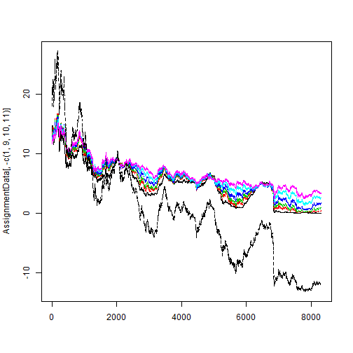 

Plot the input variables with the output variable.


```r
matplot(AssignmentData[,-c(1,10,11)],type='l')
```

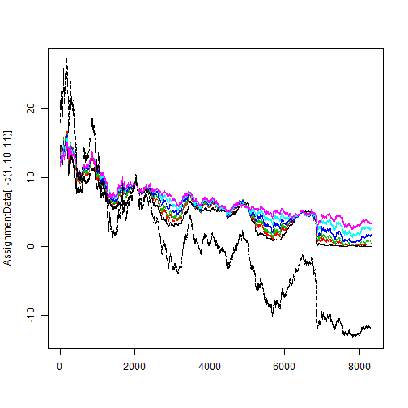 


**Step 2:**

Estimate simple regression model with each of the input variables and the output variable given in RegressionAssignmentData. Because we need to find linear models for all of the input variables, I'll use a loop to get at least the first 7.


```r
output.var.no <- 8
all.coefficients <- list()
for (i in c(1:7)){
  Input.linear.Model<-lm(AssignmentData[,output.var.no]~AssignmentData[,i])
  
  # get summary of model
  smry<-summary(Input.linear.Model)
  print(paste("SUMMARY FOR VARIABLE", (i), "-", names(AssignmentData)[i], sep=" "))
  print(smry)
  
  # get plot of model
  print(paste("PLOT FOR VARIABLE", (i), "-", names(AssignmentData)[i], sep=" "))
  matplot(AssignmentData[,output.var.no],type="l",xaxt="n", main = paste("PLOT FOR VARIABLE", (i), "-", names(AssignmentData)[i], sep=" "))
  lines(Input.linear.Model$fitted.values,col="red")
  
  # print the total variance and unexplained variance of the model
  print(c(Total.Variance=var(AssignmentData[,output.var.no]),Unexplained.Variance=summary(Input.linear.Model)$sigma^2))
  
  # put the coefficients in a list
  coefs <- coefficients(smry)[,1]
  all.coefficients[[i]] <- coefs
  names(all.coefficients)[i] <- names(AssignmentData)[i]
  names(all.coefficients[[i]]) <- c("intercept", "slope")
}
```

```
## [1] "SUMMARY FOR VARIABLE 1 - USGG3M"
## 
## Call:
## lm(formula = AssignmentData[, output.var.no] ~ AssignmentData[, 
##     i])
## 
## Residuals:
##    Min     1Q Median     3Q    Max 
## -6.937 -1.212 -0.053  1.264  7.705 
## 
## Coefficients:
##                      Estimate Std. Error t value Pr(>|t|)    
## (Intercept)         -11.72318    0.03137    -374   <2e-16 ***
## AssignmentData[, i]   2.50756    0.00541     463   <2e-16 ***
## ---
## Signif. codes:  0 '***' 0.001 '**' 0.01 '*' 0.05 '.' 0.1 ' ' 1
## 
## Residual standard error: 1.69 on 8298 degrees of freedom
## Multiple R-squared:  0.963,	Adjusted R-squared:  0.963 
## F-statistic: 2.15e+05 on 1 and 8298 DF,  p-value: <2e-16
## 
## [1] "PLOT FOR VARIABLE 1 - USGG3M"
```

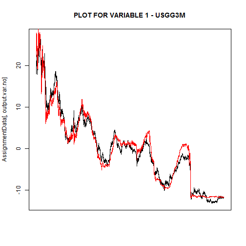 

```
##       Total.Variance Unexplained.Variance 
##               76.804                2.857 
## [1] "SUMMARY FOR VARIABLE 2 - USGG6M"
## 
## Call:
## lm(formula = AssignmentData[, output.var.no] ~ AssignmentData[, 
##     i])
## 
## Residuals:
##    Min     1Q Median     3Q    Max 
## -3.753 -1.039  0.022  1.144  4.151 
## 
## Coefficients:
##                      Estimate Std. Error t value Pr(>|t|)    
## (Intercept)         -12.09753    0.02647    -457   <2e-16 ***
## AssignmentData[, i]   2.49723    0.00444     562   <2e-16 ***
## ---
## Signif. codes:  0 '***' 0.001 '**' 0.01 '*' 0.05 '.' 0.1 ' ' 1
## 
## Residual standard error: 1.4 on 8298 degrees of freedom
## Multiple R-squared:  0.974,	Adjusted R-squared:  0.974 
## F-statistic: 3.16e+05 on 1 and 8298 DF,  p-value: <2e-16
## 
## [1] "PLOT FOR VARIABLE 2 - USGG6M"
```

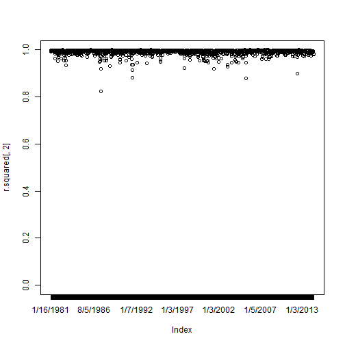 

```
##       Total.Variance Unexplained.Variance 
##               76.804                1.967 
## [1] "SUMMARY FOR VARIABLE 3 - USGG2YR"
## 
## Call:
## lm(formula = AssignmentData[, output.var.no] ~ AssignmentData[, 
##     i])
## 
## Residuals:
##     Min      1Q  Median      3Q     Max 
## -1.4328 -0.3836 -0.0058  0.4336  1.7256 
## 
## Coefficients:
##                      Estimate Std. Error t value Pr(>|t|)    
## (Intercept)         -13.05577    0.01003   -1302   <2e-16 ***
## AssignmentData[, i]   2.40045    0.00153    1567   <2e-16 ***
## ---
## Signif. codes:  0 '***' 0.001 '**' 0.01 '*' 0.05 '.' 0.1 ' ' 1
## 
## Residual standard error: 0.509 on 8298 degrees of freedom
## Multiple R-squared:  0.997,	Adjusted R-squared:  0.997 
## F-statistic: 2.45e+06 on 1 and 8298 DF,  p-value: <2e-16
## 
## [1] "PLOT FOR VARIABLE 3 - USGG2YR"
```

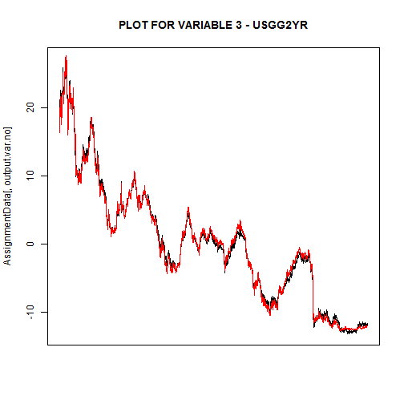 

```
##       Total.Variance Unexplained.Variance 
##              76.8044               0.2588 
## [1] "SUMMARY FOR VARIABLE 4 - USGG3YR"
## 
## Call:
## lm(formula = AssignmentData[, output.var.no] ~ AssignmentData[, 
##     i])
## 
## Residuals:
##     Min      1Q  Median      3Q     Max 
## -2.0160 -0.2459  0.0325  0.2638  3.0666 
## 
## Coefficients:
##                      Estimate Std. Error t value Pr(>|t|)    
## (Intercept)         -13.86162    0.00821   -1688   <2e-16 ***
## AssignmentData[, i]   2.45579    0.00123    1996   <2e-16 ***
## ---
## Signif. codes:  0 '***' 0.001 '**' 0.01 '*' 0.05 '.' 0.1 ' ' 1
## 
## Residual standard error: 0.4 on 8298 degrees of freedom
## Multiple R-squared:  0.998,	Adjusted R-squared:  0.998 
## F-statistic: 3.98e+06 on 1 and 8298 DF,  p-value: <2e-16
## 
## [1] "PLOT FOR VARIABLE 4 - USGG3YR"
```

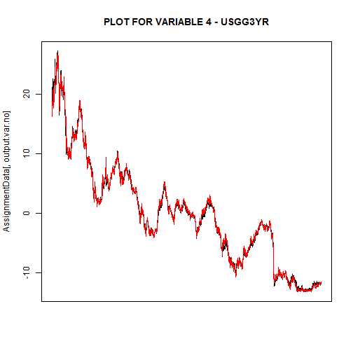 

```
##       Total.Variance Unexplained.Variance 
##              76.8044               0.1597 
## [1] "SUMMARY FOR VARIABLE 5 - USGG5YR"
## 
## Call:
## lm(formula = AssignmentData[, output.var.no] ~ AssignmentData[, 
##     i])
## 
## Residuals:
##    Min     1Q Median     3Q    Max 
## -2.652 -0.622 -0.015  0.652  3.172 
## 
## Coefficients:
##                      Estimate Std. Error t value Pr(>|t|)    
## (Intercept)         -15.43665    0.01782    -866   <2e-16 ***
## AssignmentData[, i]   2.56874    0.00258     995   <2e-16 ***
## ---
## Signif. codes:  0 '***' 0.001 '**' 0.01 '*' 0.05 '.' 0.1 ' ' 1
## 
## Residual standard error: 0.799 on 8298 degrees of freedom
## Multiple R-squared:  0.992,	Adjusted R-squared:  0.992 
## F-statistic: 9.9e+05 on 1 and 8298 DF,  p-value: <2e-16
## 
## [1] "PLOT FOR VARIABLE 5 - USGG5YR"
```

 

```
##       Total.Variance Unexplained.Variance 
##              76.8044               0.6383 
## [1] "SUMMARY FOR VARIABLE 6 - USGG10YR"
## 
## Call:
## lm(formula = AssignmentData[, output.var.no] ~ AssignmentData[, 
##     i])
## 
## Residuals:
##    Min     1Q Median     3Q    Max 
## -3.033 -1.281 -0.194  1.356  4.225 
## 
## Coefficients:
##                      Estimate Std. Error t value Pr(>|t|)    
## (Intercept)         -18.06337    0.03918    -461   <2e-16 ***
## AssignmentData[, i]   2.78699    0.00546     511   <2e-16 ***
## ---
## Signif. codes:  0 '***' 0.001 '**' 0.01 '*' 0.05 '.' 0.1 ' ' 1
## 
## Residual standard error: 1.54 on 8298 degrees of freedom
## Multiple R-squared:  0.969,	Adjusted R-squared:  0.969 
## F-statistic: 2.61e+05 on 1 and 8298 DF,  p-value: <2e-16
## 
## [1] "PLOT FOR VARIABLE 6 - USGG10YR"
```

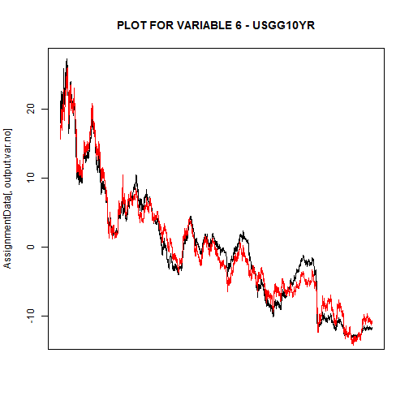 

```
##       Total.Variance Unexplained.Variance 
##               76.804                2.367 
## [1] "SUMMARY FOR VARIABLE 7 - USGG30YR"
## 
## Call:
## lm(formula = AssignmentData[, output.var.no] ~ AssignmentData[, 
##     i])
## 
## Residuals:
##    Min     1Q Median     3Q    Max 
## -4.645 -1.843 -0.473  1.953  4.873 
## 
## Coefficients:
##                      Estimate Std. Error t value Pr(>|t|)    
## (Intercept)         -21.08590    0.06560    -321   <2e-16 ***
## AssignmentData[, i]   3.06956    0.00886     346   <2e-16 ***
## ---
## Signif. codes:  0 '***' 0.001 '**' 0.01 '*' 0.05 '.' 0.1 ' ' 1
## 
## Residual standard error: 2.23 on 8298 degrees of freedom
## Multiple R-squared:  0.935,	Adjusted R-squared:  0.935 
## F-statistic: 1.2e+05 on 1 and 8298 DF,  p-value: <2e-16
## 
## [1] "PLOT FOR VARIABLE 7 - USGG30YR"
```

 

```
##       Total.Variance Unexplained.Variance 
##               76.804                4.967
```

Most of the model plots appear to fit fairly well. The three year bond rate appears to fit the data the best, according to eyeballing the plot and to looking at the explained vs. unexplained variance. As you get shorter or longer from the 3 year term, the unexplained variance in the data rises as a percentage of the total variance.

Now we will print a table of all of the coefficients for Step 2:

```r
# put all of the coefficients into a table
coefficients <- data.frame(all.coefficients)
print("ALL COEFFICIENTS")
```

```
## [1] "ALL COEFFICIENTS"
```

```r
print(coefficients)
```

```
##            USGG3M  USGG6M USGG2YR USGG3YR USGG5YR USGG10YR USGG30YR
## intercept -11.723 -12.098  -13.06 -13.862 -15.437  -18.063   -21.09
## slope       2.508   2.497    2.40   2.456   2.569    2.787     3.07
```

**Step 3:**

Fit linear regression models using single output (column 8) as input and each of the original inputs as outputs.

Collect all slopes and intercepts in one table and print this table.
(This is basically the reverse of what we did in step 2, so I'll copy and paste some of that code)


```r
input.var.no <- 8
all.coefficients <- list()
for (i in c(1:7)){
  Input.linear.Model<-lm(AssignmentData[,i] ~ AssignmentData[,input.var.no])
  
  # get summary of model
#   smry<-summary(Input.linear.Model)
#   print(paste("SUMMARY FOR VARIABLE", (i), "-", names(AssignmentData)[i], sep=" "))
#   print(smry)
  
  # get plot of model
#   print(paste("PLOT FOR VARIABLE", (i), "-", names(AssignmentData)[i], sep=" "))
#   matplot(AssignmentData[,output.var.no],type="l",xaxt="n")
#   lines(Input.linear.Model$fitted.values,col="red")
  
  # put the coefficients in a list
  coefs <- coefficients(smry)[,1]
  all.coefficients[[i]] <- coefs
  names(all.coefficients)[i] <- names(AssignmentData)[i]
  names(all.coefficients[[i]]) <- c("intercept", "slope")
}
```

We will now print the coefficients for step 3:

```r
# put all of the coefficients into a table
coefficients <- data.frame(all.coefficients)
print("ALL COEFFICIENTS")
```

```
## [1] "ALL COEFFICIENTS"
```

```r
print(coefficients)
```

```
##           USGG3M USGG6M USGG2YR USGG3YR USGG5YR USGG10YR USGG30YR
## intercept -21.09 -21.09  -21.09  -21.09  -21.09   -21.09   -21.09
## slope       3.07   3.07    3.07    3.07    3.07     3.07     3.07
```


**Step 4:**


```r
# import the data# Script RegressionAssignmentPreparation.R
# Prepare Data for the Regression Assignment
AssignmentDataLogistic<-read.csv(file="C:/users/Brian_Ritz/uchicago/statistical_analysis/hw/course_project/RegressionAssignmentData2014.csv",
           header=TRUE,sep=",", row.names=1)


AssignmentDataLogistic<-data.matrix(AssignmentDataLogistic,rownames.force="automatic")
dim(AssignmentDataLogistic)
```

```
## [1] 8300   10
```

```r
AssignmentDataLogistic[1:10,]
```

```
##           USGG3M USGG6M USGG2YR USGG3YR USGG5YR USGG10YR USGG30YR Output1
## 1/5/1981   13.52  13.09   12.29   12.28   12.29    12.15    11.67   18.02
## 1/6/1981   13.58  13.16   12.43   12.31   12.21    12.11    11.67   18.09
## 1/7/1981   14.50  13.90   12.93   12.78   12.61    12.38    11.89   19.45
## 1/8/1981   14.76  14.00   13.10   12.95   12.68    12.35    11.91   19.75
## 1/9/1981   15.20  14.30   13.54   13.28   12.88    12.57    12.13   20.57
## 1/12/1981  15.22  14.23   13.18   12.94   12.71    12.45    12.08   20.14
## 1/13/1981  15.24  14.10   13.31   12.97   12.68    12.53    12.08   20.18
## 1/14/1981  15.08  13.90   12.96   12.75   12.61    12.53    12.07   19.78
## 1/15/1981  15.25  14.09   13.26   13.02   12.77    12.62    12.25   20.30
## 1/16/1981  15.15  13.98   13.09   12.85   12.66    12.53    12.13   19.97
##           Easing Tightening
## 1/5/1981      NA         NA
## 1/6/1981      NA         NA
## 1/7/1981      NA         NA
## 1/8/1981      NA         NA
## 1/9/1981      NA         NA
## 1/12/1981     NA         NA
## 1/13/1981     NA         NA
## 1/14/1981     NA         NA
## 1/15/1981     NA         NA
## 1/16/1981     NA         NA
```


```r
# Create columns of easing periods (as 0s) and tightening periods (as 1s)
EasingPeriods<-AssignmentDataLogistic[,9]
EasingPeriods[AssignmentDataLogistic[,9]==1]<-0
TighteningPeriods<-AssignmentDataLogistic[,10]
# Check easing and tightening periods
cbind(EasingPeriods,TighteningPeriods)[c(550:560,900:910,970:980),]
```

```
##            EasingPeriods TighteningPeriods
## 3/29/1983             NA                NA
## 3/30/1983             NA                NA
## 3/31/1983             NA                NA
## 4/4/1983              NA                 1
## 4/5/1983              NA                 1
## 4/6/1983              NA                 1
## 4/7/1983              NA                 1
## 4/8/1983              NA                 1
## 4/11/1983             NA                 1
## 4/12/1983             NA                 1
## 4/13/1983             NA                 1
## 8/27/1984             NA                 1
## 8/28/1984             NA                 1
## 8/29/1984             NA                 1
## 8/30/1984             NA                 1
## 8/31/1984             NA                 1
## 9/4/1984              NA                NA
## 9/5/1984              NA                NA
## 9/6/1984              NA                NA
## 9/7/1984              NA                NA
## 9/10/1984             NA                NA
## 9/11/1984             NA                NA
## 12/10/1984             0                NA
## 12/11/1984             0                NA
## 12/12/1984             0                NA
## 12/13/1984             0                NA
## 12/14/1984             0                NA
## 12/17/1984             0                NA
## 12/18/1984             0                NA
## 12/19/1984             0                NA
## 12/20/1984             0                NA
## 12/21/1984             0                NA
## 12/24/1984             0                NA
```


```r
# Remove the periods of neither easing nor tightening
All.NAs<-is.na(EasingPeriods)&is.na(TighteningPeriods)
AssignmentDataLogistic.EasingTighteningOnly<-AssignmentDataLogistic
AssignmentDataLogistic.EasingTighteningOnly[,9]<-EasingPeriods
AssignmentDataLogistic.EasingTighteningOnly[c(550:560,900:910,970:980),]
```

```
##            USGG3M USGG6M USGG2YR USGG3YR USGG5YR USGG10YR USGG30YR Output1
## 3/29/1983   8.630  8.630   9.889   10.05  10.284    10.60    10.66   10.87
## 3/30/1983   8.630  8.660   9.889   10.04  10.254    10.59    10.65   10.86
## 3/31/1983   8.640  8.680   9.879   10.04  10.274    10.62    10.69   10.90
## 4/4/1983    8.640  8.710   9.879   10.04  10.254    10.60    10.67   10.89
## 4/5/1983    8.510  8.530   9.729    9.87  10.114    10.49    10.55   10.51
## 4/6/1983    8.400  8.430   9.699    9.87  10.114    10.49    10.54   10.41
## 4/7/1983    8.360  8.450   9.679    9.83  10.094    10.51    10.56   10.39
## 4/8/1983    8.330  8.410   9.679    9.87  10.114    10.51    10.58   10.39
## 4/11/1983   8.170  8.270   9.539    9.70   9.994    10.41    10.46   10.03
## 4/12/1983   8.200  8.290   9.589    9.76  10.014    10.42    10.46   10.10
## 4/13/1983   8.180  8.250   9.579    9.74  10.014    10.39    10.44   10.05
## 8/27/1984  11.080 11.497  12.510   12.55  12.762    12.80    12.56   17.34
## 8/28/1984  11.087 11.508  12.510   12.58  12.745    12.77    12.53   17.33
## 8/29/1984  11.094 11.519  12.547   12.58  12.727    12.82    12.57   17.37
## 8/30/1984  11.102 11.531  12.565   12.60  12.811    12.85    12.57   17.44
## 8/31/1984  11.045 11.470  12.492   12.55  12.761    12.77    12.51   17.28
## 9/4/1984   11.151 11.587  12.618   12.67  12.912    12.94    12.59   17.61
## 9/5/1984   11.041 11.508  12.600   12.64  12.904    12.89    12.59   17.50
## 9/6/1984   11.027 11.463  12.526   12.59  12.819    12.78    12.47   17.31
## 9/7/1984   10.991 11.414  12.416   12.50  12.760    12.71    12.43   17.14
## 9/10/1984  10.801 11.180  12.195   12.30  12.608    12.57    12.33   16.66
## 9/11/1984  10.851 11.270  12.286   12.37  12.624    12.54    12.32   16.78
## 12/10/1984  8.628  9.033  10.398   10.73  11.233    11.60    11.61   12.52
## 12/11/1984  8.626  8.978  10.361   10.68  11.185    11.56    11.57   12.41
## 12/12/1984  8.518  8.812  10.271   10.59  11.119    11.48    11.51   12.16
## 12/13/1984  8.537  8.888  10.289   10.64  11.225    11.62    11.61   12.35
## 12/14/1984  8.419  8.787  10.234   10.56  11.176    11.59    11.59   12.17
## 12/17/1984  8.226  8.590   9.981   10.33  10.997    11.44    11.46   11.66
## 12/18/1984  8.013  8.425   9.802   10.18  10.852    11.31    11.36   11.25
## 12/19/1984  7.979  8.458   9.954   10.24  10.892    11.36    11.38   11.38
## 12/20/1984  8.020  8.458   9.901   10.23  10.868    11.31    11.36   11.33
## 12/21/1984  7.882  8.513   9.866   10.22  10.859    11.30    11.36   11.28
## 12/24/1984  7.877  8.414   9.831   10.18  10.851    11.29    11.34   11.19
##            Easing Tightening
## 3/29/1983      NA         NA
## 3/30/1983      NA         NA
## 3/31/1983      NA         NA
## 4/4/1983       NA          1
## 4/5/1983       NA          1
## 4/6/1983       NA          1
## 4/7/1983       NA          1
## 4/8/1983       NA          1
## 4/11/1983      NA          1
## 4/12/1983      NA          1
## 4/13/1983      NA          1
## 8/27/1984      NA          1
## 8/28/1984      NA          1
## 8/29/1984      NA          1
## 8/30/1984      NA          1
## 8/31/1984      NA          1
## 9/4/1984       NA         NA
## 9/5/1984       NA         NA
## 9/6/1984       NA         NA
## 9/7/1984       NA         NA
## 9/10/1984      NA         NA
## 9/11/1984      NA         NA
## 12/10/1984      0         NA
## 12/11/1984      0         NA
## 12/12/1984      0         NA
## 12/13/1984      0         NA
## 12/14/1984      0         NA
## 12/17/1984      0         NA
## 12/18/1984      0         NA
## 12/19/1984      0         NA
## 12/20/1984      0         NA
## 12/21/1984      0         NA
## 12/24/1984      0         NA
```


```r
AssignmentDataLogistic.EasingTighteningOnly<-AssignmentDataLogistic.EasingTighteningOnly[!All.NAs,]
AssignmentDataLogistic.EasingTighteningOnly[is.na(AssignmentDataLogistic.EasingTighteningOnly[,10]),10]<-0
# Binary output for logistic regression is now in columh 10

matplot(AssignmentDataLogistic.EasingTighteningOnly[,-c(9,10)],type="l")
lines(AssignmentDataLogistic.EasingTighteningOnly[,10]*20,col="red")
```

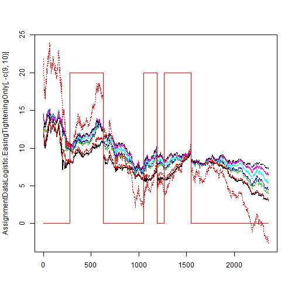 

Check out the data again:

```r
AssignmentDataLogistic.EasingTighteningOnly[c(550:560,900:910,970:980),]
```

```
##           USGG3M USGG6M USGG2YR USGG3YR USGG5YR USGG10YR USGG30YR Output1
## 5/10/1984 10.268 10.875  12.395  12.654  13.044   13.369   13.406  17.340
## 5/11/1984 10.319 10.939  12.432  12.719  13.089   13.392   13.432  17.459
## 5/14/1984 10.512 11.169  12.545  12.835  13.262   13.580   13.625  17.908
## 5/15/1984 10.498 11.135  12.471  12.731  13.145   13.427   13.467  17.670
## 5/16/1984 10.154 10.853  12.378  12.680  13.092   13.392   13.440  17.328
## 5/17/1984 10.162 11.044  12.546  12.847  13.281   13.591   13.616  17.739
## 5/18/1984 10.169 10.939  12.435  12.744  13.156   13.426   13.458  17.459
## 5/21/1984 10.384 11.114  12.455  12.769  13.121   13.432   13.466  17.619
## 5/22/1984 10.381 11.204  12.493  12.795  13.167   13.449   13.474  17.705
## 5/23/1984 10.356 11.261  12.724  12.951  13.303   13.567   13.597  18.008
## 5/24/1984 10.044 11.227  12.761  13.003  13.422   13.709   13.722  18.045
## 1/13/1986  7.455  7.646   8.337   8.633   8.979    9.449    9.606   7.590
## 1/14/1986  7.485  7.690   8.303   8.582   8.925    9.399    9.556   7.531
## 1/15/1986  7.410  7.635   8.162   8.443   8.755    9.243    9.403   7.199
## 1/16/1986  7.262  7.515   8.091   8.367   8.656    9.146    9.355   6.949
## 1/17/1986  7.323  7.579   8.197   8.430   8.770    9.253    9.421   7.168
## 1/21/1986  7.243  7.526   8.198   8.441   8.777    9.233    9.415   7.115
## 1/22/1986  7.200  7.483   8.168   8.416   8.746    9.223    9.427   7.048
## 1/23/1986  7.167  7.450   8.151   8.390   8.730    9.204    9.409   6.986
## 1/24/1986  7.134  7.394   8.099   8.339   8.699    9.175    9.415   6.889
## 1/27/1986  7.150  7.417   8.065   8.288   8.599    9.088    9.355   6.782
## 1/28/1986  7.117  7.363   7.979   8.186   8.507    9.011    9.284   6.587
## 4/24/1986  6.287  6.462   6.940   7.220   7.424    7.559    7.613   3.661
## 4/25/1986  6.296  6.472   6.922   7.195   7.350    7.533    7.567   3.599
## 4/28/1986  6.227  6.387   6.837   7.032   7.217    7.412    7.495   3.323
## 4/29/1986  6.268  6.409   6.786   6.958   7.129    7.310    7.414   3.201
## 4/30/1986  6.256  6.398   6.786   6.982   7.113    7.335    7.450   3.216
## 5/1/1986   6.287  6.419   6.820   7.042   7.193    7.420    7.549   3.365
## 5/2/1986   6.275  6.396   6.872   7.078   7.222    7.505    7.618   3.450
## 5/5/1986   6.217  6.333   6.718   6.915   7.067    7.342    7.445   3.103
## 5/6/1986   6.215  6.333   6.769   6.921   7.140    7.435    7.492   3.201
## 5/7/1986   6.183  6.300   6.769   6.934   7.154    7.395    7.508   3.177
## 5/8/1986   6.234  6.354   6.838   6.981   7.212    7.458    7.403   3.278
##           Easing Tightening
## 5/10/1984     NA          1
## 5/11/1984     NA          1
## 5/14/1984     NA          1
## 5/15/1984     NA          1
## 5/16/1984     NA          1
## 5/17/1984     NA          1
## 5/18/1984     NA          1
## 5/21/1984     NA          1
## 5/22/1984     NA          1
## 5/23/1984     NA          1
## 5/24/1984     NA          1
## 1/13/1986      0          0
## 1/14/1986      0          0
## 1/15/1986      0          0
## 1/16/1986      0          0
## 1/17/1986      0          0
## 1/21/1986      0          0
## 1/22/1986      0          0
## 1/23/1986      0          0
## 1/24/1986      0          0
## 1/27/1986      0          0
## 1/28/1986      0          0
## 4/24/1986      0          0
## 4/25/1986      0          0
## 4/28/1986      0          0
## 4/29/1986      0          0
## 4/30/1986      0          0
## 5/1/1986       0          0
## 5/2/1986       0          0
## 5/5/1986       0          0
## 5/6/1986       0          0
## 5/7/1986       0          0
## 5/8/1986       0          0
```

Estimate logistic regression with 3M and 30Y yields as predictors for easing/tightening output.

```r
# Run logistic regression for 3M yield as predictor of easing/tightening

LogisticModel.TighteningEasing_3M<-glm(AssignmentDataLogistic.EasingTighteningOnly[,10]~
                                      AssignmentDataLogistic.EasingTighteningOnly[,1],family=binomial(link=logit))
summary(LogisticModel.TighteningEasing_3M)
```

```
## 
## Call:
## glm(formula = AssignmentDataLogistic.EasingTighteningOnly[, 10] ~ 
##     AssignmentDataLogistic.EasingTighteningOnly[, 1], family = binomial(link = logit))
## 
## Deviance Residuals: 
##    Min      1Q  Median      3Q     Max  
## -1.424  -0.901  -0.774   1.355   1.674  
## 
## Coefficients:
##                                                  Estimate Std. Error
## (Intercept)                                       -2.1526     0.1733
## AssignmentDataLogistic.EasingTighteningOnly[, 1]   0.1864     0.0214
##                                                  z value Pr(>|z|)    
## (Intercept)                                       -12.42   <2e-16 ***
## AssignmentDataLogistic.EasingTighteningOnly[, 1]    8.69   <2e-16 ***
## ---
## Signif. codes:  0 '***' 0.001 '**' 0.01 '*' 0.05 '.' 0.1 ' ' 1
## 
## (Dispersion parameter for binomial family taken to be 1)
## 
##     Null deviance: 2983.5  on 2357  degrees of freedom
## Residual deviance: 2904.8  on 2356  degrees of freedom
## AIC: 2909
## 
## Number of Fisher Scoring iterations: 4
```

The 3M yeild appears to be a signifiant predictor of easing or tightening. Let's check out the fitted values:


```r
matplot(AssignmentDataLogistic.EasingTighteningOnly[,-c(9,10)],type="l")
lines(AssignmentDataLogistic.EasingTighteningOnly[,10]*20,col="red")
lines(LogisticModel.TighteningEasing_3M$fitted.values*20,col="green")
```

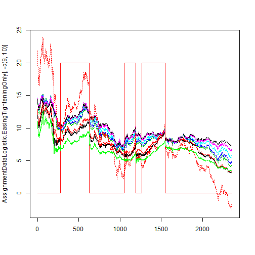 

Now use all inputs as predictors for logistic regression.

```r
LogisticModel.TighteningEasing_All<-glm(AssignmentDataLogistic.EasingTighteningOnly[,10]~
                                      AssignmentDataLogistic.EasingTighteningOnly[,1]+
                                        AssignmentDataLogistic.EasingTighteningOnly[,2]+
                                        AssignmentDataLogistic.EasingTighteningOnly[,3]+
                                        AssignmentDataLogistic.EasingTighteningOnly[,4]+
                                        AssignmentDataLogistic.EasingTighteningOnly[,5]+
                                        AssignmentDataLogistic.EasingTighteningOnly[,6]+
                                        AssignmentDataLogistic.EasingTighteningOnly[,7],
                                        family=binomial(link=logit))
# Observe the results
summary(LogisticModel.TighteningEasing_All)
```

```
## 
## Call:
## glm(formula = AssignmentDataLogistic.EasingTighteningOnly[, 10] ~ 
##     AssignmentDataLogistic.EasingTighteningOnly[, 1] + AssignmentDataLogistic.EasingTighteningOnly[, 
##         2] + AssignmentDataLogistic.EasingTighteningOnly[, 3] + 
##         AssignmentDataLogistic.EasingTighteningOnly[, 4] + AssignmentDataLogistic.EasingTighteningOnly[, 
##         5] + AssignmentDataLogistic.EasingTighteningOnly[, 6] + 
##         AssignmentDataLogistic.EasingTighteningOnly[, 7], family = binomial(link = logit))
## 
## Deviance Residuals: 
##    Min      1Q  Median      3Q     Max  
## -2.211  -0.859  -0.594   1.131   2.553  
## 
## Coefficients:
##                                                  Estimate Std. Error
## (Intercept)                                        -4.755      0.431
## AssignmentDataLogistic.EasingTighteningOnly[, 1]   -3.346      0.267
## AssignmentDataLogistic.EasingTighteningOnly[, 2]    4.156      0.375
## AssignmentDataLogistic.EasingTighteningOnly[, 3]    3.946      0.755
## AssignmentDataLogistic.EasingTighteningOnly[, 4]   -3.464      0.934
## AssignmentDataLogistic.EasingTighteningOnly[, 5]   -3.212      0.779
## AssignmentDataLogistic.EasingTighteningOnly[, 6]   -0.971      0.976
## AssignmentDataLogistic.EasingTighteningOnly[, 7]    3.325      0.614
##                                                  z value Pr(>|z|)    
## (Intercept)                                       -11.03  < 2e-16 ***
## AssignmentDataLogistic.EasingTighteningOnly[, 1]  -12.55  < 2e-16 ***
## AssignmentDataLogistic.EasingTighteningOnly[, 2]   11.09  < 2e-16 ***
## AssignmentDataLogistic.EasingTighteningOnly[, 3]    5.22  1.8e-07 ***
## AssignmentDataLogistic.EasingTighteningOnly[, 4]   -3.71  0.00021 ***
## AssignmentDataLogistic.EasingTighteningOnly[, 5]   -4.12  3.8e-05 ***
## AssignmentDataLogistic.EasingTighteningOnly[, 6]   -0.99  0.32021    
## AssignmentDataLogistic.EasingTighteningOnly[, 7]    5.42  6.0e-08 ***
## ---
## Signif. codes:  0 '***' 0.001 '**' 0.01 '*' 0.05 '.' 0.1 ' ' 1
## 
## (Dispersion parameter for binomial family taken to be 1)
## 
##     Null deviance: 2983.5  on 2357  degrees of freedom
## Residual deviance: 2629.6  on 2350  degrees of freedom
## AIC: 2646
## 
## Number of Fisher Scoring iterations: 4
```


```r
LogisticModel.TighteningEasing_All$formula
```

```
## AssignmentDataLogistic.EasingTighteningOnly[, 10] ~ AssignmentDataLogistic.EasingTighteningOnly[, 
##     1] + AssignmentDataLogistic.EasingTighteningOnly[, 2] + AssignmentDataLogistic.EasingTighteningOnly[, 
##     3] + AssignmentDataLogistic.EasingTighteningOnly[, 4] + AssignmentDataLogistic.EasingTighteningOnly[, 
##     5] + AssignmentDataLogistic.EasingTighteningOnly[, 6] + AssignmentDataLogistic.EasingTighteningOnly[, 
##     7]
```

This will report the AIC, which is a measure of fit.

```r
summary(LogisticModel.TighteningEasing_All)$aic
```

```
## [1] 2646
```

This will look at the significance of each variable in the model.

```r
summary(LogisticModel.TighteningEasing_All)$coefficients[,c(1,4)]
```

```
##                                                  Estimate  Pr(>|z|)
## (Intercept)                                       -4.7552 2.784e-28
## AssignmentDataLogistic.EasingTighteningOnly[, 1]  -3.3456 4.073e-36
## AssignmentDataLogistic.EasingTighteningOnly[, 2]   4.1559 1.423e-28
## AssignmentDataLogistic.EasingTighteningOnly[, 3]   3.9460 1.752e-07
## AssignmentDataLogistic.EasingTighteningOnly[, 4]  -3.4642 2.081e-04
## AssignmentDataLogistic.EasingTighteningOnly[, 5]  -3.2115 3.786e-05
## AssignmentDataLogistic.EasingTighteningOnly[, 6]  -0.9705 3.202e-01
## AssignmentDataLogistic.EasingTighteningOnly[, 7]   3.3254 6.036e-08
```

The only variable that does not appear significant is variable 6. 


Let's check out the fitted values from this model with more variables:

```r
matplot(AssignmentDataLogistic.EasingTighteningOnly[,-c(9,10)],type="l")
lines(AssignmentDataLogistic.EasingTighteningOnly[,10]*20,col="red")
lines(LogisticModel.TighteningEasing_All$fitted.values*20,col="green")
```

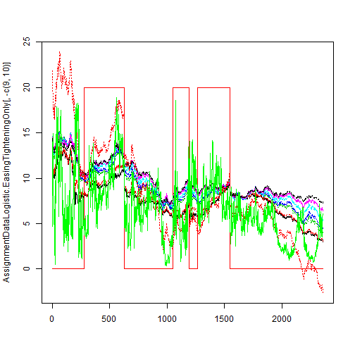 

First of all, we see that there is much more variance in this green line that the fitted values for the model using just the 3M yield because there are more variables that affect the output of the model.

Now we will find the log odds and probabilities.

```r
# Calculate odds
Log.Odds<-predict(LogisticModel.TighteningEasing_All)
plot(Log.Odds,type="l")
```

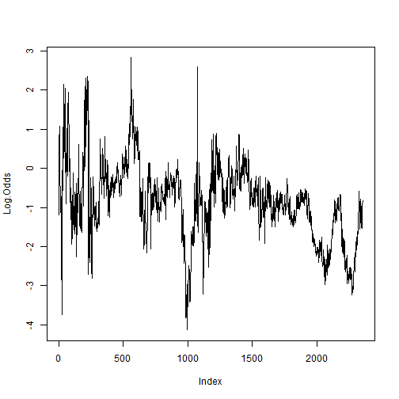 

The plot for the log odds and the fitted values are very similar, just on a different scale. This is because the fitted values represent the probability of easing in at a particular time.

Let's take a look at probabilities:

```r
Probabilities<-1/(exp(-Log.Odds)+1)
plot(LogisticModel.TighteningEasing_All$fitted.values,type="l")
lines(Probabilities,col="red")
```

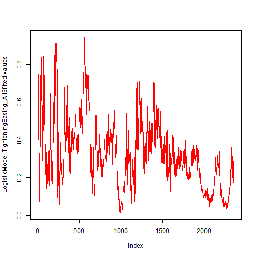 

Here we see that the plot for the probabilities is identical to the plot of the fitted values.


**STEP 5**

Compare linear regression models with different combinations of predictors. Select the best combination.

Below we show only two of possible combinations: full model containing all 7 predictors and Null model containing only intercept, but none of the 7 predictors. Please, estimate other possible combinations.

Read the data


```r
# Script RegressionAssignmentModelComparison.R
# Prepare Data
# Import dates as row names, turn data frame into a data matrix
 AssignmentDataRegressionComparison<-
  read.csv(file="C:/users/Brian_Ritz/uchicago/statistical_analysis/hw/course_project/RegressionAssignmentData2014.csv",
           row.names=1,header=TRUE,sep=",")
AssignmentDataRegressionComparison<-data.matrix(AssignmentDataRegressionComparison,rownames.force="automatic")
# Check
dim(AssignmentDataRegressionComparison)
```

```
## [1] 8300   10
```

```r
AssignmentDataRegressionComparison[1:10,]
```

```
##           USGG3M USGG6M USGG2YR USGG3YR USGG5YR USGG10YR USGG30YR Output1
## 1/5/1981   13.52  13.09   12.29   12.28   12.29    12.15    11.67   18.02
## 1/6/1981   13.58  13.16   12.43   12.31   12.21    12.11    11.67   18.09
## 1/7/1981   14.50  13.90   12.93   12.78   12.61    12.38    11.89   19.45
## 1/8/1981   14.76  14.00   13.10   12.95   12.68    12.35    11.91   19.75
## 1/9/1981   15.20  14.30   13.54   13.28   12.88    12.57    12.13   20.57
## 1/12/1981  15.22  14.23   13.18   12.94   12.71    12.45    12.08   20.14
## 1/13/1981  15.24  14.10   13.31   12.97   12.68    12.53    12.08   20.18
## 1/14/1981  15.08  13.90   12.96   12.75   12.61    12.53    12.07   19.78
## 1/15/1981  15.25  14.09   13.26   13.02   12.77    12.62    12.25   20.30
## 1/16/1981  15.15  13.98   13.09   12.85   12.66    12.53    12.13   19.97
##           Easing Tightening
## 1/5/1981      NA         NA
## 1/6/1981      NA         NA
## 1/7/1981      NA         NA
## 1/8/1981      NA         NA
## 1/9/1981      NA         NA
## 1/12/1981     NA         NA
## 1/13/1981     NA         NA
## 1/14/1981     NA         NA
## 1/15/1981     NA         NA
## 1/16/1981     NA         NA
```

Estimate full model with all predictors:

```r
# Run regression with different combinations of predictors
RegressionModelComparison.Full<-lm(AssignmentDataRegressionComparison[,8]~
                                AssignmentDataRegressionComparison[,1]+
                                AssignmentDataRegressionComparison[,2]+
                                AssignmentDataRegressionComparison[,3]+
                                AssignmentDataRegressionComparison[,4]+
                                AssignmentDataRegressionComparison[,5]+
                                AssignmentDataRegressionComparison[,6]+
                                AssignmentDataRegressionComparison[,7]
                                )
summary(RegressionModelComparison.Full)
```

```
## 
## Call:
## lm(formula = AssignmentDataRegressionComparison[, 8] ~ AssignmentDataRegressionComparison[, 
##     1] + AssignmentDataRegressionComparison[, 2] + AssignmentDataRegressionComparison[, 
##     3] + AssignmentDataRegressionComparison[, 4] + AssignmentDataRegressionComparison[, 
##     5] + AssignmentDataRegressionComparison[, 6] + AssignmentDataRegressionComparison[, 
##     7])
## 
## Residuals:
##       Min        1Q    Median        3Q       Max 
## -5.11e-09 -3.43e-10 -1.00e-12  3.34e-10  5.08e-09 
## 
## Coefficients:
##                                          Estimate Std. Error   t value
## (Intercept)                             -1.49e+01   1.06e-10 -1.41e+11
## AssignmentDataRegressionComparison[, 1]  3.84e-01   9.86e-11  3.89e+09
## AssignmentDataRegressionComparison[, 2]  3.90e-01   1.50e-10  2.60e+09
## AssignmentDataRegressionComparison[, 3]  4.15e-01   2.57e-10  1.62e+09
## AssignmentDataRegressionComparison[, 4]  4.06e-01   3.30e-10  1.23e+09
## AssignmentDataRegressionComparison[, 5]  3.86e-01   2.62e-10  1.47e+09
## AssignmentDataRegressionComparison[, 6]  3.48e-01   2.80e-10  1.24e+09
## AssignmentDataRegressionComparison[, 7]  3.05e-01   1.57e-10  1.95e+09
##                                         Pr(>|t|)    
## (Intercept)                               <2e-16 ***
## AssignmentDataRegressionComparison[, 1]   <2e-16 ***
## AssignmentDataRegressionComparison[, 2]   <2e-16 ***
## AssignmentDataRegressionComparison[, 3]   <2e-16 ***
## AssignmentDataRegressionComparison[, 4]   <2e-16 ***
## AssignmentDataRegressionComparison[, 5]   <2e-16 ***
## AssignmentDataRegressionComparison[, 6]   <2e-16 ***
## AssignmentDataRegressionComparison[, 7]   <2e-16 ***
## ---
## Signif. codes:  0 '***' 0.001 '**' 0.01 '*' 0.05 '.' 0.1 ' ' 1
## 
## Residual standard error: 1.56e-09 on 8292 degrees of freedom
## Multiple R-squared:     1,	Adjusted R-squared:     1 
## F-statistic: 3.73e+22 on 7 and 8292 DF,  p-value: <2e-16
```

Now we look at the null model by only estimating the intercept


```r
RegressionModelComparison.Null<-lm(AssignmentDataRegressionComparison[,8]~1)
summary(RegressionModelComparison.Null)
```

```
## 
## Call:
## lm(formula = AssignmentDataRegressionComparison[, 8] ~ 1)
## 
## Residuals:
##     Min      1Q  Median      3Q     Max 
## -13.173  -6.509  -0.415   4.860  27.298 
## 
## Coefficients:
##             Estimate Std. Error t value Pr(>|t|)
## (Intercept) 1.42e-11   9.62e-02       0        1
## 
## Residual standard error: 8.76 on 8299 degrees of freedom
```

Now compare the models using ANOVA:

```r
anova(RegressionModelComparison.Full,RegressionModelComparison.Null)
```

```
## Analysis of Variance Table
## 
## Model 1: AssignmentDataRegressionComparison[, 8] ~ AssignmentDataRegressionComparison[, 
##     1] + AssignmentDataRegressionComparison[, 2] + AssignmentDataRegressionComparison[, 
##     3] + AssignmentDataRegressionComparison[, 4] + AssignmentDataRegressionComparison[, 
##     5] + AssignmentDataRegressionComparison[, 6] + AssignmentDataRegressionComparison[, 
##     7]
## Model 2: AssignmentDataRegressionComparison[, 8] ~ 1
##   Res.Df    RSS Df Sum of Sq        F Pr(>F)    
## 1   8292      0                                 
## 2   8299 637400 -7   -637400 3.73e+22 <2e-16 ***
## ---
## Signif. codes:  0 '***' 0.001 '**' 0.01 '*' 0.05 '.' 0.1 ' ' 1
```

The anova output suggests that the reduction in the residual sum of squares when going from the Null model to the Full model is significant. This means that adding in the variables that we added to the full model adds explanitory power to the model. The models are significantly different from eachother.

We will now look at a few other combinations of variables. 

Estimate full model with one short term predictor, and one longer term predictor:

```r
# Run regression with different combinations of predictors
RegressionModelComparison.shortlong<-lm(AssignmentDataRegressionComparison[,8]~
                                AssignmentDataRegressionComparison[,1]+
                                AssignmentDataRegressionComparison[,7]
                                )
summary(RegressionModelComparison.shortlong)
```

```
## 
## Call:
## lm(formula = AssignmentDataRegressionComparison[, 8] ~ AssignmentDataRegressionComparison[, 
##     1] + AssignmentDataRegressionComparison[, 7])
## 
## Residuals:
##     Min      1Q  Median      3Q     Max 
## -3.1620 -0.3508 -0.0243  0.3215  2.7313 
## 
## Coefficients:
##                                          Estimate Std. Error t value
## (Intercept)                             -16.49486    0.01974    -836
## AssignmentDataRegressionComparison[, 1]   1.49913    0.00400     375
## AssignmentDataRegressionComparison[, 7]   1.38095    0.00496     278
##                                         Pr(>|t|)    
## (Intercept)                               <2e-16 ***
## AssignmentDataRegressionComparison[, 1]   <2e-16 ***
## AssignmentDataRegressionComparison[, 7]   <2e-16 ***
## ---
## Signif. codes:  0 '***' 0.001 '**' 0.01 '*' 0.05 '.' 0.1 ' ' 1
## 
## Residual standard error: 0.526 on 8297 degrees of freedom
## Multiple R-squared:  0.996,	Adjusted R-squared:  0.996 
## F-statistic: 1.15e+06 on 2 and 8297 DF,  p-value: <2e-16
```
Let's find out if the shortlong model has significantly less residual sum of squares than the full model.

```r
anova(RegressionModelComparison.shortlong, RegressionModelComparison.Full)
```

```
## Analysis of Variance Table
## 
## Model 1: AssignmentDataRegressionComparison[, 8] ~ AssignmentDataRegressionComparison[, 
##     1] + AssignmentDataRegressionComparison[, 7]
## Model 2: AssignmentDataRegressionComparison[, 8] ~ AssignmentDataRegressionComparison[, 
##     1] + AssignmentDataRegressionComparison[, 2] + AssignmentDataRegressionComparison[, 
##     3] + AssignmentDataRegressionComparison[, 4] + AssignmentDataRegressionComparison[, 
##     5] + AssignmentDataRegressionComparison[, 6] + AssignmentDataRegressionComparison[, 
##     7]
##   Res.Df  RSS Df Sum of Sq        F Pr(>F)    
## 1   8297 2295                                 
## 2   8292    0  5      2295 1.88e+20 <2e-16 ***
## ---
## Signif. codes:  0 '***' 0.001 '**' 0.01 '*' 0.05 '.' 0.1 ' ' 1
```

Yes, the F-Test of the anova indicates that the difference in residual sum of squares between the full model and the shortlong model is significant. 


Now let's try an all short model -- perhaps the longer term yields don't add much:

Estimate full model with all predictors:

```r
# Run regression with different combinations of predictors
RegressionModelComparison.allshort<-lm(AssignmentDataRegressionComparison[,8]~
                                AssignmentDataRegressionComparison[,1]+
                                AssignmentDataRegressionComparison[,2]+
                                AssignmentDataRegressionComparison[,3]
                                )
summary(RegressionModelComparison.allshort)
```

```
## 
## Call:
## lm(formula = AssignmentDataRegressionComparison[, 8] ~ AssignmentDataRegressionComparison[, 
##     1] + AssignmentDataRegressionComparison[, 2] + AssignmentDataRegressionComparison[, 
##     3])
## 
## Residuals:
##     Min      1Q  Median      3Q     Max 
## -1.3310 -0.3408 -0.0043  0.3254  1.8147 
## 
## Coefficients:
##                                          Estimate Std. Error t value
## (Intercept)                             -13.12398    0.00906 -1448.6
## AssignmentDataRegressionComparison[, 1]   1.18377    0.02575    46.0
## AssignmentDataRegressionComparison[, 2]  -1.78351    0.03359   -53.1
## AssignmentDataRegressionComparison[, 3]   2.98401    0.01163   256.6
##                                         Pr(>|t|)    
## (Intercept)                               <2e-16 ***
## AssignmentDataRegressionComparison[, 1]   <2e-16 ***
## AssignmentDataRegressionComparison[, 2]   <2e-16 ***
## AssignmentDataRegressionComparison[, 3]   <2e-16 ***
## ---
## Signif. codes:  0 '***' 0.001 '**' 0.01 '*' 0.05 '.' 0.1 ' ' 1
## 
## Residual standard error: 0.435 on 8296 degrees of freedom
## Multiple R-squared:  0.998,	Adjusted R-squared:  0.998 
## F-statistic: 1.12e+06 on 3 and 8296 DF,  p-value: <2e-16
```


```r
anova(RegressionModelComparison.allshort, RegressionModelComparison.Full)
```

```
## Analysis of Variance Table
## 
## Model 1: AssignmentDataRegressionComparison[, 8] ~ AssignmentDataRegressionComparison[, 
##     1] + AssignmentDataRegressionComparison[, 2] + AssignmentDataRegressionComparison[, 
##     3]
## Model 2: AssignmentDataRegressionComparison[, 8] ~ AssignmentDataRegressionComparison[, 
##     1] + AssignmentDataRegressionComparison[, 2] + AssignmentDataRegressionComparison[, 
##     3] + AssignmentDataRegressionComparison[, 4] + AssignmentDataRegressionComparison[, 
##     5] + AssignmentDataRegressionComparison[, 6] + AssignmentDataRegressionComparison[, 
##     7]
##   Res.Df  RSS Df Sum of Sq        F Pr(>F)    
## 1   8296 1572                                 
## 2   8292    0  4      1572 1.61e+20 <2e-16 ***
## ---
## Signif. codes:  0 '***' 0.001 '**' 0.01 '*' 0.05 '.' 0.1 ' ' 1
```

This F-Test as well suggests that the allshort model we are looking at does significantly worse than the full model.


Let's try one more model -- the all long model, maybe short term rates don't add explanatory power:


```r
# Run regression with different combinations of predictors
RegressionModelComparison.alllong<-lm(AssignmentDataRegressionComparison[,8]~
                                AssignmentDataRegressionComparison[,4]+
                                AssignmentDataRegressionComparison[,5]+
                                AssignmentDataRegressionComparison[,6]+
                                AssignmentDataRegressionComparison[,7]
                                )
summary(RegressionModelComparison.alllong)
```

```
## 
## Call:
## lm(formula = AssignmentDataRegressionComparison[, 8] ~ AssignmentDataRegressionComparison[, 
##     4] + AssignmentDataRegressionComparison[, 5] + AssignmentDataRegressionComparison[, 
##     6] + AssignmentDataRegressionComparison[, 7])
## 
## Residuals:
##     Min      1Q  Median      3Q     Max 
## -2.3042 -0.2015  0.0154  0.2231  3.0965 
## 
## Coefficients:
##                                         Estimate Std. Error t value
## (Intercept)                             -14.7000     0.0213 -690.71
## AssignmentDataRegressionComparison[, 4]   3.1144     0.0269  115.82
## AssignmentDataRegressionComparison[, 5]  -1.0067     0.0564  -17.83
## AssignmentDataRegressionComparison[, 6]  -0.3190     0.0635   -5.03
## AssignmentDataRegressionComparison[, 7]   0.7625     0.0349   21.86
##                                         Pr(>|t|)    
## (Intercept)                              < 2e-16 ***
## AssignmentDataRegressionComparison[, 4]  < 2e-16 ***
## AssignmentDataRegressionComparison[, 5]  < 2e-16 ***
## AssignmentDataRegressionComparison[, 6]  5.1e-07 ***
## AssignmentDataRegressionComparison[, 7]  < 2e-16 ***
## ---
## Signif. codes:  0 '***' 0.001 '**' 0.01 '*' 0.05 '.' 0.1 ' ' 1
## 
## Residual standard error: 0.359 on 8295 degrees of freedom
## Multiple R-squared:  0.998,	Adjusted R-squared:  0.998 
## F-statistic: 1.23e+06 on 4 and 8295 DF,  p-value: <2e-16
```

```r
anova(RegressionModelComparison.alllong, RegressionModelComparison.Full)
```

```
## Analysis of Variance Table
## 
## Model 1: AssignmentDataRegressionComparison[, 8] ~ AssignmentDataRegressionComparison[, 
##     4] + AssignmentDataRegressionComparison[, 5] + AssignmentDataRegressionComparison[, 
##     6] + AssignmentDataRegressionComparison[, 7]
## Model 2: AssignmentDataRegressionComparison[, 8] ~ AssignmentDataRegressionComparison[, 
##     1] + AssignmentDataRegressionComparison[, 2] + AssignmentDataRegressionComparison[, 
##     3] + AssignmentDataRegressionComparison[, 4] + AssignmentDataRegressionComparison[, 
##     5] + AssignmentDataRegressionComparison[, 6] + AssignmentDataRegressionComparison[, 
##     7]
##   Res.Df  RSS Df Sum of Sq        F Pr(>F)    
## 1   8295 1069                                 
## 2   8292    0  3      1069 1.46e+20 <2e-16 ***
## ---
## Signif. codes:  0 '***' 0.001 '**' 0.01 '*' 0.05 '.' 0.1 ' ' 1
```

Again, the F-Test shows that the full model does better at reducing the residual sum of squares.

Because all of the variables are either covered in the allshort or alllong models, I am reasonably sure that all variables can add predictive value. I would therefore use the full model when trying to predict output.


**STEP 6**

Perform rolling window analysis on the data.


```r
# Read data
AssignmentDataRegressionComparison<-
  read.csv(file="C:/users/Brian_Ritz/uchicago/statistical_analysis/hw/course_project/RegressionAssignmentData2014.csv",
           row.names=1,header=TRUE,sep=",")
AssignmentDataRegressionComparison[1:10,1:8]
```

```
##           USGG3M USGG6M USGG2YR USGG3YR USGG5YR USGG10YR USGG30YR Output1
## 1/5/1981   13.52  13.09   12.29   12.28   12.29    12.15    11.67   18.02
## 1/6/1981   13.58  13.16   12.43   12.31   12.21    12.11    11.67   18.09
## 1/7/1981   14.50  13.90   12.93   12.78   12.61    12.38    11.89   19.45
## 1/8/1981   14.76  14.00   13.10   12.95   12.68    12.35    11.91   19.75
## 1/9/1981   15.20  14.30   13.54   13.28   12.88    12.57    12.13   20.57
## 1/12/1981  15.22  14.23   13.18   12.94   12.71    12.45    12.08   20.14
## 1/13/1981  15.24  14.10   13.31   12.97   12.68    12.53    12.08   20.18
## 1/14/1981  15.08  13.90   12.96   12.75   12.61    12.53    12.07   19.78
## 1/15/1981  15.25  14.09   13.26   13.02   12.77    12.62    12.25   20.30
## 1/16/1981  15.15  13.98   13.09   12.85   12.66    12.53    12.13   19.97
```

Set the window width and window shift parameters for rolling window.

```r
Window.width<-20; Window.shift<-5
```

Run rolling mean values. You can use the package zoo and the function rollapply in it.

```r
library(zoo)
```

```
## 
## Attaching package: 'zoo'
## 
## The following objects are masked from 'package:base':
## 
##     as.Date, as.Date.numeric
```


```r
# Means
all.means<-rollapply(AssignmentDataRegressionComparison[,1:8],width=Window.width,by=Window.shift,by.column=TRUE, mean)
all.means[1:10,]
```

```
##       USGG3M USGG6M USGG2YR USGG3YR USGG5YR USGG10YR USGG30YR Output1
##  [1,]  15.04  14.09   13.28   12.94   12.78    12.58    12.15   20.15
##  [2,]  15.19  14.14   13.49   13.11   12.93    12.74    12.34   20.55
##  [3,]  15.25  14.28   13.74   13.34   13.15    12.95    12.55   21.05
##  [4,]  14.93  14.08   13.78   13.48   13.24    13.05    12.66   21.03
##  [5,]  14.75  14.06   13.96   13.69   13.46    13.23    12.83   21.31
##  [6,]  14.60  14.01   14.04   13.78   13.57    13.30    12.89   21.39
##  [7,]  14.08  13.52   13.87   13.67   13.48    13.19    12.77   20.77
##  [8,]  13.63  13.06   13.68   13.57   13.43    13.13    12.70   20.24
##  [9,]  13.25  12.68   13.51   13.46   13.37    13.08    12.65   19.77
## [10,]  12.95  12.42   13.41   13.42   13.38    13.11    12.68   19.53
```


```r
# Create points at which rolling means are calculated
Count<-1:length(AssignmentDataRegressionComparison[,1])
Rolling.window.matrix<-rollapply(Count,width=Window.width,by=Window.shift,by.column=FALSE,
          FUN=function(z) z)
Rolling.window.matrix[1:10,]
```

```
##       [,1] [,2] [,3] [,4] [,5] [,6] [,7] [,8] [,9] [,10] [,11] [,12] [,13]
##  [1,]    1    2    3    4    5    6    7    8    9    10    11    12    13
##  [2,]    6    7    8    9   10   11   12   13   14    15    16    17    18
##  [3,]   11   12   13   14   15   16   17   18   19    20    21    22    23
##  [4,]   16   17   18   19   20   21   22   23   24    25    26    27    28
##  [5,]   21   22   23   24   25   26   27   28   29    30    31    32    33
##  [6,]   26   27   28   29   30   31   32   33   34    35    36    37    38
##  [7,]   31   32   33   34   35   36   37   38   39    40    41    42    43
##  [8,]   36   37   38   39   40   41   42   43   44    45    46    47    48
##  [9,]   41   42   43   44   45   46   47   48   49    50    51    52    53
## [10,]   46   47   48   49   50   51   52   53   54    55    56    57    58
##       [,14] [,15] [,16] [,17] [,18] [,19] [,20]
##  [1,]    14    15    16    17    18    19    20
##  [2,]    19    20    21    22    23    24    25
##  [3,]    24    25    26    27    28    29    30
##  [4,]    29    30    31    32    33    34    35
##  [5,]    34    35    36    37    38    39    40
##  [6,]    39    40    41    42    43    44    45
##  [7,]    44    45    46    47    48    49    50
##  [8,]    49    50    51    52    53    54    55
##  [9,]    54    55    56    57    58    59    60
## [10,]    59    60    61    62    63    64    65
```


```r
# Take middle of each window
Points.of.calculation<-Rolling.window.matrix[,10]
Points.of.calculation[1:10]
```

```
##  [1] 10 15 20 25 30 35 40 45 50 55
```

```r
length(Points.of.calculation)
```

```
## [1] 1657
```


```r
# Insert means into the total length vector to plot the rolling mean with the original data
Means.forPlot<-rep(NA,length(AssignmentDataRegressionComparison[,1]))
Means.forPlot[Points.of.calculation]<-all.means[,1]
Means.forPlot[1:50]
```

```
##  [1]    NA    NA    NA    NA    NA    NA    NA    NA    NA 15.04    NA
## [12]    NA    NA    NA 15.19    NA    NA    NA    NA 15.25    NA    NA
## [23]    NA    NA 14.93    NA    NA    NA    NA 14.75    NA    NA    NA
## [34]    NA 14.60    NA    NA    NA    NA 14.08    NA    NA    NA    NA
## [45] 13.63    NA    NA    NA    NA 13.25
```


```r
# Assemble the matrix to plot the rolling means
cbind(AssignmentDataRegressionComparison[,1],Means.forPlot)[1:50,]
```

```
##             Means.forPlot
##  [1,] 13.52            NA
##  [2,] 13.58            NA
##  [3,] 14.50            NA
##  [4,] 14.76            NA
##  [5,] 15.20            NA
##  [6,] 15.22            NA
##  [7,] 15.24            NA
##  [8,] 15.08            NA
##  [9,] 15.25            NA
## [10,] 15.15         15.04
## [11,] 15.79            NA
## [12,] 15.32            NA
## [13,] 15.71            NA
## [14,] 15.72            NA
## [15,] 15.70         15.19
## [16,] 15.35            NA
## [17,] 15.20            NA
## [18,] 15.06            NA
## [19,] 14.87            NA
## [20,] 14.59         15.25
## [21,] 14.90            NA
## [22,] 14.85            NA
## [23,] 14.67            NA
## [24,] 14.74            NA
## [25,] 15.32         14.93
## [26,] 15.52            NA
## [27,] 15.46            NA
## [28,] 15.54            NA
## [29,] 15.51            NA
## [30,] 15.14         14.75
## [31,] 15.02            NA
## [32,] 14.48            NA
## [33,] 14.09            NA
## [34,] 14.23            NA
## [35,] 14.15         14.60
## [36,] 14.20            NA
## [37,] 14.14            NA
## [38,] 14.22            NA
## [39,] 14.52            NA
## [40,] 14.39         14.08
## [41,] 14.49            NA
## [42,] 14.51            NA
## [43,] 14.29            NA
## [44,] 14.16            NA
## [45,] 13.99         13.63
## [46,] 13.92            NA
## [47,] 13.66            NA
## [48,] 13.21            NA
## [49,] 13.02            NA
## [50,] 12.95         13.25
```

```r
plot(Means.forPlot,col="red")
lines(AssignmentDataRegressionComparison[,1])
```

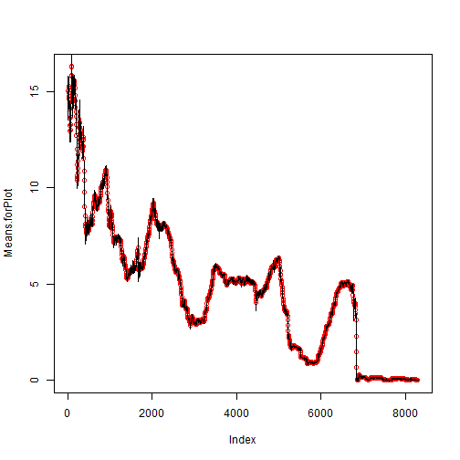 

We only plot the 3M means because all yields are highly correlated, and adding in the other rolling means would look very similar and not add to the story.

Now let's move on to the rolling standard deviation of each variable.


```r
# Rolling standard deviation
# Create increments
AssignmentDataRegressionComparison.Diff<-diff(data.matrix(AssignmentDataRegressionComparison[,1:8]))
AssignmentDataRegressionComparison.Diff[1:10,]
```

```
##           USGG3M USGG6M USGG2YR USGG3YR USGG5YR USGG10YR USGG30YR  Output1
## 1/6/1981    0.06   0.07    0.14    0.03   -0.08    -0.04     0.00  0.07587
## 1/7/1981    0.92   0.74    0.50    0.47    0.40     0.27     0.22  1.35592
## 1/8/1981    0.26   0.10    0.17    0.17    0.07    -0.03     0.02  0.30120
## 1/9/1981    0.44   0.30    0.44    0.33    0.20     0.22     0.22  0.82353
## 1/12/1981   0.02  -0.07   -0.36   -0.34   -0.17    -0.12    -0.05 -0.42986
## 1/13/1981   0.02  -0.13    0.13    0.03   -0.03     0.08     0.00  0.03936
## 1/14/1981  -0.16  -0.20   -0.35   -0.22   -0.07     0.00    -0.01 -0.40426
## 1/15/1981   0.17   0.19    0.30    0.27    0.16     0.09     0.18  0.52160
## 1/16/1981  -0.10  -0.11   -0.17   -0.17   -0.11    -0.09    -0.12 -0.33131
## 1/19/1981   0.64   0.75    0.54    0.07    0.26     0.11     0.12  0.96621
```


```r
# Rolling sd
rolling.sd<-rollapply(AssignmentDataRegressionComparison.Diff,width=Window.width,by=Window.shift,by.column=TRUE, sd)
rolling.dates<-rollapply(AssignmentDataRegressionComparison[-1,1:8],width=Window.width,by=Window.shift,by.column=FALSE,
                         FUN=function(z) rownames(z))
rolling.dates[1:10,]
```

```
##       [,1]        [,2]        [,3]        [,4]        [,5]       
##  [1,] "1/6/1981"  "1/7/1981"  "1/8/1981"  "1/9/1981"  "1/12/1981"
##  [2,] "1/13/1981" "1/14/1981" "1/15/1981" "1/16/1981" "1/19/1981"
##  [3,] "1/20/1981" "1/21/1981" "1/22/1981" "1/23/1981" "1/26/1981"
##  [4,] "1/27/1981" "1/28/1981" "1/29/1981" "1/30/1981" "2/2/1981" 
##  [5,] "2/3/1981"  "2/4/1981"  "2/5/1981"  "2/6/1981"  "2/9/1981" 
##  [6,] "2/10/1981" "2/11/1981" "2/13/1981" "2/17/1981" "2/18/1981"
##  [7,] "2/19/1981" "2/20/1981" "2/23/1981" "2/24/1981" "2/25/1981"
##  [8,] "2/26/1981" "2/27/1981" "3/2/1981"  "3/3/1981"  "3/4/1981" 
##  [9,] "3/5/1981"  "3/6/1981"  "3/9/1981"  "3/10/1981" "3/11/1981"
## [10,] "3/12/1981" "3/13/1981" "3/16/1981" "3/17/1981" "3/18/1981"
##       [,6]        [,7]        [,8]        [,9]        [,10]      
##  [1,] "1/13/1981" "1/14/1981" "1/15/1981" "1/16/1981" "1/19/1981"
##  [2,] "1/20/1981" "1/21/1981" "1/22/1981" "1/23/1981" "1/26/1981"
##  [3,] "1/27/1981" "1/28/1981" "1/29/1981" "1/30/1981" "2/2/1981" 
##  [4,] "2/3/1981"  "2/4/1981"  "2/5/1981"  "2/6/1981"  "2/9/1981" 
##  [5,] "2/10/1981" "2/11/1981" "2/13/1981" "2/17/1981" "2/18/1981"
##  [6,] "2/19/1981" "2/20/1981" "2/23/1981" "2/24/1981" "2/25/1981"
##  [7,] "2/26/1981" "2/27/1981" "3/2/1981"  "3/3/1981"  "3/4/1981" 
##  [8,] "3/5/1981"  "3/6/1981"  "3/9/1981"  "3/10/1981" "3/11/1981"
##  [9,] "3/12/1981" "3/13/1981" "3/16/1981" "3/17/1981" "3/18/1981"
## [10,] "3/19/1981" "3/20/1981" "3/23/1981" "3/24/1981" "3/25/1981"
##       [,11]       [,12]       [,13]       [,14]       [,15]      
##  [1,] "1/20/1981" "1/21/1981" "1/22/1981" "1/23/1981" "1/26/1981"
##  [2,] "1/27/1981" "1/28/1981" "1/29/1981" "1/30/1981" "2/2/1981" 
##  [3,] "2/3/1981"  "2/4/1981"  "2/5/1981"  "2/6/1981"  "2/9/1981" 
##  [4,] "2/10/1981" "2/11/1981" "2/13/1981" "2/17/1981" "2/18/1981"
##  [5,] "2/19/1981" "2/20/1981" "2/23/1981" "2/24/1981" "2/25/1981"
##  [6,] "2/26/1981" "2/27/1981" "3/2/1981"  "3/3/1981"  "3/4/1981" 
##  [7,] "3/5/1981"  "3/6/1981"  "3/9/1981"  "3/10/1981" "3/11/1981"
##  [8,] "3/12/1981" "3/13/1981" "3/16/1981" "3/17/1981" "3/18/1981"
##  [9,] "3/19/1981" "3/20/1981" "3/23/1981" "3/24/1981" "3/25/1981"
## [10,] "3/26/1981" "3/27/1981" "3/30/1981" "3/31/1981" "4/1/1981" 
##       [,16]       [,17]       [,18]       [,19]       [,20]      
##  [1,] "1/27/1981" "1/28/1981" "1/29/1981" "1/30/1981" "2/2/1981" 
##  [2,] "2/3/1981"  "2/4/1981"  "2/5/1981"  "2/6/1981"  "2/9/1981" 
##  [3,] "2/10/1981" "2/11/1981" "2/13/1981" "2/17/1981" "2/18/1981"
##  [4,] "2/19/1981" "2/20/1981" "2/23/1981" "2/24/1981" "2/25/1981"
##  [5,] "2/26/1981" "2/27/1981" "3/2/1981"  "3/3/1981"  "3/4/1981" 
##  [6,] "3/5/1981"  "3/6/1981"  "3/9/1981"  "3/10/1981" "3/11/1981"
##  [7,] "3/12/1981" "3/13/1981" "3/16/1981" "3/17/1981" "3/18/1981"
##  [8,] "3/19/1981" "3/20/1981" "3/23/1981" "3/24/1981" "3/25/1981"
##  [9,] "3/26/1981" "3/27/1981" "3/30/1981" "3/31/1981" "4/1/1981" 
## [10,] "4/2/1981"  "4/3/1981"  "4/6/1981"  "4/7/1981"  "4/8/1981"
```

```r
rownames(rolling.sd)<-rolling.dates[,10]
rolling.sd[1:10,]
```

```
##           USGG3M USGG6M USGG2YR USGG3YR USGG5YR USGG10YR USGG30YR Output1
## 1/19/1981 0.3433 0.3262  0.2748  0.2030  0.1713   0.1300   0.1202  0.5640
## 1/26/1981 0.2933 0.2908  0.2262  0.1499  0.1450   0.1147   0.1192  0.4707
## 2/2/1981  0.2613 0.2438  0.2006  0.1633  0.1654   0.1459   0.1352  0.4681
## 2/9/1981  0.2552 0.2470  0.1989  0.1693  0.1717   0.1551   0.1422  0.4786
## 2/18/1981 0.2481 0.2482  0.2102  0.1786  0.1745   0.1644   0.1517  0.4889
## 2/25/1981 0.1964 0.2364  0.2095  0.1809  0.1823   0.1665   0.1537  0.4789
## 3/4/1981  0.2212 0.2604  0.1985  0.1656  0.1581   0.1442   0.1408  0.4607
## 3/11/1981 0.2204 0.2674  0.2115  0.1820  0.1578   0.1511   0.1525  0.4839
## 3/18/1981 0.2242 0.2620  0.2024  0.1744  0.1530   0.1392   0.1457  0.4715
## 3/25/1981 0.3607 0.3892  0.2666  0.2250  0.1808   0.1766   0.1752  0.6561
```


```r
matplot(rolling.sd[,c(1,5,7,8)],xaxt="n",type="l",col=c("black","red","blue","green"))
axis(side=1,at=1:1656,rownames(rolling.sd))
```

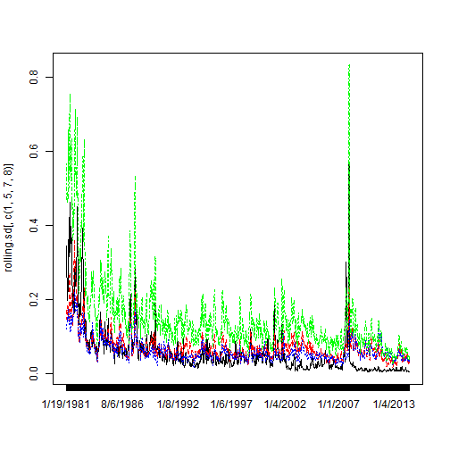 

Where the lines spike high, there is the most volitility. When we compare this graph to the graph of rolling means, we see that volitility may be higher at higher levels of rates, but that could just be an anomaly from the 1982-1983 period of our dataset. 

Generally, the higher the term of bond, the higher the yield, and also the higher the volitility. So in this sense, volitility has a positive relationship to rates. This effect is easier seen in our dataset after around 2002-- before then, the relationship between volitility and level or rates is more muddled.

Let's now look at periods of high volitility:

```r
# Show periods of high volatility
high.volatility.periods<-rownames(rolling.sd)[rolling.sd[,8]>.5]
high.volatility.periods
```

```
##  [1] "1/19/1981"  "3/25/1981"  "4/1/1981"   "4/8/1981"   "4/23/1981" 
##  [6] "4/30/1981"  "5/7/1981"   "5/14/1981"  "5/21/1981"  "5/29/1981" 
## [11] "6/5/1981"   "6/12/1981"  "6/19/1981"  "6/26/1981"  "7/6/1981"  
## [16] "7/13/1981"  "7/20/1981"  "7/27/1981"  "10/28/1981" "11/5/1981" 
## [21] "11/13/1981" "11/20/1981" "11/30/1981" "12/7/1981"  "12/14/1981"
## [26] "12/29/1981" "1/14/1982"  "1/21/1982"  "1/28/1982"  "2/4/1982"  
## [31] "2/11/1982"  "7/29/1982"  "8/5/1982"   "8/12/1982"  "8/19/1982" 
## [36] "8/26/1982"  "9/24/1982"  "10/1/1982"  "10/8/1982"  "10/18/1982"
## [41] "10/13/1987" "10/20/1987" "10/27/1987" "11/19/2007" "11/26/2007"
## [46] "11/12/2008" "11/19/2008"
```

There was much volitility in the early years of our dataset -- 1981 and 1982. The rest of the high volitility days come in 1987, 2007, and 2008.


Fit a linear model to the rolling window data.

```r
# Rolling lm coefficients
Coefficients<-rollapply(AssignmentDataRegressionComparison[,1:8],width=Window.width,by=Window.shift,by.column=FALSE,
         FUN=function(z) coef(lm(Output1~USGG3M+USGG5YR+USGG30YR,data=as.data.frame(z))))
rolling.dates<-rollapply(AssignmentDataRegressionComparison[,1:8],width=Window.width,by=Window.shift,by.column=FALSE,
                         FUN=function(z) rownames(z))

rownames(Coefficients)<-rolling.dates[,10]
Coefficients[1:10,]
```

```
##           (Intercept) USGG3M USGG5YR USGG30YR
## 1/16/1981      -15.71 0.6724   1.798   0.2276
## 1/23/1981      -15.97 0.6949   1.481   0.5529
## 1/30/1981      -16.77 0.7078   1.434   0.6507
## 2/6/1981       -16.91 0.7279   1.470   0.6003
## 2/17/1981      -17.47 0.7343   1.361   0.7500
## 2/24/1981      -17.05 0.7358   1.296   0.7845
## 3/3/1981       -17.68 0.8545   1.397   0.5945
## 3/10/1981      -17.72 0.9162   1.654   0.2571
## 3/17/1981      -17.00 0.9266   1.648   0.1951
## 3/24/1981      -16.84 0.9103   1.478   0.3788
```

Look at pairwise X-Y plots of regression coefficients for the 3M, 5Yr and 30Yr yields as inputs.

```r
# Pairs plot of Coefficients
pairs(Coefficients)
```

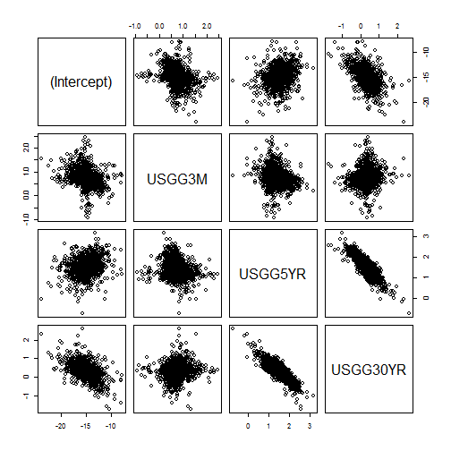 

The 5Yr and the 30Yr look like they show correlation with eachother. Also, the intercept and the 30Yr may have correlation as well.

Plot the coefficients. Show periods

```r
# Plot of coefficients
matplot(Coefficients[,-1],xaxt="n",type="l",col=c("black","red","green"))
axis(side=1,at=1:1657,rownames(Coefficients))
```

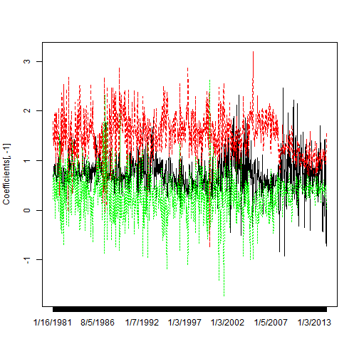 


```r
high.slopespread.periods<-rownames(Coefficients)[Coefficients[,3]-Coefficients[,4]>3]
jump.slopes<-rownames(Coefficients)[Coefficients[,3]>3]
```


```r
# R-squared
r.squared<-rollapply(AssignmentDataRegressionComparison[,1:10],width=Window.width,by=Window.shift,by.column=FALSE,
         FUN=function(z) summary(lm(Output1~USGG3M+USGG5YR+USGG30YR,data=as.data.frame(z)))$r.squared)
r.squared<-cbind(rolling.dates[,10],r.squared)
r.squared[1:10,]
```

```
##                   r.squared          
##  [1,] "1/16/1981" "0.995046300986446"
##  [2,] "1/23/1981" "0.992485868136646"
##  [3,] "1/30/1981" "0.998641209587999"
##  [4,] "2/6/1981"  "0.998849080081881"
##  [5,] "2/17/1981" "0.997958757207598"
##  [6,] "2/24/1981" "0.996489757136839"
##  [7,] "3/3/1981"  "0.99779753570421" 
##  [8,] "3/10/1981" "0.998963395226792"
##  [9,] "3/17/1981" "0.998729445388789"
## [10,] "3/24/1981" "0.997073000898673"
```

```r
plot(r.squared[,2],xaxt="n",ylim=c(0,1))
axis(side=1,at=1:1657,rownames(Coefficients))
```

 
From the plot, it looks very rare that the R-Squared is not around the 99% level.


```r
low.r.squared.periods<-r.squared[r.squared[,2]<.9,1]
```


Analyze the rolling p-values.

```r
# P-values
Pvalues<-rollapply(AssignmentDataRegressionComparison[,1:10],width=Window.width,by=Window.shift,by.column=FALSE,
                        FUN=function(z) summary(lm(Output1~USGG3M+USGG5YR+USGG30YR,data=as.data.frame(z)))$coefficients[,4])
rownames(Pvalues)<-rolling.dates[,10]
Pvalues[1:10,]
```

```
##           (Intercept)    USGG3M   USGG5YR  USGG30YR
## 1/16/1981   1.193e-10 3.765e-10 2.391e-07 2.539e-01
## 1/23/1981   3.751e-12 1.008e-11 2.447e-07 5.301e-03
## 1/30/1981   3.106e-18 1.406e-14 4.040e-09 3.627e-05
## 2/6/1981    2.592e-19 3.360e-19 3.828e-11 2.222e-05
## 2/17/1981   1.897e-16 6.578e-17 1.462e-09 1.332e-04
## 2/24/1981   2.341e-13 1.000e-13 9.008e-07 4.734e-03
## 3/3/1981    5.436e-14 1.536e-11 3.357e-06 6.010e-02
## 3/10/1981   6.228e-16 1.178e-16 1.679e-05 3.852e-01
## 3/17/1981   9.593e-17 7.065e-20 1.460e-05 5.026e-01
## 3/24/1981   8.249e-16 6.690e-16 6.413e-04 3.053e-01
```

```r
matplot(Pvalues,xaxt="n",col=c("black","blue","red","green"),type="o")
axis(side=1,at=1:1657,rownames(Coefficients))
```

 

The 4th variable -- 30Yr looks to have the highest p-values overall over the entire time period. However, there are a couple shorter time periods in which the p-values of other variables are higher. For example, around 1987 there was a short time period in which the 3rd variable, the 5Yr, had a high p-values. From about 2009 on, the 30Yr P-values decreased, and the 2nd variable, 3M Yield, became the variable with the highest p-value. 

We can see the behavior described above if we look at the dates on which the p-values were >.5 for each variable:

```r
rownames(Pvalues)[Pvalues[,2]>.5]
```

```
##  [1] "7/15/1992"  "7/26/1996"  "8/2/1996"   "11/7/2000"  "5/30/2001" 
##  [6] "5/2/2002"   "5/16/2002"  "5/23/2002"  "1/30/2003"  "2/6/2003"  
## [11] "7/24/2003"  "7/31/2003"  "8/7/2003"   "11/20/2003" "12/18/2003"
## [16] "4/28/2005"  "2/10/2006"  "3/9/2007"   "3/16/2007"  "7/21/2009" 
## [21] "10/6/2009"  "10/13/2009" "12/28/2010" "1/11/2011"  "3/1/2011"  
## [26] "11/16/2011" "11/23/2011" "5/23/2012"  "7/11/2012"  "6/6/2013"  
## [31] "1/16/2014"  "1/30/2014"  "3/6/2014"
```


```r
rownames(Pvalues)[Pvalues[,3]>.5]
```

```
## [1] "12/1/1982" "3/16/1987" "4/28/1987" "6/24/1987" "9/3/1987"  "9/11/1987"
## [7] "9/20/1988" "12/3/1999"
```


```r
rownames(Pvalues)[Pvalues[,4]>.5]
```

```
##   [1] "3/17/1981"  "4/22/1981"  "4/29/1981"  "6/4/1981"   "10/13/1981"
##   [6] "11/19/1981" "2/3/1982"   "2/26/1982"  "4/2/1982"   "4/12/1982" 
##  [11] "5/3/1982"   "7/7/1982"   "9/1/1982"   "9/23/1982"  "12/8/1982" 
##  [16] "2/18/1983"  "3/1/1983"   "5/4/1983"   "12/30/1983" "1/9/1984"  
##  [21] "2/6/1984"   "3/14/1984"  "3/21/1984"  "4/11/1984"  "6/22/1984" 
##  [26] "6/29/1984"  "10/31/1984" "11/16/1984" "11/26/1984" "12/17/1984"
##  [31] "3/25/1985"  "5/14/1985"  "5/21/1985"  "8/30/1985"  "9/9/1985"  
##  [36] "9/23/1985"  "10/1/1985"  "10/8/1985"  "10/16/1985" "10/23/1985"
##  [41] "10/30/1985" "11/14/1985" "11/21/1985" "1/22/1986"  "1/29/1986" 
##  [46] "5/5/1987"   "12/16/1987" "1/25/1988"  "2/1/1988"   "2/16/1988" 
##  [51] "3/1/1988"   "3/22/1988"  "5/18/1988"  "6/3/1988"   "6/10/1988" 
##  [56] "6/24/1988"  "7/25/1988"  "8/15/1988"  "12/5/1988"  "2/2/1989"  
##  [61] "3/3/1989"   "4/10/1989"  "5/1/1989"   "6/13/1989"  "8/16/1989" 
##  [66] "9/14/1989"  "9/21/1989"  "10/3/1989"  "10/11/1989" "10/18/1989"
##  [71] "11/1/1989"  "11/30/1989" "12/7/1989"  "1/8/1990"   "1/16/1990" 
##  [76] "6/15/1990"  "7/30/1990"  "8/6/1990"   "10/2/1990"  "10/10/1990"
##  [81] "11/23/1990" "3/1/1991"   "5/13/1991"  "5/20/1991"  "6/13/1991" 
##  [86] "7/5/1991"   "7/19/1991"  "9/16/1991"  "2/12/1992"  "2/20/1992" 
##  [91] "3/12/1992"  "4/16/1992"  "4/24/1992"  "5/1/1992"   "5/8/1992"  
##  [96] "6/2/1992"   "6/9/1992"   "6/16/1992"  "8/19/1992"  "8/26/1992" 
## [101] "10/23/1992" "5/20/1993"  "6/11/1993"  "6/18/1993"  "8/30/1993" 
## [106] "12/15/1993" "12/22/1993" "3/16/1994"  "3/30/1994"  "4/6/1994"  
## [111] "4/20/1994"  "4/27/1994"  "6/29/1994"  "8/17/1994"  "9/21/1994" 
## [116] "9/28/1994"  "12/22/1994" "12/29/1994" "1/5/1995"   "1/12/1995" 
## [121] "1/26/1995"  "2/2/1995"   "2/9/1995"   "4/6/1995"   "4/13/1995" 
## [126] "8/25/1995"  "9/29/1995"  "10/27/1995" "11/3/1995"  "11/10/1995"
## [131] "12/29/1995" "1/5/1996"   "1/12/1996"  "1/19/1996"  "3/29/1996" 
## [136] "5/31/1996"  "6/21/1996"  "7/12/1996"  "7/19/1996"  "7/26/1996" 
## [141] "8/2/1996"   "8/9/1996"   "8/16/1996"  "8/23/1996"  "9/27/1996" 
## [146] "10/4/1996"  "12/6/1996"  "2/28/1997"  "3/7/1997"   "4/18/1997" 
## [151] "4/25/1997"  "5/2/1997"   "6/13/1997"  "6/20/1997"  "6/27/1997" 
## [156] "7/4/1997"   "10/10/1997" "10/17/1997" "12/12/1997" "12/19/1997"
## [161] "12/26/1997" "1/9/1998"   "1/16/1998"  "8/14/1998"  "8/21/1998" 
## [166] "8/28/1998"  "9/18/1998"  "9/25/1998"  "12/4/1998"  "12/11/1998"
## [171] "1/8/1999"   "3/12/1999"  "4/2/1999"   "5/14/1999"  "6/25/1999" 
## [176] "7/9/1999"   "7/30/1999"  "8/20/1999"  "9/10/1999"  "9/24/1999" 
## [181] "10/15/1999" "12/31/1999" "3/3/2000"   "3/31/2000"  "4/7/2000"  
## [186] "4/14/2000"  "4/21/2000"  "7/25/2000"  "11/21/2000" "11/28/2000"
## [191] "3/7/2001"   "5/30/2001"  "7/11/2001"  "10/11/2001" "12/13/2001"
## [196] "1/24/2002"  "1/31/2002"  "8/29/2002"  "9/26/2002"  "12/26/2002"
## [201] "1/16/2003"  "1/23/2003"  "3/6/2003"   "3/13/2003"  "3/20/2003" 
## [206] "3/27/2003"  "5/1/2003"   "6/19/2003"  "6/26/2003"  "7/3/2003"  
## [211] "9/18/2003"  "9/25/2003"  "10/16/2003" "10/23/2003" "10/30/2003"
## [216] "11/20/2003" "1/1/2004"   "2/5/2004"   "2/26/2004"  "3/4/2004"  
## [221] "4/15/2004"  "4/22/2004"  "5/13/2004"  "5/27/2004"  "6/3/2004"  
## [226] "6/17/2004"  "6/24/2004"  "7/8/2004"   "10/14/2004" "10/21/2004"
## [231] "10/28/2004" "11/18/2004" "12/23/2004" "3/17/2005"  "3/24/2005" 
## [236] "3/31/2005"  "4/7/2005"   "7/21/2005"  "8/11/2005"  "9/22/2005" 
## [241] "10/6/2005"  "11/3/2005"  "12/8/2005"  "12/15/2005" "1/20/2006" 
## [246] "5/12/2006"  "5/19/2006"  "5/26/2006"  "6/2/2006"   "6/9/2006"  
## [251] "6/16/2006"  "7/7/2006"   "7/21/2006"  "10/6/2006"  "11/3/2006" 
## [256] "1/12/2007"  "2/23/2007"  "3/16/2007"  "4/27/2007"  "5/25/2007" 
## [261] "9/7/2007"   "9/14/2007"  "9/21/2007"  "9/28/2007"  "11/16/2007"
## [266] "5/5/2009"   "6/1/2010"   "6/15/2010"  "1/25/2011"  "2/1/2011"  
## [271] "6/12/2014"
```


**STEP 7**

Read the data:

```r
# Read data
AssignmentData<-
  read.csv(file="C:/users/Brian_Ritz/uchicago/statistical_analysis/hw/course_project/RegressionAssignmentData2014.csv",
           row.names=1,header=TRUE,sep=",")
AssignmentData.Output<-AssignmentData[,8]
AssignmentData<-data.matrix(AssignmentData[,1:7],rownames.force="automatic")
dim(AssignmentData)
```

```
## [1] 8300    7
```

```r
AssignmentData[1:10,]
```

```
##           USGG3M USGG6M USGG2YR USGG3YR USGG5YR USGG10YR USGG30YR
## 1/5/1981   13.52  13.09   12.29   12.28   12.29    12.15    11.67
## 1/6/1981   13.58  13.16   12.43   12.31   12.21    12.11    11.67
## 1/7/1981   14.50  13.90   12.93   12.78   12.61    12.38    11.89
## 1/8/1981   14.76  14.00   13.10   12.95   12.68    12.35    11.91
## 1/9/1981   15.20  14.30   13.54   13.28   12.88    12.57    12.13
## 1/12/1981  15.22  14.23   13.18   12.94   12.71    12.45    12.08
## 1/13/1981  15.24  14.10   13.31   12.97   12.68    12.53    12.08
## 1/14/1981  15.08  13.90   12.96   12.75   12.61    12.53    12.07
## 1/15/1981  15.25  14.09   13.26   13.02   12.77    12.62    12.25
## 1/16/1981  15.15  13.98   13.09   12.85   12.66    12.53    12.13
```

Explore the dimensionality of the set of 3M, 2Y and 5Y yields.

```r
# Select 3 variables. Explore dimensionality and correlation 
AssignmentData.3M_2Y_5Y<-AssignmentData[,c(1,3,5)]
pairs(AssignmentData.3M_2Y_5Y)
```

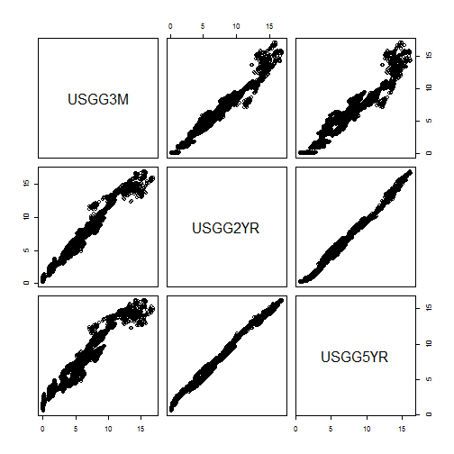 

The 2Yr and the 5Yr appear very correlated with eachother. The 2Yr and the 3M, and the 5Yr and the 3M also appear to have a correlation pattern as well, but it is not as well defined as the correlation between the 2Yr and the 5Yr.

Let's explore the 3D plot of the points:

```r
library("rgl")
rgl.points(AssignmentData.3M_2Y_5Y)
```

The points appear to be on all one plane according to the rgl points diagram. Within that plane, the points appear to take the pattern of the plot between the 3M and the 2Yr data in the pairs panel above.

Analyze the covariance matrix of the data. Compare results of manual calculation and cov.

```r
# Create covariance matrix
# Manual
Manual.Covariance.Matrix<-t(apply(AssignmentData,2,function(AssignmentData.Column) AssignmentData.Column-mean(AssignmentData.Column)))%*%(apply(AssignmentData,2,function(AssignmentData.Column) AssignmentData.Column-mean(AssignmentData.Column)))/
  (length(AssignmentData[,1])-1)
Manual.Covariance.Matrix
```

```
##          USGG3M USGG6M USGG2YR USGG3YR USGG5YR USGG10YR USGG30YR
## USGG3M   11.760 11.855   12.30  11.942  11.189    9.925    8.588
## USGG6M   11.855 12.001   12.51  12.158  11.407   10.129    8.769
## USGG2YR  12.303 12.512   13.28  12.978  12.280   11.005    9.600
## USGG3YR  11.942 12.158   12.98  12.709  12.068   10.856    9.497
## USGG5YR  11.189 11.407   12.28  12.068  11.543   10.463    9.212
## USGG10YR  9.925 10.129   11.01  10.856  10.463    9.583    8.511
## USGG30YR  8.588  8.769    9.60   9.497   9.212    8.511    7.624
```

Same thing using cov:

```r
# Using cov
Covariance.Matrix<-cov(AssignmentData)
Covariance.Matrix
```

```
##          USGG3M USGG6M USGG2YR USGG3YR USGG5YR USGG10YR USGG30YR
## USGG3M   11.760 11.855   12.30  11.942  11.189    9.925    8.588
## USGG6M   11.855 12.001   12.51  12.158  11.407   10.129    8.769
## USGG2YR  12.303 12.512   13.28  12.978  12.280   11.005    9.600
## USGG3YR  11.942 12.158   12.98  12.709  12.068   10.856    9.497
## USGG5YR  11.189 11.407   12.28  12.068  11.543   10.463    9.212
## USGG10YR  9.925 10.129   11.01  10.856  10.463    9.583    8.511
## USGG30YR  8.588  8.769    9.60   9.497   9.212    8.511    7.624
```

They are the same!

Plot the covariance matrix:

```r
Maturities<-c(.25,.5,2,3,5,10,30)
contour(Maturities,Maturities,Covariance.Matrix)
```

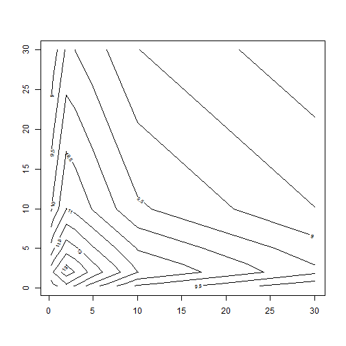 

Find the eigenvalues and eigenvectors of the covariance matrix:

```r
# Find eigenvalues and eigenvectors of the covariance matrix
Eigen.Decomposition<-eigen(Covariance.Matrix)
print(Eigen.Decomposition)
```

```
## $values
## [1] 76.804438  1.551521  0.122380  0.014155  0.008321  0.002249  0.001556
## 
## $vectors
##         [,1]     [,2]    [,3]     [,4]    [,5]     [,6]     [,7]
## [1,] -0.3840 -0.50745  0.5298  0.40374  0.3861 -0.03976  0.02674
## [2,] -0.3902 -0.43946  0.1115 -0.40526 -0.6788  0.09475 -0.09091
## [3,] -0.4152 -0.11113 -0.4188 -0.40897  0.3787 -0.29849  0.49001
## [4,] -0.4064  0.01697 -0.4477  0.06434  0.2362  0.19760 -0.73157
## [5,] -0.3861  0.23140 -0.2462  0.53358 -0.2868  0.42126  0.43856
## [6,] -0.3478  0.43246  0.1501  0.19857 -0.2562 -0.73562 -0.15263
## [7,] -0.3047  0.54421  0.4979 -0.42099  0.2075  0.37777  0.00920
```


```r
# Check dimensionality
barplot(Eigen.Decomposition$values/sum(Eigen.Decomposition$values),width=2,col = "black",
        names.arg=c("F1","F2","F3","F4","F5","F6","F7"))
```

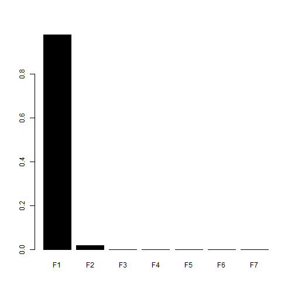 
Factor one has by far the most variance accounted for by it.


```r
# Create 3 loadings
Loadings<-Eigen.Decomposition$vectors[,1:3]
matplot(Maturities,Loadings,type="l",lty=1,col=c("black","red","green"),lwd=3)
```

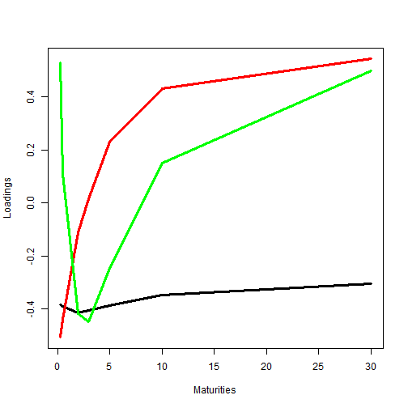 

The first factor has a roughly consistent loading, so each maturity roughly contributes as much to the first factor as any other maturity. This is the factor that accounts for the correlation between all of the input variables in our dataset. The 2nd factor multiplies the shorter term variables by a negative, and the longer term variables(5Yr, 10Yr, 30Yr) by a positive number. The third factor has its highest loading on the first variable--3M. The variables for the terms between the 2Yr and the 5Yr are all multiplied by a negative number to get the 3rd factor, while the other variables are multiplied by numbers greater than 0.

Calculate and plot 3 selected factors

```r
# Calculate factors
# Vector of means
Means<-t(apply(AssignmentData,2,mean))
Factors<-t(apply(AssignmentData,1,"-",Means))%*%Loadings
matplot(Factors,type="l",col=c("black","red","green"),lty=1,lwd=3)
```

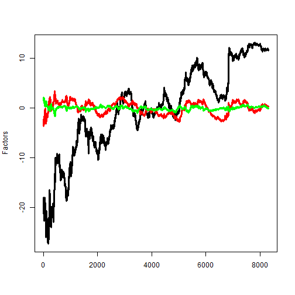 

Change the signs of the first factor and the corresponding factor loading.


```r
# Change the signs of the 1st factor and the first loading
Loadings[,1]<--Loadings[,1]
Factors[,1]<--Factors[,1]
matplot(Factors,type="l",col=c("black","red","green"),lty=1,lwd=3)
```

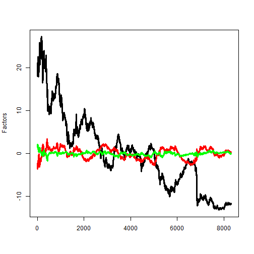 


```r
matplot(Maturities,Loadings,type="l",lty=1,col=c("black","red","green"),lwd=3)
```

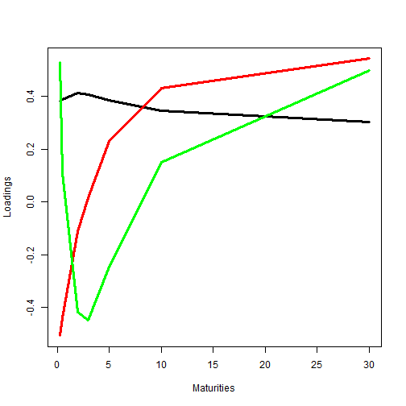 


```r
plot(Factors[,1],Factors[,2],type="l",lwd=2)
```

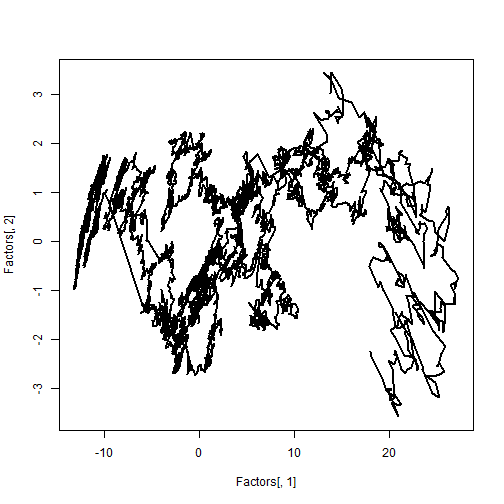 

Analyze the adjustments that each factor makes to the term curve.


```r
# Check how the curve changes with changes of 3 factors
OldCurve<-AssignmentData[135,]
NewCurve<-AssignmentData[136,]
CurveChange<-NewCurve-OldCurve
FactorsChange<-Factors[136,]-Factors[135,]
ModelCurveAdjustment.1Factor<-OldCurve+t(Loadings[,1])*FactorsChange[1]
ModelCurveAdjustment.2Factors<-OldCurve+t(Loadings[,1])*FactorsChange[1]+t(Loadings[,2])*FactorsChange[2]
ModelCurveAdjustment.3Factors<-OldCurve+t(Loadings[,1])*FactorsChange[1]+t(Loadings[,2])*FactorsChange[2]+
  t(Loadings[,3])*FactorsChange[3]
matplot(Maturities,t(rbind(OldCurve,NewCurve,ModelCurveAdjustment.1Factor,ModelCurveAdjustment.2Factors,ModelCurveAdjustment.3Factors)),
        type="l",lty=c(1,1,2,2,2),col=c("black","red","green","blue","magenta"),lwd=3,ylab="Curve Adjustment")
legend(x="topright",c("Old Curve","New Curve","1-Factor Adj.","2-Factor Adj.","3-Factor Adj."),lty=c(1,1,2,2,2),lwd=3,col=c("black","red","green","blue","magenta"))
```

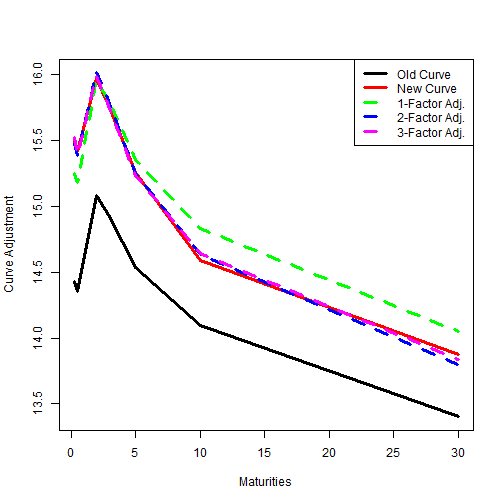 


```r
rbind(CurveChange,ModelCurveAdjustment.3Factors-OldCurve)
```

```
##             USGG3M USGG6M USGG2YR USGG3YR USGG5YR USGG10YR USGG30YR
## CurveChange   1.07  1.070  0.8900  0.8300  0.7200   0.5000   0.4700
##               1.09  1.041  0.9046  0.8248  0.6979   0.5532   0.4358
```

See the goodness of fit for the example of 5Y yield.


```r
# How close is the approximation for each maturity?
# 5Y
Model.5Y<-Means[6]+Loadings[6,1]*Factors[,1]+Loadings[6,2]*Factors[,2]+Loadings[6,3]*Factors[,3]
matplot(cbind(AssignmentData[,6],Model.5Y),type="l",lty=1,lwd=c(3,1),col=c("black","red"),ylab="5Y Yield")
```

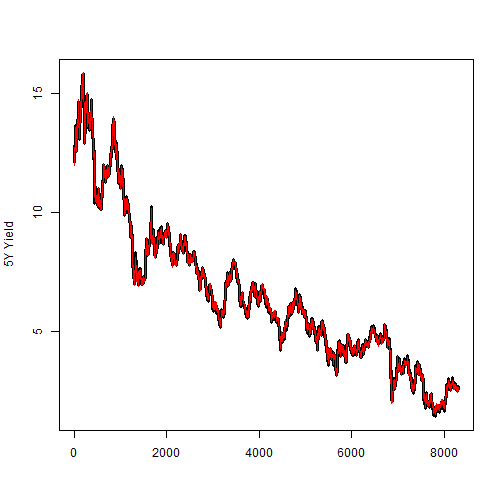 


Repeat the PCA using princomp.


```r
# Do PCA analysis using princomp()
PCA.Yields<-princomp(AssignmentData)
names(PCA.Yields)
```

```
## [1] "sdev"     "loadings" "center"   "scale"    "n.obs"    "scores"  
## [7] "call"
```

Compare the loadings:

```r
# Check that the loadings are the same
cbind(PCA.Yields$loadings[,1:3],Maturities,Eigen.Decomposition$vectors[,1:3])
```

```
##           Comp.1   Comp.2  Comp.3 Maturities                         
## USGG3M   -0.3840  0.50745  0.5298       0.25 -0.3840 -0.50745  0.5298
## USGG6M   -0.3902  0.43946  0.1115       0.50 -0.3902 -0.43946  0.1115
## USGG2YR  -0.4152  0.11113 -0.4188       2.00 -0.4152 -0.11113 -0.4188
## USGG3YR  -0.4064 -0.01697 -0.4477       3.00 -0.4064  0.01697 -0.4477
## USGG5YR  -0.3861 -0.23140 -0.2462       5.00 -0.3861  0.23140 -0.2462
## USGG10YR -0.3478 -0.43246  0.1501      10.00 -0.3478  0.43246  0.1501
## USGG30YR -0.3047 -0.54421  0.4979      30.00 -0.3047  0.54421  0.4979
```

The loadings are the same.


```r
matplot(Maturities,PCA.Yields$loadings[,1:3],type="l",col=c("black","red","green"),lty=1,lwd=3)
```

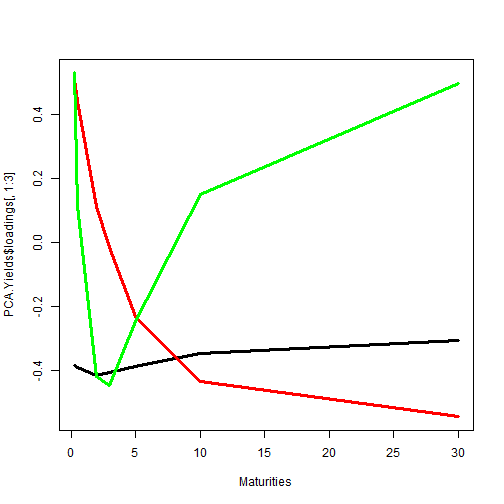 


```r
matplot(PCA.Yields$scores[,1:3],type="l",col=c("black","red","green"),lwd=3,lty=1)
```

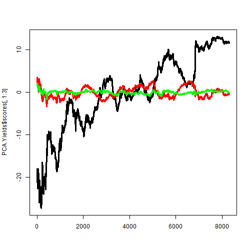 

Change the signs of the first factor and factor loading again.

```r
# Change the signs of the 1st factor and the first loading
PCA.Yields$loadings[,1]<--PCA.Yields$loadings[,1]
PCA.Yields$scores[,1]<--PCA.Yields$scores[,1]
matplot(Maturities,PCA.Yields$loadings[,1:3],type="l",col=c("black","red","green"),lty=1,lwd=3)
```

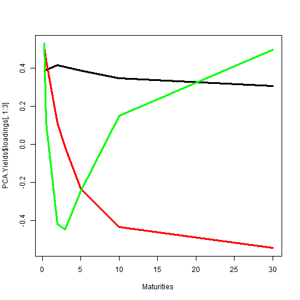 


```r
matplot(PCA.Yields$scores[,1:3],type="l",col=c("black","red","green"),lwd=3,lty=1)
```

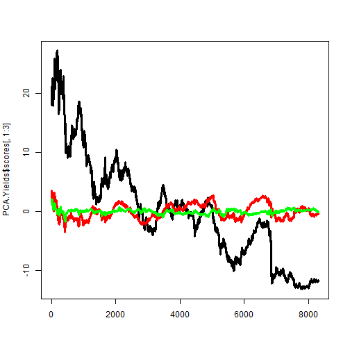 

Both of these plots look the same as our manually done PCA.

Uncover the mystery of the Output in column 8.

```r
# What variable we had as Output?
matplot(cbind(PCA.Yields$scores[,1],AssignmentData.Output),type="l",col=c("black","red"),lwd=3,lty=1)
```

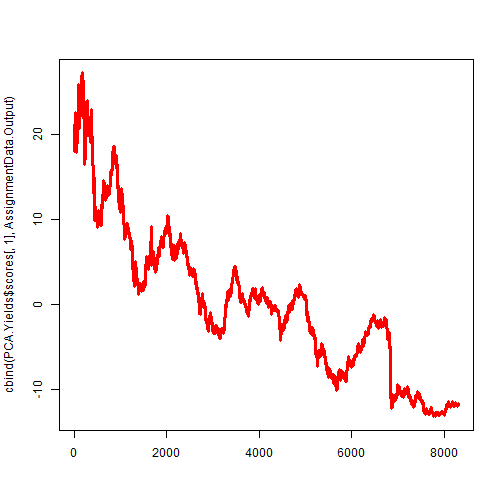 


```r
# Compare factors
matplot(cbind(PCA.Yields$scores[,1],Factors[,1]),type="l",col=c("black","red"),lwd=c(3,1),lty=1)
```

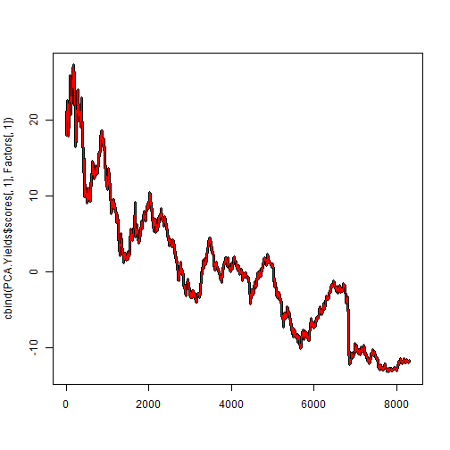 


Compare the regression coefficients from Step 2 and Step 3 with factor loadings.

First, look at the slopes for AssignmentData.Input~AssignmentData.Output

```r
t(apply(AssignmentData, 2, function(AssignmentData.col) lm(AssignmentData.col~AssignmentData.Output)$coef))
```

```
##          (Intercept) AssignmentData.Output
## USGG3M         4.675                0.3840
## USGG6M         4.844                0.3902
## USGG2YR        5.439                0.4152
## USGG3YR        5.644                0.4064
## USGG5YR        6.009                0.3861
## USGG10YR       6.481                0.3478
## USGG30YR       6.869                0.3047
```

```r
cbind(PCA.Yields$center,PCA.Yields$loadings[,1])
```

```
##           [,1]   [,2]
## USGG3M   4.675 0.3840
## USGG6M   4.844 0.3902
## USGG2YR  5.439 0.4152
## USGG3YR  5.644 0.4064
## USGG5YR  6.009 0.3861
## USGG10YR 6.481 0.3478
## USGG30YR 6.869 0.3047
```

Check if the same is true in the opposite direction.

```r
AssignmentData.Centered<-t(apply(AssignmentData,1,function(AssignmentData.row) AssignmentData.row-PCA.Yields$center))
dim(AssignmentData.Centered)
```

```
## [1] 8300    7
```


```r
t(apply(AssignmentData.Centered, 2, function(AssignmentData.col) lm(AssignmentData.Output~AssignmentData.col)$coef))
```

```
##          (Intercept) AssignmentData.col
## USGG3M     1.420e-11              2.508
## USGG6M     1.421e-11              2.497
## USGG2YR    1.420e-11              2.400
## USGG3YR    1.420e-11              2.456
## USGG5YR    1.420e-11              2.569
## USGG10YR   1.420e-11              2.787
## USGG30YR   1.421e-11              3.070
```

To recover the loading of the first factor by doing regression, use all inputs together.

```r
t(lm(AssignmentData.Output~AssignmentData.Centered)$coef)[-1]
```

```
## [1] 0.3840 0.3902 0.4152 0.4064 0.3861 0.3478 0.3047
```


```r
PCA.Yields$loadings[,1]
```

```
##   USGG3M   USGG6M  USGG2YR  USGG3YR  USGG5YR USGG10YR USGG30YR 
##   0.3840   0.3902   0.4152   0.4064   0.3861   0.3478   0.3047
```

This means that the factor is a portfolio of all input variables.
