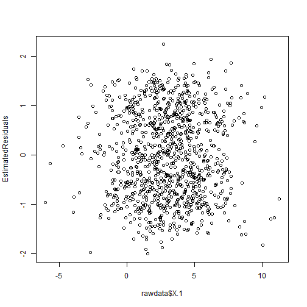

Week 4 Homework 1 - Linear Model and Classification
========================================================
Brian Ritz
--------------------------------------------------------
MSCA 31007 Autumn 2014
--------------------------------------------------------
Case 1
-----------------

First we will import the case 1 file and take a look at it.


```r
# import the data
rawdata <- read.csv("C:/Users/Brian_Ritz/uchicago/statistical_analysis/hw/week04_hw/LinearModelCase1.csv")
head(rawdata)
```

```
##   X    X.1 LinearModel
## 1 1  4.954      5.3789
## 2 2  2.237      1.1761
## 3 3  3.845      1.8389
## 4 4  1.146      0.8422
## 5 5  5.182      2.5158
## 6 6 -1.105     -1.9829
```

Now we plot


```r
plot(rawdata$X.1, rawdata$LinearModel);
```

 

It does look like a linear relationship -- lets estimate the relationship using the lm function:


```r
# estimate using linear model
EstimatedLinearModel <- lm(rawdata$LinearModel~rawdata$X.1)
```

Now find the coefficients for the data at hand


```r
EstimatedLinearModel$coefficients
```

```
## (Intercept) rawdata$X.1 
##    -0.07341     0.80376
```

```r
summary(EstimatedLinearModel)
```

```
## 
## Call:
## lm(formula = rawdata$LinearModel ~ rawdata$X.1)
## 
## Residuals:
##    Min     1Q Median     3Q    Max 
## -2.002 -0.737 -0.032  0.737  2.240 
## 
## Coefficients:
##             Estimate Std. Error t value Pr(>|t|)    
## (Intercept)  -0.0734     0.0432    -1.7    0.089 .  
## rawdata$X.1   0.8038     0.0109    73.6   <2e-16 ***
## ---
## Signif. codes:  0 '***' 0.001 '**' 0.01 '*' 0.05 '.' 0.1 ' ' 1
## 
## Residual standard error: 0.88 on 998 degrees of freedom
## Multiple R-squared:  0.844,	Adjusted R-squared:  0.844 
## F-statistic: 5.42e+03 on 1 and 998 DF,  p-value: <2e-16
```

**INTERPRET THE RESULTS OF THE OUTPUT**

This output indicates that the process that created this distribution could have determined the Y coordinate by introducing some random error around the value -0.07341 + .80376X for a given value of X. The P-value for the intercept is 0.08, so this intercept would be measured about 8% of the time even if the "true" intercept was 0. If we use a 5% confidence hueristic, we are not very confident that the intercept is different from 0. We are confident that the slope is greater than 0, because the P-value on X.1 is much smaller.


Now lets take a look at the residuals.


```r
EstimatedResiduals<-EstimatedLinearModel$residuals
plot(rawdata$X.1,EstimatedResiduals)
```

 

You can see a little bit of a "tunnel" through the middle of the distribution around 0. We look at the density distribution and compare it to the normal distribution to get a better look.


```r
Probability.Density.Residuals<-density(EstimatedResiduals)
plot(Probability.Density.Residuals,ylim=c(0,.5))
lines(Probability.Density.Residuals$x,dnorm(Probability.Density.Residuals$x,mean=mean(EstimatedResiduals),sd=sd(EstimatedResiduals)))
```

 

**WHAT DO YOU CONCLUDE FROM THE ANALYSIS OF RESIDUALS**
Now we do see that there are some residual observations "missing" when compared to the normal distribution. When we look at the distribution, we see a bimodal density, which could indicate that there are actually two separate systems that are creating these data.

we now look at the means of the distribution of residuals on each side of zero.

```r
c(Left.Mean=mean(EstimatedResiduals[EstimatedResiduals<0]),Right.Mean=mean(EstimatedResiduals[EstimatedResiduals>0]))
```

```
##  Left.Mean Right.Mean 
##    -0.7411     0.7683
```

The left mean and the right mean are very near -.75 and +.75 respectively. This could be the value of the intercept parameter for which the process that generates this data is set.

I now separate the data into subsamples where the residual is above zero, and where the residual is below zero. This basically divides the points into points that were above our estimated line, and points that were below our estimated line.


```r
nSample <- nrow(rawdata)
LinearModel <- rawdata
Unscrambled.Selection.Sequence<-(EstimatedResiduals>0)*1
LinearModel1.Recovered<-cbind(rep(1,nSample),rep(1,nSample))
LinearModel2.Recovered<-cbind(rep(1,nSample),rep(1,nSample))
LinearModel1.Recovered[Unscrambled.Selection.Sequence==1,1]<-LinearModel[Unscrambled.Selection.Sequence==1,2]
LinearModel1.Recovered[Unscrambled.Selection.Sequence==1,2]<-LinearModel[Unscrambled.Selection.Sequence==1,3]
LinearModel1.Recovered[Unscrambled.Selection.Sequence==0,1]<-NA
LinearModel1.Recovered[Unscrambled.Selection.Sequence==0,2]<-NA
LinearModel2.Recovered[Unscrambled.Selection.Sequence==0,1]<-LinearModel[Unscrambled.Selection.Sequence==0,2]
LinearModel2.Recovered[Unscrambled.Selection.Sequence==0,2]<-LinearModel[Unscrambled.Selection.Sequence==0,3]
LinearModel2.Recovered[Unscrambled.Selection.Sequence==1,1]<-NA
LinearModel2.Recovered[Unscrambled.Selection.Sequence==1,2]<-NA
matplot(rawdata[,2],cbind(LinearModel1.Recovered[,2],LinearModel2.Recovered[,2]), type="p",col=c("green","blue"),pch=19,ylab="Separated Subsamples")
```

 

Take a look at the switching process -- are the data points with residuals above the estimated line found in our original dataset in some systematic way?


```r
plot(Unscrambled.Selection.Sequence[1:100],type="s")
```

 

No obvious pattern appears. Let's estimate 2 new linear models from our subsamples that were created by determining if the residual was above or below zero.


```r
LinearModel1.Recovered.lm<-lm(LinearModel1.Recovered[,2]~LinearModel1.Recovered[,1])
LinearModel2.Recovered.lm<-lm(LinearModel2.Recovered[,2]~LinearModel2.Recovered[,1])
summary(LinearModel1.Recovered.lm)
```

```
## 
## Call:
## lm(formula = LinearModel1.Recovered[, 2] ~ LinearModel1.Recovered[, 
##     1])
## 
## Residuals:
##     Min      1Q  Median      3Q     Max 
## -0.7969 -0.3471 -0.0243  0.3425  1.4743 
## 
## Coefficients:
##                             Estimate Std. Error t value Pr(>|t|)    
## (Intercept)                  0.66409    0.03255    20.4   <2e-16 ***
## LinearModel1.Recovered[, 1]  0.81406    0.00832    97.8   <2e-16 ***
## ---
## Signif. codes:  0 '***' 0.001 '**' 0.01 '*' 0.05 '.' 0.1 ' ' 1
## 
## Residual standard error: 0.466 on 489 degrees of freedom
##   (509 observations deleted due to missingness)
## Multiple R-squared:  0.951,	Adjusted R-squared:  0.951 
## F-statistic: 9.57e+03 on 1 and 489 DF,  p-value: <2e-16
```

```r
summary(LinearModel2.Recovered.lm)
```

```
## 
## Call:
## lm(formula = LinearModel2.Recovered[, 2] ~ LinearModel2.Recovered[, 
##     1])
## 
## Residuals:
##     Min      1Q  Median      3Q     Max 
## -1.2644 -0.3042  0.0175  0.3520  0.7308 
## 
## Coefficients:
##                             Estimate Std. Error t value Pr(>|t|)    
## (Intercept)                 -0.80714    0.03016   -26.8   <2e-16 ***
## LinearModel2.Recovered[, 1]  0.80135    0.00756   106.0   <2e-16 ***
## ---
## Signif. codes:  0 '***' 0.001 '**' 0.01 '*' 0.05 '.' 0.1 ' ' 1
## 
## Residual standard error: 0.438 on 507 degrees of freedom
##   (491 observations deleted due to missingness)
## Multiple R-squared:  0.957,	Adjusted R-squared:  0.957 
## F-statistic: 1.12e+04 on 1 and 507 DF,  p-value: <2e-16
```

**WHAT IS THE DIFFERENCE BETWEEN THE QUALITY OF FIT**
The fit of the new models, as indicated by the R-squared statistic, is better than when we estimated a single model for all of the data points. The difference in the quality of fit can be shown by the differences in the R-squared. The R-squared for the two new models are both greater than .95 -- indicating a very high quality of fit. In contrast the R-squared of the original model fit to all the data was .84, which is still decent but not near the quality of fit as the two separate models. This difference can be accounted for because the original first model was not taking into account two separate data-generation processes.

**WHAT IS THE DIFFERENCE BETWEEN THE TWO ESTIMATED MODELS**
The difference between the two estimated models is the estimate for the intercept. One model has a negative intercept (-.80), while the other has a positive intercept (.66). The slopes are much the same (.81 to .80), only the intercepts differ. This means that the lines around which the two data generating processes introduced error were probably parallel to eachother, but differing in their Y-intercepts.

**HOW THE MODEL WAS CREATED AND WHAT WERE THE PARAMETERS**

```r
Probability.Density.X.1<-density(rawdata$X.1)
plot(Probability.Density.X.1, main = "Density Plot of X values")
```

 

```r
print (mean(rawdata$X.1))
```

```
## [1] 3.021
```

```r
print (sd(rawdata$X.1))
```

```
## [1] 2.551
```

```r
print (mean(Unscrambled.Selection.Sequence))
```

```
## [1] 0.491
```

Also look at the residual to estimate the shape of epsilon.

```r
plot(density(LinearModel1.Recovered.lm$residuals))
```

 

```r
print(c(mean(LinearModel1.Recovered.lm$residuals), sd(LinearModel1.Recovered.lm$residuals)))
```

```
## [1] -1.155e-18  4.651e-01
```


```r
plot(density(LinearModel2.Recovered.lm$residuals))
```

 

```r
print(c(mean(LinearModel2.Recovered.lm$residuals), sd(LinearModel2.Recovered.lm$residuals)))
```

```
## [1] 3.978e-18 4.380e-01
```
The residuals appear lop-sided because we miss-assign some values to the wrong model based on our criteria of being >0 or <0.


The model was created by first selecting between two separate data generation processes that differed in their Intercepts. The fact that 49% of the observations had residuals greater than zero indicates that there was a very close to even 50/50 chance of either generating function being chosen for a given data point. The normal plot titled "Density Plot of X values" indicates that an X was chosen randomly from a normal distribution with the mean probably close to 3 and a standard Deviation near 2.5. Once the X was chosen, the appropriate Y value was selected using the function Y =  -.75 + .8\*(X) + epsilon or Y = .75 + .8\*(X)  + epsilon. I believe the generation function picked was likely the result of a 50/50 coin flip, for reasons discussed above in this paragraph. And my estimates of the standard deviation of the epsilons is .45, with is a round number near the measures of the residuals. The means of the epsilons are zero.

While the linear model estimates the intercepts for the two generating functions to be -.80 and .66, I believe the true intercepts of the generating functions were at +.75 and -.75 largely becuase of prior knowledge outside of the model -- I know that this was created by the professor for the purposes of this class, and the mean differences of the residuals were both very near +/- .75.


-----------------
Case 2
-----------------

First we will import the case 1 file and take a look at it.


```r
# import the data
LinearModel2 <- read.csv("C:/Users/Brian_Ritz/uchicago/statistical_analysis/hw/week04_hw//LinearModelCase2.csv")
head(LinearModel2)
```

```
##   X    X.1 LinearModel
## 1 1 4.7291      4.4721
## 2 2 5.5057      6.2003
## 3 3 0.2905      0.8775
## 4 4 7.7411      6.6647
## 5 5 2.1916      1.2919
## 6 6 5.0303      7.0464
```

Now we plot


```r
plot(LinearModel2$X.1, LinearModel2$LinearModel, pch=19, col="blue")
```

 

There is possibly more variance around the mean among the data points with a greater X value. Perhaps this distribution is "cone-shaped." That would indicate heteroskedacity. Let's first estimate a linear model and see where that gets us.

** 1. ESTIMATE LINEAR MODEL**

```r
# estimate using linear model
EstimatedLinearModel2 <- lm(LinearModel2$LinearModel~LinearModel2$X.1)
summary(EstimatedLinearModel2)
```

```
## 
## Call:
## lm(formula = LinearModel2$LinearModel ~ LinearModel2$X.1)
## 
## Residuals:
##    Min     1Q Median     3Q    Max 
## -3.899 -0.814 -0.036  0.833  3.546 
## 
## Coefficients:
##                  Estimate Std. Error t value Pr(>|t|)    
## (Intercept)       -0.0094     0.0603   -0.16     0.88    
## LinearModel2$X.1   1.0051     0.0153   65.58   <2e-16 ***
## ---
## Signif. codes:  0 '***' 0.001 '**' 0.01 '*' 0.05 '.' 0.1 ' ' 1
## 
## Residual standard error: 1.23 on 998 degrees of freedom
## Multiple R-squared:  0.812,	Adjusted R-squared:  0.811 
## F-statistic: 4.3e+03 on 1 and 998 DF,  p-value: <2e-16
```

** 2. ANALYZE THE RESULTS OF THE FITTING **
The R-squared statistic is .81. The intercept is indistinguishable from 0, while the estimate for slope parameter is different from 0 and approximately equal to 1. I believe this model has captured some of the essential elements of the data generating process well, but it could be leaving out the heterskedacity. Still, I believe the 0 estimate for the intercept and the 1 estimate for the slope parameter is likely valid.

** 3. ANALYZE THE RESIDUALS **
Let's take a look at the residuals:


```r
plot(LinearModel2$X.1,EstimatedLinearModel2$residuals, xlab="X.1", ylab = "Residuals of Estimate", pch=19, col=rgb(0,0,255, 50,maxColorValue = 255))
```

 

```r
print(mean(EstimatedLinearModel2$residuals))
```

```
## [1] 1.868e-17
```

The residuals look to have a greater variance as we move right on the X axis. To check this, lets look at the variance across differnet parts of the X axis. The residuals also look like they might have a similar "tunnel" to case 1 as we get to the far right extreme of the x axis, but that might just be an illusion because of the increased variance.


```r
variance.by.x.pos <- c()
for (i in (-5:10)){
  variance.by.x.pos <- c(variance.by.x.pos, var(EstimatedLinearModel2$residuals[LinearModel2$X.1 > i-.5 & LinearModel2$X.1 <i+.5]))
}
names(variance.by.x.pos) <- -5:10
print(variance.by.x.pos)
```

```
##      -5      -4      -3      -2      -1       0       1       2       3 
## 0.04702 1.31676 0.97425 1.16089 0.93722 0.85176 1.15463 1.04890 1.54687 
##       4       5       6       7       8       9      10 
## 1.35656 1.77925 1.89966 3.35549 2.90982 3.35210 7.09573
```

Yes... the variance increases as we move the right along the X axis. This means that our usual statistical tests for significance are not valid. The variance also is the least at 0, which might indicate that we do in fact have two separate lines around which the data is genereated, and they intersect at 0. The variance increases as the absolute value of X increases.

Lets plot the density of the residuals


```r
Probability.Density.Residuals2<-density(EstimatedLinearModel2$residuals)
plot(Probability.Density.Residuals2,ylim=c(0,.5))
lines(Probability.Density.Residuals2$x,dnorm(Probability.Density.Residuals2$x,mean=mean(EstimatedLinearModel2$residuals),sd=sd(EstimatedLinearModel2$residuals)), col="red")
```

 


Before we move on, lets go back and divide out the residuals according to which quadrant they belong to. The hypothesis I want to investigate here is whether the points for which residuals are in diagonal quadrants all belong to the same generating function.

```r
# if the residual and the X.1 are the same sign(quadrants I and III), then their product will be > 0, if they are opposite signs(quadrants II and IV) then product is <0
nSample <- nrow(LinearModel2)
Unscrambled.Selection.Sequence<-(EstimatedLinearModel2$residuals*LinearModel2$X.1 > 0)
LinearModel2.Recovered2<-cbind(rep(NA,nSample),rep(NA,nSample))
LinearModel2.Recovered3<-cbind(rep(NA,nSample),rep(NA,nSample))
LinearModel2.Recovered2[Unscrambled.Selection.Sequence,1:2] <- as.matrix(LinearModel2[Unscrambled.Selection.Sequence,2:3])
LinearModel2.Recovered3[!Unscrambled.Selection.Sequence,1:2] <- as.matrix(LinearModel2[!Unscrambled.Selection.Sequence,2:3])
```


Now lets plot these two samples with different colors so we can see if we did it right --


```r
matplot(LinearModel2[,2],cbind(LinearModel2.Recovered2[,2],LinearModel2.Recovered3[,2]), type="p",col=c("green","blue"),pch=19,ylab="Separated Subsamples")
```

 

Eh...I did what I was trying to do...but it doesn't look like I'm going to get a good linear model of those two populations.
How can I separate the two populations if there are actually two lines that intersect eachother at zero?

**MAKE A HYPOTHESIS ABOUT THE REASONS FOR THE OBSERVED BEHAVIOR OF THE RESIDUALS**

I believe the behavior of these residuals is because the random error term of the data generating model is set to introduce greater variance for higher X values. The errors are approximately normally distributed, but there is greater variance in the residuals at greater x values.

** TELL HOW THE SAMPLE WAS CREATED AND WHAT ARE THE VALUES OF ALL THE PARAMETERS**

I must find how the Xs were generated:


```r
Probability.Density.X.1<-density(LinearModel2$X.1)
plot(Probability.Density.X.1, main = "Density Plot of X values")
lines(Probability.Density.X.1$x,dnorm(Probability.Density.X.1$x,mean=mean(LinearModel2$X.1),sd=sd(LinearModel2$X.1)), col="red")
```

 

```r
print (mean(LinearModel2$X.1))
```

```
## [1] 3.012
```

```r
print (sd(LinearModel2$X.1))
```

```
## [1] 2.535
```

The sample was created by first selecting Xs by from a normal random distribution with mean 3 and standard deviation 2.5. Once the X's were selected, they cooresponding Y values were selected using the formula Y = X + epsilon, where epsilon was approximately a normal random variable with mean 0 and variance as an increasing function of X, possibly an increasing function of the absolute value of X.

My best guess at the function that generates epsilon is a random normal distribution with mean 0 and variance which can be determined by our variance.by.x.pos above.

I estimate a linear function for the variance by x pos below:


```r
plot(abs(c(-5:10)), variance.by.x.pos)
```

 

```r
epsilon.variance.est <- lm(variance.by.x.pos ~ (c(-5:10)))
summary(epsilon.variance.est)
```

```
## 
## Call:
## lm(formula = variance.by.x.pos ~ (c(-5:10)))
## 
## Residuals:
##    Min     1Q Median     3Q    Max 
## -0.980 -0.572 -0.354  0.268  3.123 
## 
## Coefficients:
##             Estimate Std. Error t value Pr(>|t|)    
## (Intercept)   1.2414     0.3020    4.11  0.00106 ** 
## c(-5:10)      0.2731     0.0576    4.74  0.00032 ***
## ---
## Signif. codes:  0 '***' 0.001 '**' 0.01 '*' 0.05 '.' 0.1 ' ' 1
## 
## Residual standard error: 1.06 on 14 degrees of freedom
## Multiple R-squared:  0.616,	Adjusted R-squared:  0.589 
## F-statistic: 22.5 on 1 and 14 DF,  p-value: 0.000315
```

```r
epsilon.variance.est$coefficients
```

```
## (Intercept)    c(-5:10) 
##      1.2414      0.2731
```

```r
#get standard deviation of the epsilons as a function of abs(x)
print(sqrt(epsilon.variance.est$coefficients[2]))
```

```
## c(-5:10) 
##   0.5226
```

My best guess at the standard deviation of the epsilons is (2/3)\*abs(x), giving the full function of the epsilons as epsilon = norm(0, (2/3)\*abs(x)).

The full funciton of Y as a function of x would be Y = X + norm(0,(2/3)\*abs(X)), with Xs selected from a norm(3,2.5).


